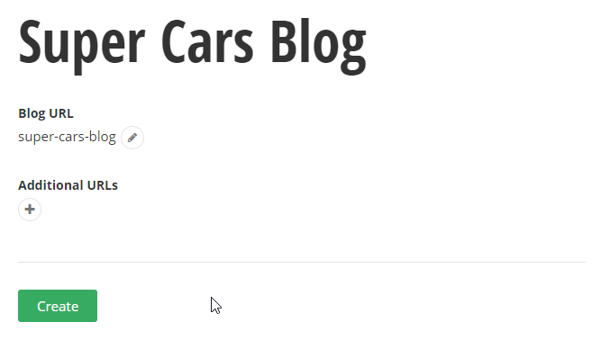
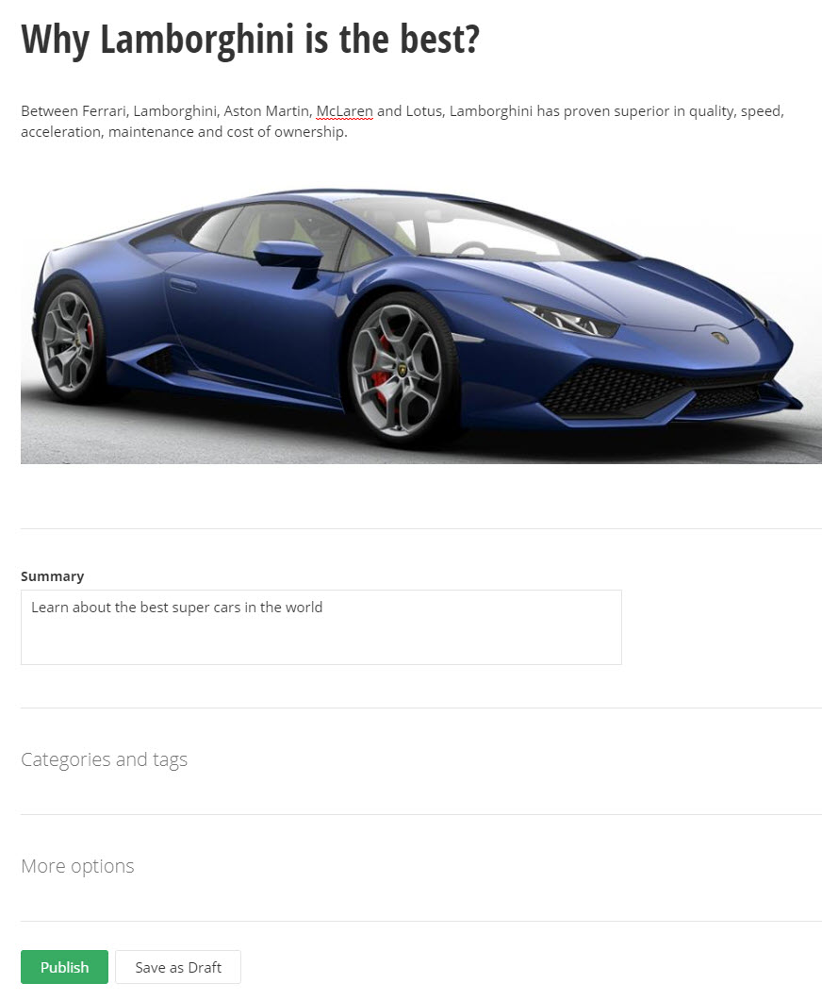
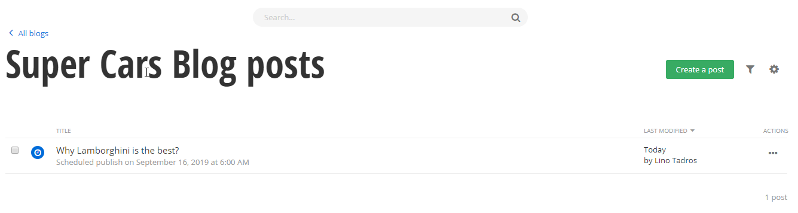
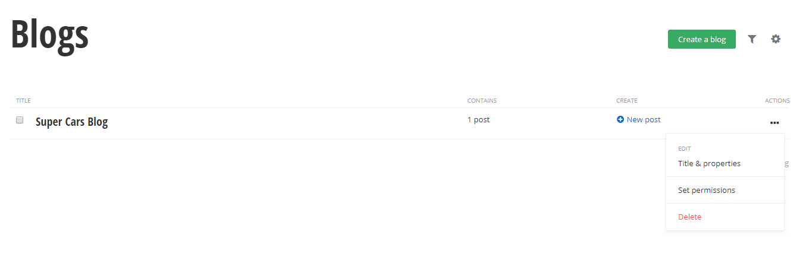
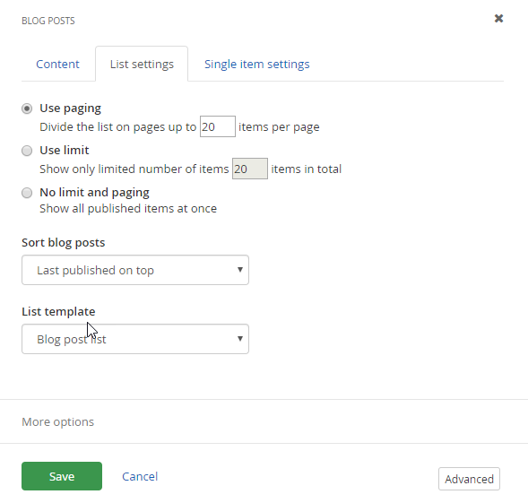

Blogs
=====

> Blogs are used to publish current information and allow commentary by
> readers to form an online conversation. A successful blog can be
> syndicated to other websites over various standards such as RSS
> (Really Simple Syndication). Sitefinity makes it easy to create blogs
> for as many groups or subjects as needed. You could have a blog for
> each subject your site covers, such as a blog for each department in
> your organization, or even a blog for each person in smaller
> organizations. The blog will contain blog *posts*, that is, articles
> that relate to the blog content.
>
> When someone says \"I wrote a blog\", they are usually talking about a
> \"blog post\". The blog itself is the container that holds blog posts.

##### Creating a Blog

> This walk-through shows how to create a blog that will later contain posts.

1.  Drop down the Content menu and select Blogs.

2.  Click the Create a Blog link. This will display the Create a Blog
    page.

3.  Set the Title to \"Classic Cars Blog\".

> Here is an explanation of the settings:
>
> Alternative Publishing: By default, blogs are published as RSS (Really
> Simple Syndication) that can be read by online readers like
> [Feedly](http://feedly.com/i/welcome) or native readers
> like [RSSOwl](http://www.rssowl.org/) -- any news reader
> that accepts RSS or ATOM feeds. This allows your news to be syndicated, that is, your blogs are made available to multiple other websites.

4.  Open the Alternative publishing (RSS) section.

5.  Click the Change button. This will display the RSS feed page so that
    you can fine- tune the settings. Enter the Url name \"classics\" and
    click the Done button.

> Here is an explanation of the settings:
>
> RSS or Atom to generate?: This set of options adjusts the standard
> used to publish the feed. Both standards are widely used and can be
> handled by most popular feed readers.
>
> Url name helps create the full URL used to access the blog. Most
> browsers will recognize and format the blog automatically.
>
> Limit the items in the feed helps keep the material fresh by limiting
> the number of posts shown in the blog to the newest items.
>
> An item in the feed contains controls the amount of content shown.

6.  Based on the Url name that you entered, the Alternative publishing
    section now includes a link to the blog. Make a note of this link
    for later use.

7.  Click the Create this blog button. This will display the Blog Posts
    page.

##### Blog Posts

> Now that you have created a blog, that is, the container for posts,
> you can create the actual blog posts that contain the content.

1.  From the Blog posts page, click the Create a post link.

2.  In the Create a post page, enter a Title, then text to the HTML
    editor.

3.  Click the Summary link, then the Click to add summary link and add a
    line or two of text that sums up the post.

4.  From the More actions button at the bottom of the page select
    Publish/Unpublish on a Specific Date. Using the date and time
    pickers for the Publication date, set a date in the future that
    lands on a Monday at 6am.

#### Note: 
> When it comes to blogging, all days of the week are not
> created equal. Late in the week, blog posts get lost in the shuffle
> and won\'t be read. Early Monday, the new blog posts come in and bury
> the posts from Friday, Saturday and Sunday. The scheduling feature
> makes it easy to write your blogs at any time of the week and schedule
> them to show up at the optimum time.

5.  The Blog Posts page shows the new post with the \"Clock\" icon and
    the scheduled publish date and time.

6.  We will want to see this blog immediately, so click Publish from the
    Actions menu.

7.  Click the All blogs link.

8.  From the Blogs page you can see the new blog has a single post. From
    here you can Create a post, use the Edit posts link to list all the
    posts for this blog or use the Actions drop down to Delete, edit the
    Title & Properties or edit the Permissions.

##### Using RSS Feeds

> Using the link to the RSS feed, plug this link into the address bar of
> your browser. If you don\'t have the link, the general format is:
>
> http://\<base website url\>/Feeds/\<feed name\>
>
> In the example, the link was:
>
> http://localhost:47632/CarConduit/Feeds/classics
>
> Viewing the example in Internet Explorer produces the result in the
> screenshot below. The blog will be formatted something like this
> example using Internet Explorer, Firefox and Safari. Some browsers may
> require an RSS Reader extension be configured for the browser.

##### Using Blog Widgets

> In this example, we only have a single blog post, but you can have as
> many blogs and blog posts as you like. You can also use as many Blog
> widgets on the page as you need to display listings of multiple blog
> posts or smaller groups of blog posts.

1.  Click the Pages menu item.

2.  Create a new child page under the \"Welcome\" page titled \"Blogs\",
    then click the Create and go to add content button.

3.  Drag a Blog Posts widget to one of the boxes on the page. Notice
    that the blog post shows up immediately. This is OK when you only
    have a single post, but you will need a way to select which blog
    posts show.

4.  Click the widget's Edit link. Click the From selected blogs only\...
    option. The Blogs dialog will look similar to the News and Events
    dialog where you have a Content link, a List Settings and Single
    Item Settings. The Content link shows all blogs or only selected
    blogs. You can narrow down the blogs to a single post or select
    posts by a combination of categories, tags and dates.

5.  Click the Select a blog button.

6.  Select the blog you created earlier and then click the Done
    selecting button.

7.  Click the List Settings link. Click Titles, dates and full content
    from the List template section.

> Like News and Events, you can limit the number of items in the list to
> an exact amount, to a certain number of items per page or simply dump
> everything onto the page at once. Use the Sort blog posts drop down to
> sort by last published, last modified, alphabetically or As Set in
> Advanced mode. The List template drop down controls the format of the
> list so that you can see the entire post at one time or just a teaser
> using the summary.

8.  Click the Save button to close the dialog.

9.  Publish and view the page.

