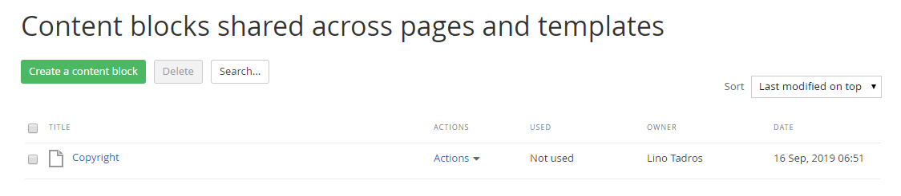
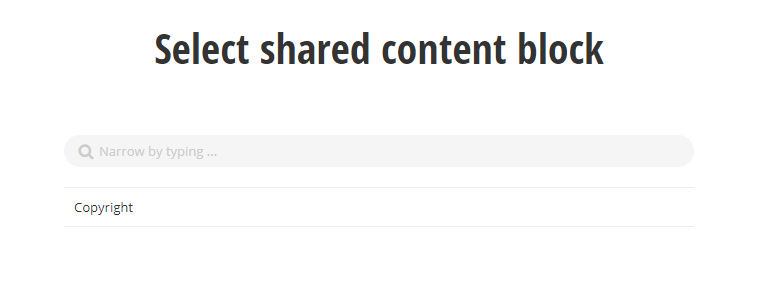
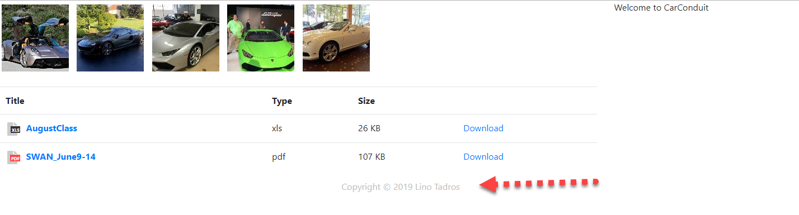
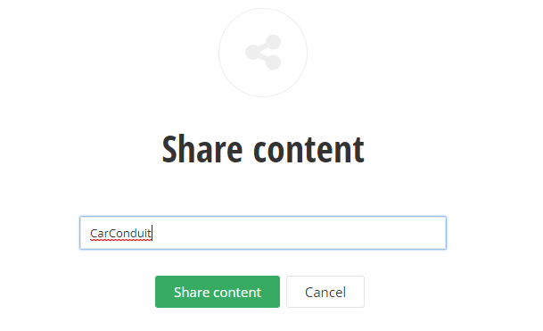

Content Blocks
==============

News, Events and Content Blocks are similar to one another with only
minor variations. The simplest item of the three is the Content Block
which contains only a title and some HTML. Content blocks can be
shared across multiple pages, just as with any other content, or can
be ad-hoc, one-off material used in a single Content Block widget on a
single page.

The HTML for the content block can range from blocks of legal language
to images and links, anything you want to include in various places on
your site that needs to be maintained in a single spot.

##### Create a Content Block from the Content Menu

If you want to create a content block that can be shared among pages
and maintained from the Content menu:

1.  Drop down the Content menu and select Content blocks.

2.  If this is the first time visiting the Create a Content Block page
    you will see the \"No Content Blocks have been created yet\"
    message. Click the Create a content block link. This will display
    the Create a content block page.

3.  Enter a Title. Below the title area, enter any text or HTML content
    in the HTML Editor.

4.  Click the Create this content block button.

5.  In place of the \"No Content Blocks have been created yet\", the
    items will display in a list that shows the item Title, a drop-down
    list of Actions, where the content block is being Used, the Owner
    and the Date.

Use a Shared Content Block
--------------------------

To use a content block that has already been created:

1.  Click the Pages menu item

2.  Add a new page or reuse an existing page. Click the page link to
    edit the content. Drag the Content block widget to the page.

3.  Click the MORE dropdown of the Content block widget.  Choose **Use shared**

4.  You will see a list of content items. Select an existing content
    item, then click the Done selecting button to return to the edit
    page.

5. The Content block widget title indicates that the content is shared.

7.  Click the Publish button.

8.  View the page and the new content.

Create Shared Content from the Content Block Widget
----------------------------------------------------

You don't need to navigate to the Content menu to create shared
content blocks. You can create and share them directly from the
Content block widget by following these steps:

1.  Drop a Content block widget on a page.

2.  Edit your content using the editor.

3.  From the MORE dropdown, pick the Share option from the dropdown.

4.  Enter a Title for the content block, then click the Share this
    content button. The content will now be available in the list of
    shared content from the Content \> Content block menu option.

#### Next Topic
[Email Campaigns](../Email%20Campaigns/readme.md)