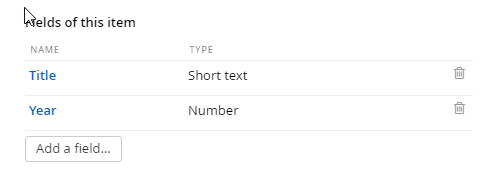
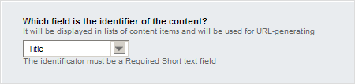
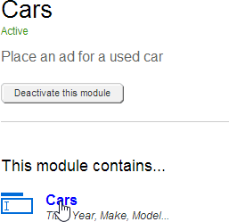
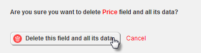
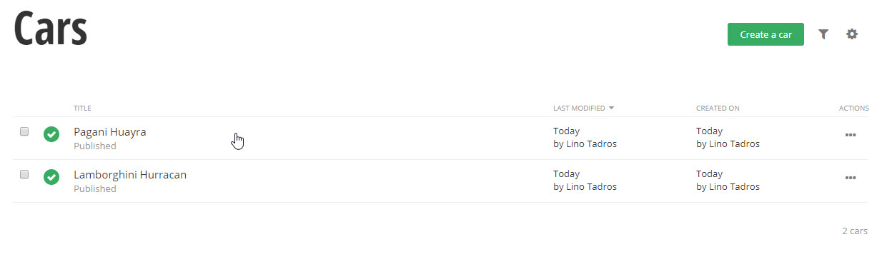
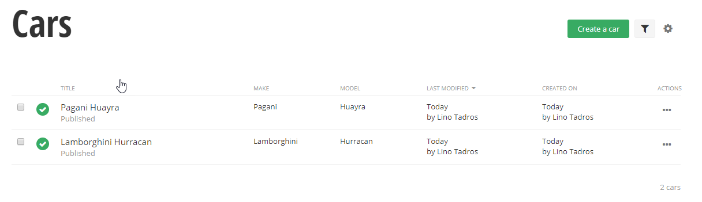
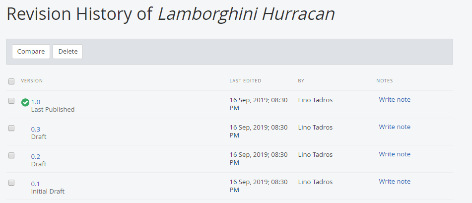
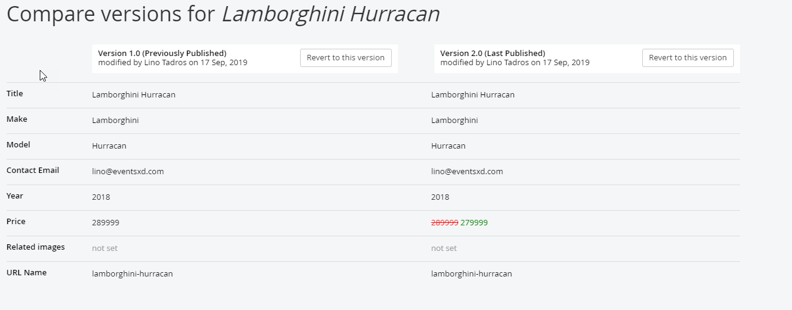

Custom Modules
==============

Sitefinity has numerous content modules right out of the box such as
news, events, and blogs and so on. The built-in types cover many
standard scenarios, but your organization may need to store custom
data, for example \"Press Releases\", \"Stock Quotes\" or \"Employee
Bio\". Such custom types of data are stored in Sitefinity custom
*modules*. Modules allow you to extend Sitefinity with custom content
administration pages and front end page widgets. The administration
back-end pages allow you to enter new data and the widgets display the
data in various formats in your pages.

This section explains how to work with modules that handle custom data
and includes how to create a custom module, add content to the module
and add a module widget to a page. You will also learn how to
customize the columns on the backend grid that displays module data.

Once your module is created, you can temporarily deactivate it from
use without having to delete it. This prevents changes to the module
while preserving module data. You can also export the entire module
along with any data that it has or just the module structure by
itself. In this way you can import the structure to another Sitefinity
site without having to describe all the fields of the module by hand.
You can also completely delete a module and it will vanish from the
site.

The steps to create custom content types and use those types in a page are:

1.  Create an Dynamic custom module

2.  Add module content

3.  Add the module widget to a page

Create a New Custom Module
----------------------------

These steps demonstrate how to create a new module that lists used
cars for sale similar to a Craigslist or classified ad entry. Each
entry will have a *Title*, *Year*, *Make*, *Model*, *Image*, *Price*,
*Contact Email* and *Notes*.

1.  From the Sitefinity main menu select Administration \> Module Builder.

2.  Click the Create a Module link.

3.  Enter a Name and Description for the module as a whole and click the
    Continue button.

4.  At the top of the Define a content type page that shows next, enter
    the *singular* name of the Content type.

#### Note: 
The Content type entry will automatically fill in the
Developer name of this content type. Developers can use this name to
work with your data in a program. You can alter the developer name,
but be sure to remove any spaces if you do.

The Parent content type can be specified if you have another custom
content type that the current entry should fit under. For example, if
you had another content type called *Want Ads*, this could be a parent
content type of *Car*.

5.  Below the content type is an area for adding a list of fields used
    to store the content. By default, the standard content Title is
    already in the list.

    a.  Click the Add a field\... button.

    b.  Enter the Name of the field (again without spaces). For this
        example use the name *Year*.

    c.  From the drop down list, select the Type of data this field
        represents. This example describes the *Year* field as a Number.
        Leave the Interface widget for entering data at its default.

6.  There are at least two interface widgets listed for each type. The
    first editor in the drop down list is the built-in editor for the
    type, such as a Textbox for a Short text type. Leave the default
    selection.

7.  Click the Continue button to finish defining the field.

8.  After hitting the Continue button on the Add a field dialog, a new
    dialog shows in its place to define the interface widget. In the
    example below the Number box requires a Label that will be shown on
    the widget and Instructional text that will show as a prompt. Select
    the This is a required field checkbox to force entry in this field.

9.  Click the Limitations link. The limitations area allows you to put
    constraints on what you allow entered in a field. The limitations
    you can apply vary depending on the type of field. The number box
    editor allows a simple Min and Max limit on allowed values. Click
    the Done button to finish creating the field.

10. The Fields of this item area shows the new custom *Year* field.

11. Add the fields with the following names and properties:

    d.  Name: *Make*, Type: Short text

    e.  Name: *Model*, Type: Short text

    f.  Name: *Image*, Type: Related media (images, video, files), What
        kind of media: Images.

    g.  Name: *Price*, Type: Number, Unit: \$

    h.  Name: *ContactEmail*, Type: Short text

Now the fields should look like the screenshot below.

#### Note: 
The image selector limitations in the Add a field dialog
includes a throttle for the number of images that may be uploaded,
their size and their type (for example \*.png or \*.jpg). You should
carefully consider what should be allowed and place limits that don't
allow users to exceed these requirements.

12. Once all the fields are defined, select the field that will be used
    as the identifier of the content from the drop down list. The drop
    down list will only show Short Text fields that are marked as
    Required. Leave the *Title* as the identifier of the content.

13. Click the Finish button to create the module.

14. Click the Activate this Module button. The page for your module will
    include an option to Deactivate the module, go back to add or edit
    fields, and edit the Name and description of the module. The Backend
    screen tweaks option determines how the module records are displayed
    and how the screen to create or edit a module record is displayed.

15. The module will now appear in three locations in Sitefinity.

-   Administration \> Module Builder: Use this option to add or change
    fields, edit the name and description, make changes to the backend
    screens and to activate/deactivate the module.

-   Content \> \[your module name\]: Use this option to add, update and
    delete data for your module, and to publish/unpublish rows of data.

-   The right hand menu of widgets on each page designer will include an
    icon that represents your module data. Drag the widget to the page
    to present the new dat[]{#_bookmark25 .anchor}a.

Editing Custom Modules
----------------------

If you need to add or delete fields, click the link or the content type.

Be aware that if you delete a field, the operation will remove the
field and any data that was entered into it.

There is no direct way to edit the type of a field, say change a short
text to a long text, but you can delete a field and then re-add it and
assign a new type.

Working with Module Content
---------------------------

From the Content menu select your new content item. This example shows a new *Cars* menu item for module of the same name.

The first time you enter the screen you will see a \"Create a \[my
module type\]\" link that you can click to create a new item.

Enter the fields you defined when creating the module. When complete,
click the Publish button.

{

After adding several entries, you can see the actions and stock
columns *Author* and *Publication Date* that come along with all content.

Customize the Grid List of Module Content
-----------------------------------------

To add columns to the listing, first navigate to Administration \> Module Builder, then click the module you are interested in. In this example we will click the custom Cars module created in previous topics. Then click the Backend screen tweaks link.

Click the Add / remove columns in the table (grid) button.

The Existing columns will allow you to drag and drop the columns in
any order you want to see. The custom fields are listed on the right
side and can be dragged into any column of the grid. In this example,
the Make and Model are dragged in just after the Title column. When
you have the arrangement of columns that you want, click the Save
Changes button.

Now you can apply a custom sort on your data as shown in the
screenshot below that is sorted first by Make and then Model.

Revision History
----------------

Each content item for your custom module has a revision history so
that you will know who changed the data, when the change occurred and
what data fields were altered. You can view the history from inside
each Module Builder module. To see revision history for a custom module's content, select the module from the
Content menu. Locate the record you're interested in and select
Revision History from the drop down Actions menu.

The revision history will have a version item for each time the record
has been edited. From this list you can quickly see how many edits
occurred, who made the edits and when.

Click the Write note link to include background or justification for
the change. Click the Save button to keep your changes with the
revision.

The notes appear in the listing of revisions.

To find out exactly which field data was changed, select two revisions
using the checkboxes and then click the Compare button.

While the revision note is the change the person editing record
*thought* they made, the comparison highlights each actual data
change. The example below shows that "279999" was changed to the Price in
the latest revision. If someone incorrectly edits a record, you can
click the Revert to this version button to roll back changes to an
earlier time.

Add the Module to a Page
---------------------------

1.  Drag the widget for your new module onto the page.

The module will be listed using the default configuration and layout.
The example below shows all published cars in a list and the layout
for each item shows the Title and published date.

2.  Publish the page.

3.  View the completed page.

4.  Click one of the items to see the detail.

#### Next Topic
[Localization](../Localization/readme.md)