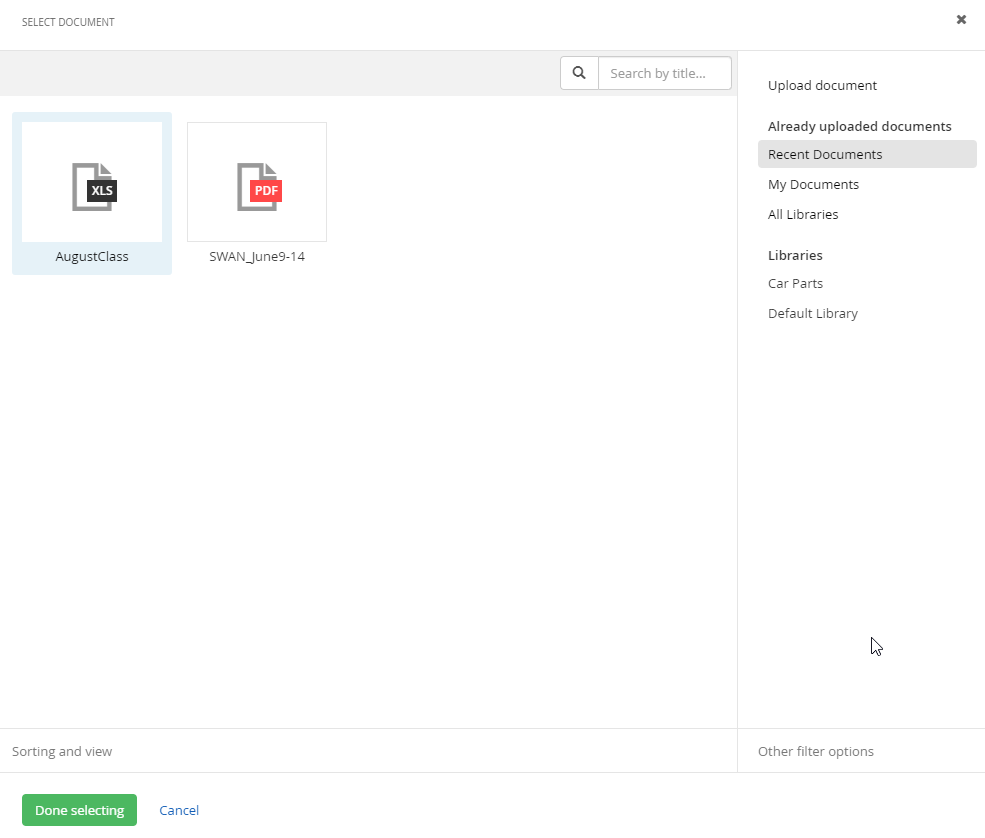
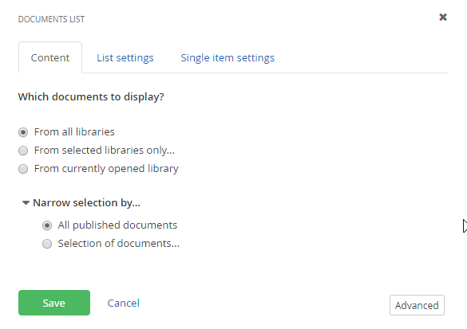

Documents & Files
=================

Use Documents when you want to include a link to a PDF, Word, Excel or
other file. Documents are contained in Libraries. You can display
links to a single document or all documents in a library.

##### Create Libraries and Documents

1.  From the administration menu Content, select the Documents & Files option.

2.  Click the Create a library link.

3.  Enter the Library name. Select the Click to add a description link
    and enter some descriptive text there.

4.  Open the Root Library settings area. You don\'t want huge file
    uploaded to the server hard drive. Pick a maximum size, for example
    2 MB, per file and enter it as the Max document/file size.

5.  Click the link to your new library to open it.

6.  Click the Upload documents and other files button.

7.  Click the Select document from your computer link.

8.  Navigate to a file and select the file.

9.  Click the Add more documents button and select another type of file.

10. Click the Upload and Publish button.

11. Click the View all items button. Click the link for the library you
    just created. The screenshot below shows a Word and a PDF file
    listed in the library. Sitefinity detects the type of files that are
    uploaded and displays the matching icon.

12. Click Embed link to this file of the first file in the list. This
    link can be used to paste into an email.

13. Close the window.

Add Document Links to Pages
-----------------------------

How do you add a link to a document or show a list of documents on the page?

1.  Click the Pages menu item.

2.  Open the *Welcome* page for editing.

3.  Drag a Document link from the Content widgets to the bottom of the
    page, below any of the other widgets or boxes on the page. This will
    automatically create a new area on the page.

4.  Click the Document link widget Edit button. This brings up the
    Document dialog.

5.  Click the Select document.

6.  Select one of the files and click the Done button.

7.  Click the Save button.

8.  Click the Preview button. The link displays along with an
    appropriate icon. Click the document link. Depending on the default
    behavior and configuration of your browser, the document may display
    in the browser or prompt to download.

9.  Close the preview.

10. Delete the Document link widget from the page using the More \>
    Delete link.

11. Drag a Documents List widget to the bottom of the page. By default,
    the list will show all the documents from all libraries.

12. Click the Documents List widget Edit button. Using the dialog, you
    can include all documents, from a selected library or from the currently opened library. 

13. Click the List Settings link to manage the layout details of the widget. The documents can be sorted by Last published, Last
    Modified, As they are ordered in library and As set in Advanced mode.

You get to choose between a list or a table view under the List Template

-   The Table option arranges the document information in a grid with the
    link to the right side of each entry.

14. Click the Save button to close the Documents list dialog.

15. Publish and view the page.

#### Next Topic
[Forms](../Forms/readme.md)