ECommerce
=========

##### Build the Products Catalog

> Before you can build a shopping page, a shopping cart and a checkout
> page, you need to setup a catalog of products you want to sell. The
> Ecommerce menu lets you define Products (T-Shirt, baseball cap), Types
> of Products (shirts, hats), and Departments (Clothing, Mens, and
> Womens) and Attributes (size, color).

##### Departments

> Departments are used to group products. In an example where we are
> selling caps and t-shirts, the department could be *Clothing*.
> Departments are hierarchical, so you could, for example, also create
> sub departments for *Mens*, *Womens*, *Girls* and *Boys* under the
> *Clothing* department.
>

1.  To get started, click the Departments menu item.

2.  Click the Create a department link to create the first item. Enter
    the name of the department. You can also add a Description or
    customize the URL (not shown in the screenshot below). Then click
    Create and add another button.

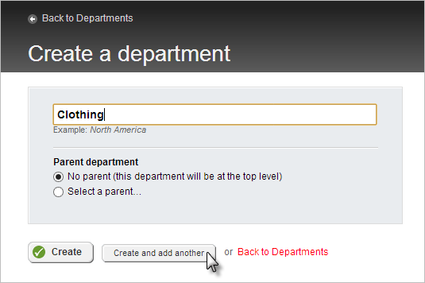

3.  To add a department below Clothing, enter the name of the new
    department, click the Select a parent radio button, and then select
    the Clothing from the list. Click the Create button.

4.  Create as many departments as you need to organize your products,
    then navigate back to the Departments page. The figure below shows
    Mens, Womens, Boys and Girls departments under the top level
    Clothing department.

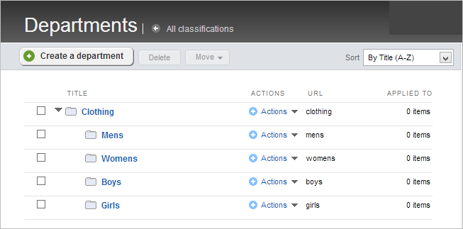

##### Types of products

> Product types help describe how a certain group of products will be
> delivered to the customer. The product can be a traditional shippable
> product, but could also be a downloadable product like software or
> music or even a service or other non-shippable product like a
> subscription.
>
> Fields are added to the product type to describe it further. By
> default, product types start out with Tags and Department fields. Your
> own custom fields take the place of product labeling such as brand
> names, manufacturer codes, ingredients, classifications and codes.
> Using the example of a t-shirt, you could add a brand name, country of
> manufacture, type of fiber and washing instructions.
>
To create a product type:

1.  First select Types of products from the Ecommerce menu

2.  Click the Create product type button.

3.  Enter the Name and the plural Name of the product type. Using the
    radio buttons under This type contains\..., choose how the product
    type should be delivered to the customer. Click the Create this
    product type and go define its fields button. The screenshot below
    shows a *Shirt* product type that will be delivered by conventional
    shipping.

4.  In the Product Fields page, click the Add a field\... button.

5.  Select the Type of data from the drop down list and enter a Name.
    The name must contain blanks. The field in the screenshot below is
    named *Brand* and is the default Short text Type of data. Click the
    Continue button to go on to the Settings page.

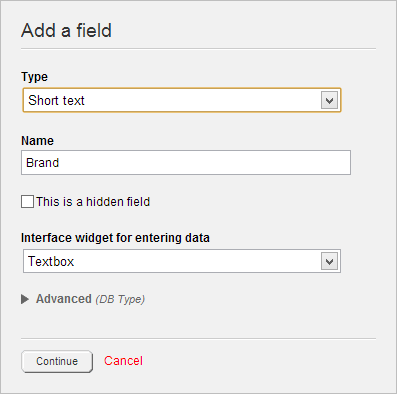

6.  The Settings page has three tabs for defining how the field looks
    and behaves in Sitefinity. In the Labels and text tab, provide a
    Label that will be used when entering data for the product. The
    Instructional text will be displayed below the textbox for the
    field. You can add a Predefined value as a default. Select the Make
    required checkbox if this field must be filled. The Limitations tab
    is used for numeric and date fields to restrict what can be entered.
    The Appearance tab controls where the field will be shown.

7.  Click the Done button when you\'re finished defining the field.

8.  Add as many fields as you need to describe the product. Then click
    the Save Changes button. This will return you to the Product types
    page.

##### Attributes

> Products have traits like color or size called *attributes*. A
> t-shirt, for example, can come in small, medium and large sizes and
> also can be red, blue or green. Sitefinity can keep track of these,
> even to the point of tracking inventory for each combination. To
> define attributes:

1.  From the Ecommerce menu select Attributes.

2.  Click the Create an attribute link or button.

3.  Enter the name of the attribute. In the This attribute can be
    applied to area, select only the product types where the attribute
    makes sense. In the screenshot, the Color attribute applies to the
    Shirt product type, but not to Software or Song. Leave the other
    defaults and click the Create this attribute button.

4.  Now the Create a value page displays. Enter a Value, then click the
    Create and add another button. The screenshot below shows Red added
    as a value of the Color attribute. Click the Back to values link
    when you\'re done.

> Enter a Description if the value itself is not self-describing. For
> example, the screenshot below show a Size attribute\'s M value stands
> for medium.

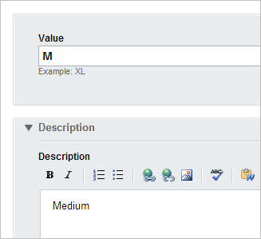

5.  The values are listed under the attribute. Click the All attributes
    link to continue defining attributes.

6.  In the Attributes page, create as many attributes as needed to
    describe all the products you want to sell. The list of attributes
    in the screenshot below shows a summary of the values, and what
    product types the attribute applies to.

##### Products

> Now that Departments Types of products and Attributes are defined, you can define
> the individual products. To create the product, you will need to have
> the product name, description, information for any of the fields that
> you defined, the shipping weight, the department that the product is
> part of, price and SKU (stock keeping unit). You may also want to get
> images of each product and have them available on your computer or
> upload them to an image library before defining products. The example
> that follows will create a t-shirt product in several different sizes
> and colors. To create a new product:

1.  From the Ecommerce menu select Products.

2.  You will have a choice of product types to start from. The
    screenshot below uses the Shirt product type.

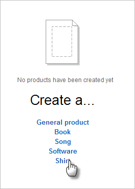

3.  In the first block of information you need to enter the product
    Title and Description, the shipping Weight of the product.

4.  The next block of entry includes the Departments and Tags. Select
    the Departments and sub departments that the product is part of and
    any Tags that will help people find the product. In the screenshot
    below, the *Clothing* and *Mens* departments are selected.

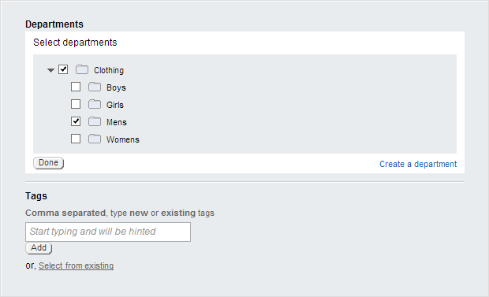

5.  Next, define the Price, SKU and inventory options for the product.
    The monetary units for the price can be adjusted later in the
    Ecommerce [[ Configuration]{.underline}.](#_bookmark22) The SKU
    (Stock Keeping Unit) can use the numbering system for your store.
    Sitefinity will keep track of basic inventory. The Track inventory
    radio button option allows you to enter a Quantity for all products,
    regardless of variations (such as color or size). You also have the
    option to Display the product, even if you\'re out of stock. If you
    want to allow back orders, also check the Allow orders even if not
    available option. The Track inventory by variations radio button
    will allow you to enter quantities later for each variation
    combination.

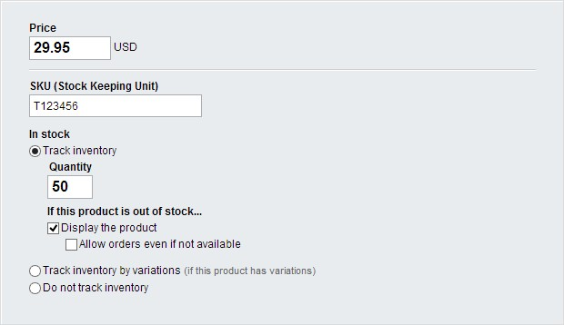

> Optionally, you can define Tier Pricing to encourage buyers to buy
> larger lots of product and Sale price for a certain period of dates.
> You can specify that the sale period start and end at specific times
> of the day.

6.  Images really help sell the product. The next block of entry allows
    you to enter multiple images and documents. In the screenshot below,
    four t-shirts images display. Any one of the images can be tagged as
    Primary using the drop down Actions button. The Products List widget
    that will display on a page shows all the images, with the Primary
    image displaying larger and above the others. Use the Documents and
    other files button to upload documents for the customer that
    describe some aspect of the product in great detail, such as
    ingredients, manufacturing details or electronic specifications.

7.  The More options section has a useful Role drop down. When the
    product is purchased, the role is assigned to the user, potentially
    giving them access to downloads or other resources.

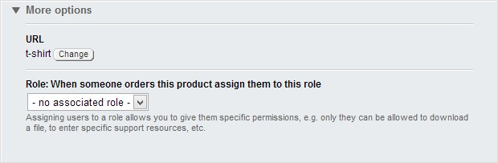

##### Build Shopping Pages

> Before trying to build shopping pages, your Sitefinity administrator
> needs to perform [configuration steps]{.underline} that support the
> shopping experience, including setting up the store, payment methods,
> shipping methods and taxes. Once the configuration is complete you can
> create the shopping pages. Minimally, to create a Sitefinity shopping
> experience you need:

-   A products page that contains a Product list widget. This is the
    page visitors will use to shop and select products. This page will
    also contain a Shopping cart summary widget used to navigate to the
    shopping cart page.

-   A page containing a Shopping cart widget. The shopping cart will
    display selected products, quantities and totals. The user can
    select the Continue shopping widget to navigate back to the products
    list page or click the Checkout button to navigate to a checkout
    page to place their order.

-   A page that contains a Checkout widget. The Checkout widget is a
    wizard that walks the user through 5 steps: Shipping information \>
    Shipping options \> Payment \> Preview \> Confirmation.

> To build a page that allows shopping using configured ecommerce items,
> first add all three pages:

1.  Select Pages from the Sitefinity menu.

2.  Create three pages and name them *Products List*, *Checkout* and
    *Shopping Cart* respectively.

 Now build the *Products List* page.

1.  Select the Edit Content action from the menu next to the *Products
    List* page.

2.  Drag a Shopping cart summary widget to the top of the page.

3.  Click the widget's Edit button.

4.  Under the Link to checkout page, click the Select a page button and
    choose the *Checkout Page* you created in step 2.

5.  Under the Link to shopping cart, click the Select a page button and
    choose the *Shopping Cart* you created in step 2.

6.  Leave the Link to Product list page (you are already on the Product
    list page).

7.  Select 200x200 from the Size of thumbnails drop down list.

8.  Drop down the Shopping cart summary template and select Simple link.

9.  Click the Save button to finish configuring the shopping cart
    summary widget.

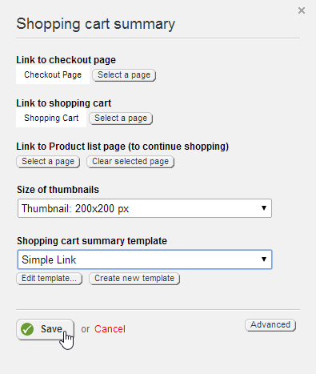

10. The shopping cart summary widget now shows a minimal link at the top
    of the page.

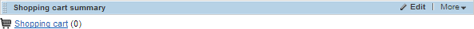

11. Drag a Products List widget from the Ecommerce section onto the
    page, below the shopping cart summary. Leave the default settings.
    This will show all the products you have available in the catalog.

12. Click the Publish button.

The next step is to build the shopping cart page:

1.  Select the Edit Content action from the menu next to the *Shopping
    cart* page.

2.  Drag a Shopping cart widget onto the page.

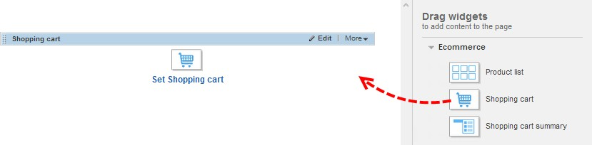

3.  Click the widget's Edit button.

4.  Under the Link to checkout page, click the Select a page button and
    choose the *Checkout Page* you created previously.

5.  Under the Link to Product list page, click the Select a page button
    and choose the *Product List* page you created previously.

6.  Select 200x200 pixels from the Size of thumbnails drop down list.

7.  Leave the other defaults and click the Save button.

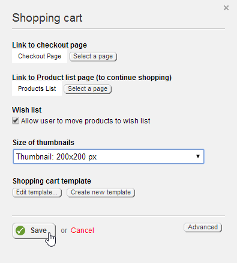

> The shopping cart widget should display on the page, but there are no
> products in the cart yet.

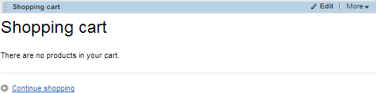

> The last set of steps implement the checkout page.

1.  Select the Edit Content action from the menu next to the *Checkout*
    page.

2.  Drag a Checkout widget onto the page.

3.  Click the widget's Edit button. Notice that there are templates you
    can use to customize each step of the wizard, from shipping to
    confirmation. Also notice the option to send the merchant a copy of
    the confirmation email and the option to allow anonymous users to
    place orders. Leave the defaults and click the Cancel button.

4.  Click the Publish button.

##### Test the Shopping Pages

> These next steps test the usability of the shopping pages by choosing
> products, going to the shopping cart and finally placing the order.

1.  Click the Live site button.

2.  Add *products-list* to the browser path. The screenshot below shows
    an example (although the number following "localhost" will likely be
    different when you run it).

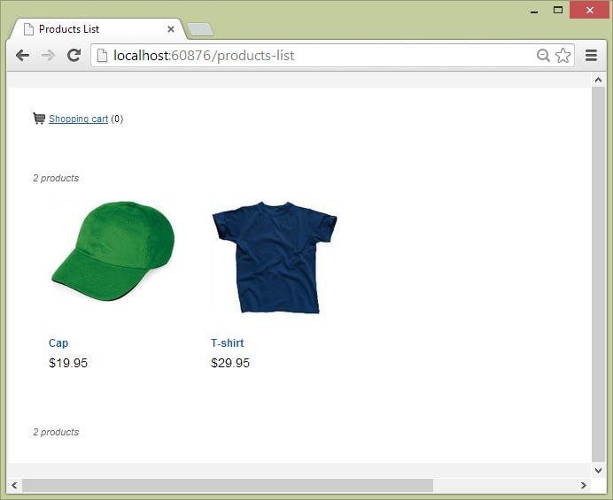

3.  Choose a product and click on the image or the title link.

4.  Click the Add to cart button. Notice that the Added to shopping cart
    message appears and the Shopping cart link shows a quantity of 1.

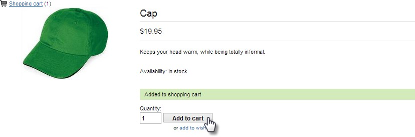

5.  Click the Shopping cart link. This step navigates to the shopping
    cart page. Notice the Continue shopping link that navigates back to
    the products list page and the Checkout button that navigates to the
    checkout page. Click the Checkout button.

6.  The checkout page is a 5-step wizard that starts by collecting
    shipping information. Enter the required shipping address
    information and click the Continue button.

7.  The Shipping options step includes one or more [ Shipping
    Methods]{.underline} setup by the Sitefinity administrator. The
    screenshot below shows that only one shipping method *FedEx Ground
    Shipping* has been configured. Notice that Tax has been included in
    the order summary. [ Taxes]{.underline} are also configured by the
    Sitefinity administrator. Click the Continue button.

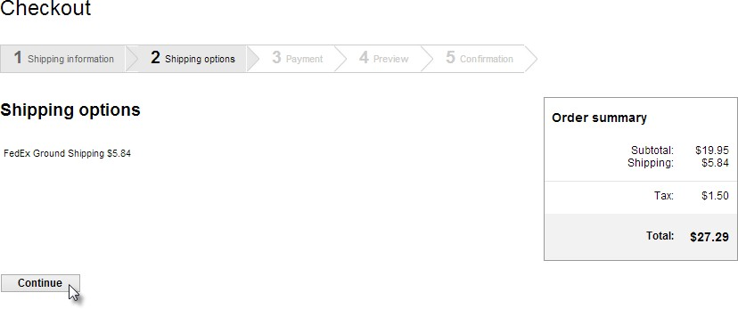

8.  The Payment step includes one or more [ Payment Methods]{.underline}
    setup by the Sitefinity administrator. The screenshot below show
    methods for Offline payment and Credit Card. Click the Continue
    button.

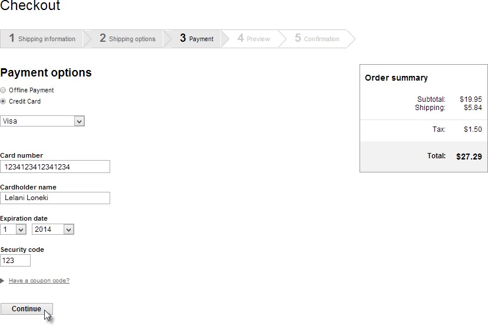

9.  The Preview step allows the customer to see the entire order
    including the total amount, payment details, shipping and billing
    addresses.

#### Important note! 
> Be aware that you may be using "live" shipping and
> payment methods depending on how the Sitefinity administrator
> configures Ecommerce options. For example, the
> administrator can set up a test shipping account to FedEx that sends
> email but does not actually try to ship product.
>
> On the other hand, if the shipping and payment options are configured
> with live accounts then you may be charged with shipping fees and
> credit card amounts.

10. If you are comfortable with the order details at this point, click
    the Place this order button.

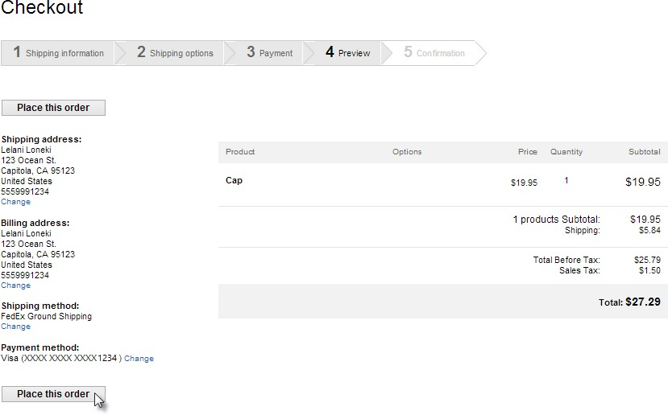

11. The Confirmation step displays a message that the order has been
    placed successfully.

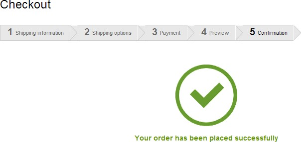

##### Order Management

> The Order Management section of the Ecommerce menu includes options
> for Customers, Orders and Reports. The Customers item list names of
> people that have placed orders, the amount of money spent, number of
> orders and the number for the last order completed.
>
> The Orders option lists each order by number and its current status.

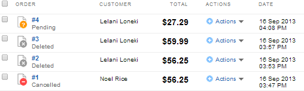

> From the Orders list you can use the Actions menu to delete the order.
> This changes its status to Deleted but does not completely remove the
> record. To see the current order details and status history, click the
> order number link.
>
> The text to the right side of the order information is the current
> status of the order in large text and a list of statuses and dates
> listed below the current status (see the screenshot below).

> The Reports option includes a list of inventory and sales reports on
> the left bar.

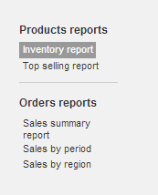

> The Inventory report and Top selling report are displayed as a grid.
> The Export... button on top command bar creates a comma delimited file
> (.csv) of the information.

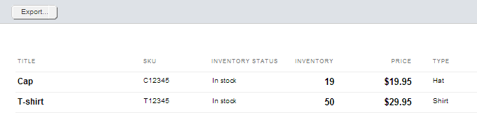

> The Sales Summary report shows a high-level view of all the orders
> completed within a certain period of time. The Select Period drop down
> list can be set to Today, Yesterday, Last 7 Days, Last 30 Days, Last
> 90 days and a Custom period between two dates. The cumulative number
> of orders, subtotals, taxes, shipping, discounts and total sales are
> summarized at the top, a line chart shows in the center of the report
> and a detail grid by date displays at the bottom of the report.
>
> Both the Sales by period and Sales by region reports are displayed in
> a grid and can be exported in any selected format including comma
> delimited (csv), adobe (pdf), Excel and
>
> Word. The Sales by period report requires a Currency. Start and End
> dates will default to the current date and a month from now.

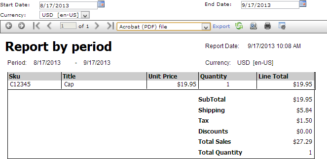

> The Sales by Region report wants a region selected from the drop down
> list and also a currency.

