Email Campaigns
===============

Email campaigns are used for appropriate mass mailings such as
newsletters, announcements and time-sensitive marketing. An email
campaign has one or more *issues*, where each issue is the actual
email sent out to users. For example, a monthly newsletter campaign
can have issues for each month, such as the *January Issue* of the
*Monthly Newsletter* campaign.

The content for an issue can be as refined as a web page built by a
professional designer, a complex rich-text document or simple
plain-text content accessible from any email client. You can create
personalized content for the email using the same process you already
use to create pages in Sitefinity.

You can enter the list of users manually, target users already
registered with your site or import from a spreadsheet. Email
campaigns are not simple, one-way blasts but allow sophisticated
tracking of the customer's reaction using mechanisms like A/B
campaigns that record two different email versions and track which
messages are opened and what links are clicked through

.

Use the administration Marketing menu to define a campaign using a
mailing list, content and how and when the email will be sent. The
options for creating email campaigns are shown in the screenshot.

As campaign issues go out, email campaign reporting details how the
email was received; how many were delivered, opened and clicked
through.

##### Subscribers and Mailing Lists

Subscribers form the pool of addresses that you can send email to.
Each subscriber has a first name, last name and email address. Mailing
lists are groups of subscribers where subscribers can be on more than
one mailing list. You can get a list of subscribers automatically by
using the email addresses of users already on your site or from people
that have responded to forms. You can also import subscribers from
spreadsheet files or by adding them individually using the Subscribers
menu option.

The Subscribe widget can be added to a page that site visitors can use
to "opt-in" and decide to become subscribers. A matching Unsubscribe
widget can be placed on another page to allow subscribers to opt-out
of a mailing list. These last two options give your site visitors
control over the email they receive and allow you to place content
where it will be well received and get the best reaction.

##### Creating a Mailing List

To launch a campaign, start by creating a mailing list of subscribers.
This walk-through demonstrates how to initially setup your mailing
list first by adding a single subscriber manually and then by adding
more subscribers using a spreadsheet file. The spreadsheet file can be
either comma delimited values (\*.csv) or tab delimited (\*.tsv). In
the example, you'll see how to create a comma separated values file
(\*.csv) in notepad. Note that you can also create \*.csv files in
spreadsheet applications like Excel.

1.  Using Notepad, create a file called *Subscribers.csv*. Open the file
    and copy the data below into the file. The first row represents the
    header of the data. The last three rows are made up of email
    address, first name and last name.

### Email,First,Last rjones\@gmail.com,Riley,Jones pksmith\@gmail.com,Percy,Kant tborialis\@whitehall.uk,Terrance,Borialis

2.  From the Marketing menu item, click the Mailing lists menu option.

3.  Click the Create a mailing list link.

4.  Enter the Mailing list title *CarConduit Monthly Newsletter*.

5.  In the Mail settings area, enter a From name *CarConduit*. In the
    Subject enter

*Monthly Newsletter*. In the Reply-to email enter
[*reply\@cardconduit.net*.](mailto:reply@cardconduit.net) Leave the
Unsubscribe page alone for now.

6.  Leave the Advanced section default and click the Create this mailing
    list button. The new mailing list shows on the Mailing lists page
    showing that it has zero subscribers and has not been used for any
    issues of the campaign.

7.  From the Actions menu, select the Create new option from the
    Subscribers section.

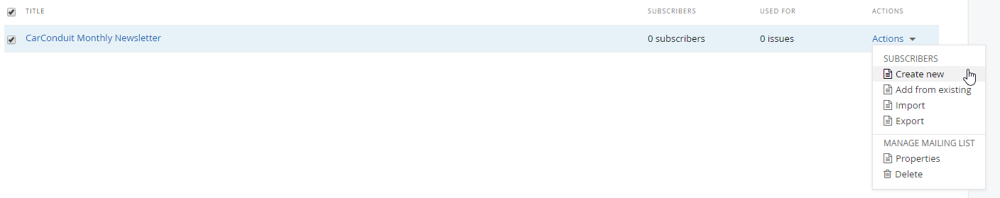

8.  Enter a First name, Last name and Email address. The *CarConduit
    Monthly*

*Newsletter* is already selected as one of the mailing lists to
subscribe to, so leave that setting as-is. Click the Create this
subscriber.

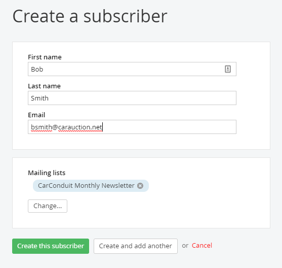

Notice that the Subscribers column now has a single entry.

9.  From the More actions menu, click the Import subscribers option.

10. In the text box at the top of the dialog, use the Browse button to
    locate and select the *Subscribers.csv* you created in step 1. Leave
    the default file format

(Comma separated), columns to use (first, second and third) and Skip
the first row (checked). In the Mailing lists section, click the
Select mailing lists button.

11. Check the *CarConduit Monthly Newsletter* box and then click the
    Done selecting button.

12. Leave the remaining defaults and click the Import button.

13. The Subscribers column now shows a link for 4 subscribers. Click the
    link.

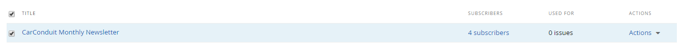

The manually added subscriber is now joined by the three imported
email addresses.

14. Click the Close button.

##### Creating a Campaign and First Issue

Creating the campaign brings the content and the mailing list
together. Somewhere in your email you should have a "call to action",
usually a link that the reader will click. In this example, there will
be a fictitious car show that will have a registration link. Having
links and tracking of those links allows you to asses a measurable
payback from the campaign.

1.  Click the Marketing \> Campaigns menu option.

2.  Click the Create a campaign button.

3.  Enter the Campaign name as *CarConduit Monthly Newsletter*.

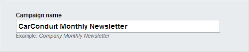

4.  In the Template section, leave the Start from scratch and Like a web
    page options selected.

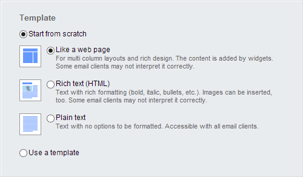

5.  In the Default mail settings, click the Select a mailing list
    button.

6.  Select the *CarConduit Monthly Newsletter* and click the Done
    selecting button.

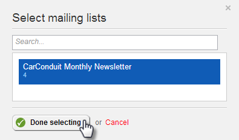

The From name and Reply to email fields are filled in automatically.

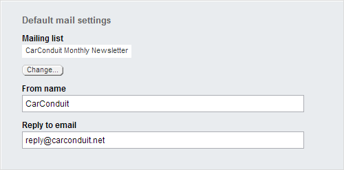

Leave the Enable Google tracking box checked. This option is important
for tracking subscriber reaction to the email.

7.  Click the Create and go to add the first issue button.

8.  In the Issue name text box enter *First Issue*. In the Message
    subject enter *CarConduit's First Monthly Newsletter!* Leave the
    other defaults and click the Go to add content button.

The content editor for campaign issues looks very much like those for
standard pages. You have Content and Layout buttons that switch
between views and a limited set of widgets that can be dragged from
the right hand menu. There are a few key differences. Instead of
publishing the content, the Send this issue button makes the issue
live. Over on the right hand side, the Plain text button can be used
to either automatically generate a plain text version or a plain text
version entered manually.

9.  Click the Layout button.

10. Drag a 75% + 25% layout element to the top of the page.

11. Drag a 100% layout element below the first row.

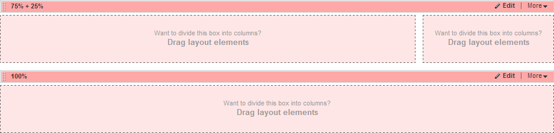

12. Click the Content button.

13. Drag a Content block widget to the left side of the top row.

14. Click the content block's Edit button.

15. Paste the following text into the HTML editor.

Welcome . In this issue:

The latest innovative technologies Classic car of the month
Restoration tips and tricks

LA Muscle cars

Are you a gearhead?

16. Put the text cursor just after the *Welcome*. In the drop down list
    of fields, make sure that First name is selected, then click the
    Insert button. The text should look something like the example
    below.

17. Select the last five items, then click the bullet points button.

18. Click the Save button.

19. Drag an Image widget to the upper right of the page. Use an image
    from your computer's hard drive and set a custom size with a width
    of 100 and the height to be adjusted automatically.

20. Add a second Content block widget to the bottom container on the
    page. Click the Edit button. Click the More formatting options
    button.

21.  In the top line of the dialog's HTML
    editor, add the text *LA Muscle Car Show*, select the text, then
    open the style drop down list and select the Heading 1 style. Then
    click the Align Center button.

22. Add a new line that states *Be sure to reserve a spot at the LA
    Muscle Car Show sponsored by CarConduit*. Highlight the *LA Muscle
    Car Show* portion of the sentence and then click the Hyperlink
    Manager  button. Provide a web address, then
    click the Insert the link button.

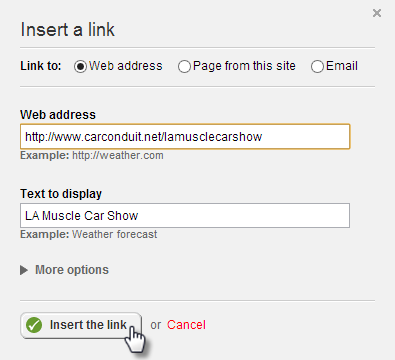

23. Click the Save button.

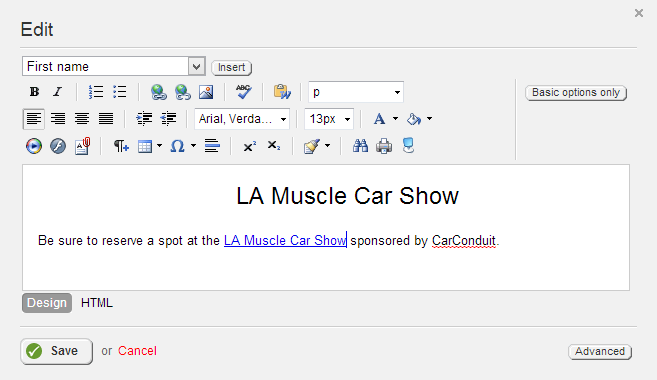

24. The page should look something like the screenshot below.

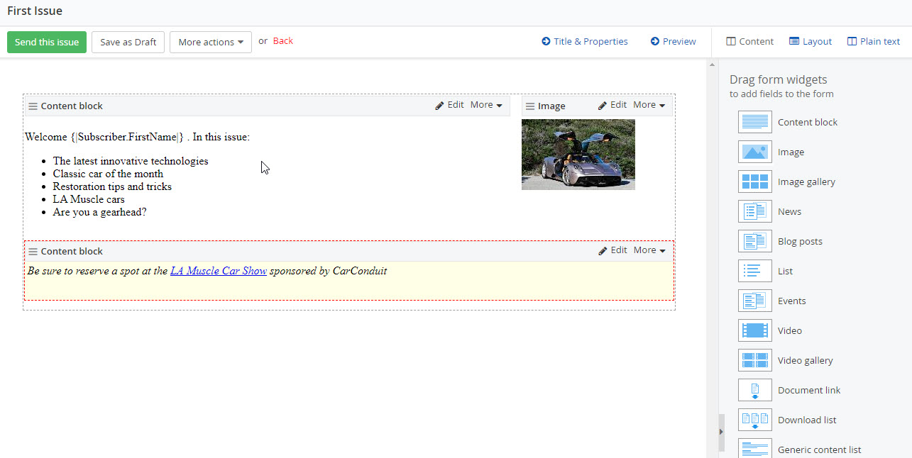

25. Click the Send this issue button. This will send the issue to all
    email addresses in the subscriber list for the campaign.

The email that arrives to the user's inbox will have any substitution
variables replaced, such as the First Name "Bob" shown in the
screenshot below.

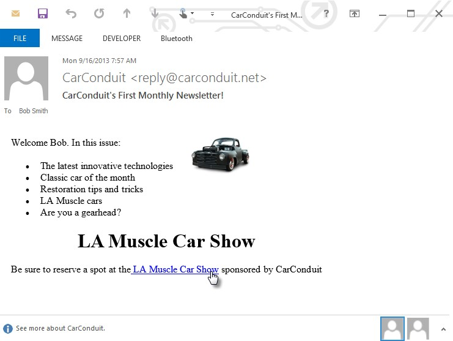

##### Issue Actions

The Send this issue button to sends the email immediately or you can
use the additional operations found under More actions. The screenshot
below shows the operations you can perform against an issue:

##### Send check message

The Send check message option allows you to send the issue as a test
to a single email address or to a list of emails separated with a
comma. If the issue arrives at the email addresses, then you can be
sure that your email configuration is properly setup.

##### Schedule delivery

The Schedule delivery option takes a date and time that the email
should be sent. When you have a future date and time entered, click
the Schedule this issue button.

##### Send an A/B test

The Send an A/B test option allows you to create two versions of the
issue and determine which email is more effective. You send version A
of the issue to a small group of subscribers, and version B to another
small group of subscribers. After the emails are sent, the responses
are measured (using criteria such as number of emails opened or links
clicked) and a winner is decided.

The remaining emails are sent using the winning issue. When you click
the Send an A/B test option, you have the opportunity to use the
content from the original issue or to start from scratch.

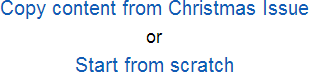

After using one of the above options to edit the content, click the
Send this A/B test button.

The Send an A/B test page displays showing both A and B issues and
provides buttons to edit both issues.

Below the issues editing are options for the entire A/B campaign,
including a Test name to help you recognize a particular test and a
What are you testing? entry that describes what you are expecting to
learn from the test. For example, you might try different variations
of a graphic to see which gets more interest.

The last set of entries in the A/B Test Settings screen determine the
sample size, winning criteria and timing of the test. Use the Testing
sample slider to define the percentage of users that will participate
in the initial A/B test before sending the winning issue. In the
Winning issue section, select if the winning issue will be determined
by having More opened emails or More link clicks. You can decide to
send the test immediately or schedule the test to be sent later.
Finally, in the A/B test end section, pick a date and time that the
winning issue should be determined and sent to the remaining users.

When you have completed your entries, click the Send this A/B test
button.

##### Reporting

The fact that the user opens the email or clicks on links is recorded
and available in the email campaign reporting. To navigate to
reporting for a campaign, click the Email Campaigns \> Campaigns menu
option, then click the link for a specific campaign. The screenshot
below shows opening a campaign link. Notice the short hint below the
link that shows that 3 issues were sent.

After clicking the link, the Campaign Overview Report shows at the top
of the page. The statistics for each issue are shown in an area graph
so that you can easily see how many of each issue were delivered,
opened and clicked through.

Below the overview is a detail list of Issues and A/B tests. Notice
the statistic columns that show how many times each issue has been
sent to a subscriber, delivered, opened or clicked through.

Click the Full report link to get a detailed breakdown of the delivery
rate, unique openings, unique clicks, number of users that
unsubscribed after getting the issue and the percentage of emails that
were opened in the first 48 hours. Each of these statistics is
accompanied by hints on how to improve each statistic.

#### Note: 
If all of your emails are not delivered (bounced), this may
be due to an invalid [email server address]{.underline}. Note that the
email address is typically maintained by the administrator. If only
some emails are not being delivered, this indicates that your list of
subscribers needs to be updated.

Below the overall statistics you can find a list of the last 10
subscribers who clicked through a link in the issue, showing which
subscriber clicked, the URL they clicked and the date and time that
they clicked.

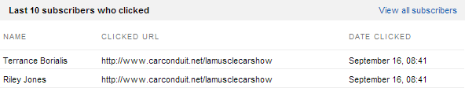

You also get a different cut at the information organized by link.

You get a further breakdown of clicks by hour that may help you adjust
the timing of your campaign. When your mouse passes over one of the
bars in the chart, a popup hint will display the cumulative number of
clicks for each hour.

Click the Report link on A/B Tests to show a breakdown of statistics
for each version of the issue.

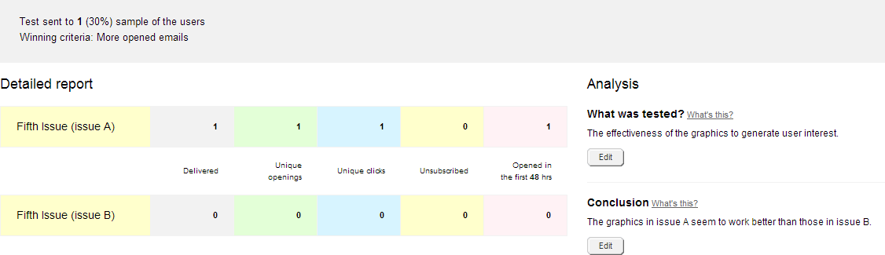

##### Message Templates

When you create a new campaign you have the choice of creating the
format from scratch or using a message template. Message templates
allow you to reuse certain content and update other parts of the email
and to setup a look-and-feel that is consistent across emails. To
create a template:

Navigate to Marketing \> Email Campaigns \> Message templates and then
click the Create a message template link. Enter a Template name and
select the type of template to create. In this example we will use the
Like a web page option. Click the Create and go to add content button.

In the designer, make sure the Content button is selected above the
right hand menu. Drag form widgets from the right hand menu to create
the parts of content that will be in every email.

For example, you may have a brief welcome message and graphic at the
top of the page, an unsubscribe link toward the bottom of the page and
a copyright notice at the very bottom. None of these items should need
to change from one issue to the next.

Now click the Layout button to establish areas on the form where
content that changes with each issue goes. For example, you may want
to add areas that will list the topic overview and the detail for the
email, and you will want that content to go above the unsubscribe link
and copyright notice.

When you create a new campaign, instead of starting from scratch with
a webpage, rich text or plain text, choose Use a template and then
select a template from the drop down list. The screenshot below shows
a new campaign being created using the *Newsletter template*. From
there, click the Create and go to add the first issue button.

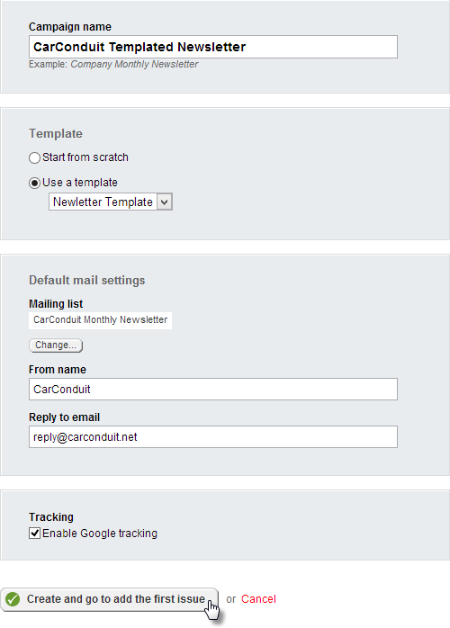

##### Providing a Link to Subscribe

You can allow the user to "opt in" to any email campaign on any page
using the Subscribe form widget. Drop the Subscribe form widget from
the Email Campaigns section to the page. You must click the Edit
button and select a mailing list. Click the Save button when you have
completed entering the Subscribe form settings.

The finished form looks something like the screenshot below.

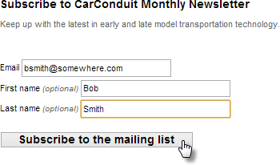

When the Subscribe to the mailing list button is clicked by the user,
their information is added to the selected mailing list.

##### Providing a Link to Unsubscribe

To setup a link in the email that lets the user easily unsubscribe on
their own, do the following:

1.  Create a page with the Unsubscribe widget. You can just drag the
    widget onto the page and publish the page. Optionally, you can click
    the Edit button and change the text.

2.  In the Mail settings for each mailing list, include a reference to
    an unsubscribe page that contains an Unsubscribe widget. You can
    navigate Mail settings using the Actions menu for a mailing list and
    selecting Properties.

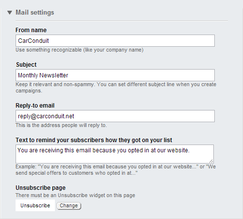

3.  Include an unsubscribe link in your issue content. You can use the
    fields drop down list in a Content Block editor to create the link.
    In the screenshot, the Unsubscribe link is selected and the Insert
    button adds the link to the content.

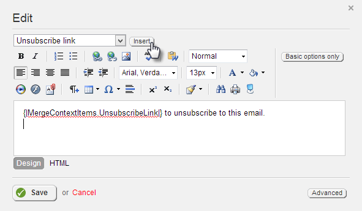

#### Next Topic
[Custom Modules](../Custom%20Modules/readme.md)