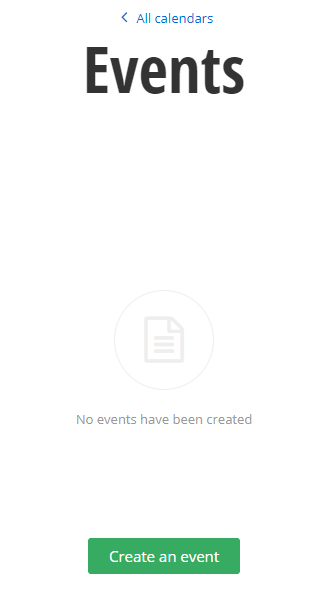
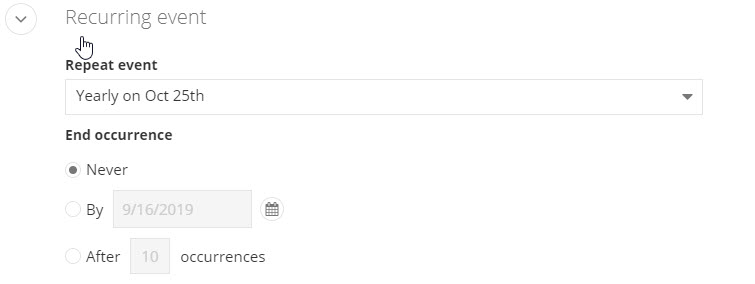
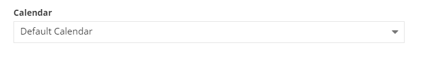
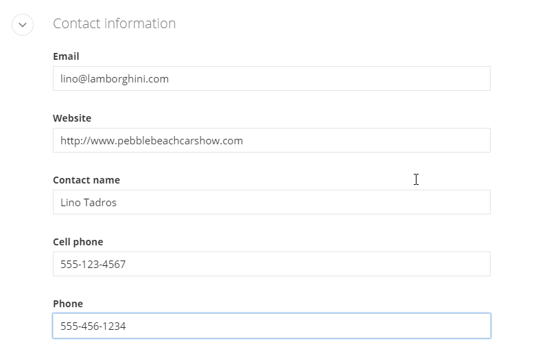
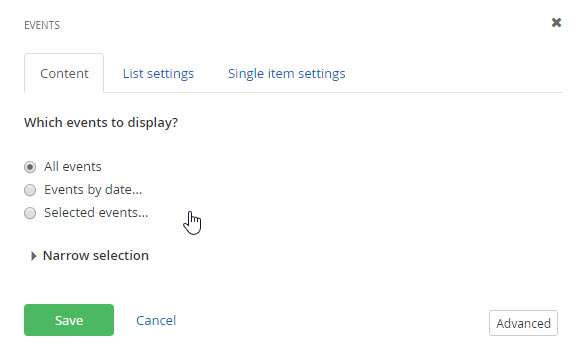
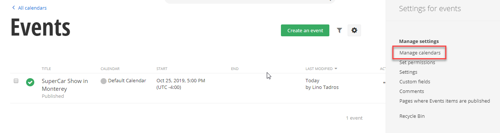

Events
======

Events have additional sections to record the event summary, event
start/end dates, location and contact information. Events are always
part of a calendar. You can use the default calendar or create your
own custom calendars for logical groupings of events, such as "East
Coast Sales" for example.

##### Creating an Event

This walk-through creates a single event that is published immediately.

1.  From the administration menu, click Content \> Events.

2.  Click the Create an event button.

3.  Enter a Title and add content text into the Editor.

4.  Below the Editor, enter a Summary, Event start and Event end.
    Click the Event start and Event end text boxes to pop up date and
    time picker widgets automatically. The event can be set for All day
    or take place between specific times of day. The Time zone drop down
    allows you to set the time for the event in another time zone than
    the local time.

#### Note: 
The Repeat event drop down allows full-featured, Outlook
style recurrence for your event to take place Yearly, Monthly, Weekly
or Daily. The screenshot below shows the event repeating every Oct 25th

5.  The Calendar section initially only has the Default Calendar
    available.

6.  In the Location section, enter the event Street, City, Country and
    State. The How to find us section can take any free-form
    instructions. The screenshot below uses the URL for Google Maps.

7.  In the Contact information section, enter details for the person
    acting as the main contact for the event.

8.  Click the Publish button.

#### Note: 
This example publishes the event right away. You can use the
Schedule action from the menu to set start and stop dates and times
for the event. When the event is over, it is automatically unpublished
and the event is no longer visible on the page.

##### Using Event Widgets

This walk-through demonstrates using the Events widget to display
event content.

1.  Click the Pages menu item.

2.  Create a new child page under the \"Welcome\" page titled
    \"Events\", pick a template and start editing the page.

3.  Drag an Events widget to one of the boxes on the page.

4.  Click the Edit link at the top right of the widget. The same designer you are used to is presented to you with a filtering tab, list settings tab and a single list setting tab.

5.  Click the Publish button for the page.

6.  Click the View button for the page.

##### Calendars

Calendars allow you to logically group events based on any category
that you require. For example, you could have calendars for each
department in an organization, sales areas or individual people. An
event can only belong to a single calendar. To create a calendar:

1.  From Content \> Events, click the Manage Calendars link once you open the setting gears on the top left of the page.

2.  Click the Create a calendar button from the toolbar.

3.  Enter the Title of the calendar. Optionally, you can provide a
    Description and use the drop down color picker to choose a custom
    color for the calendar. Click the Create this calendar button.

From that point on, you can filter your event by the calendar they are associated with

#### Next Topic
[Images](../Images/readme.md)