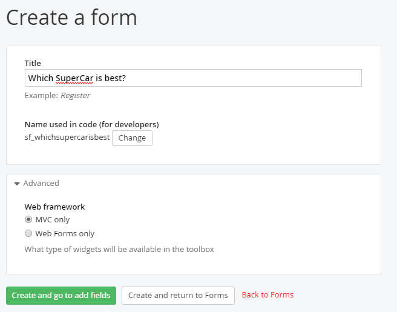
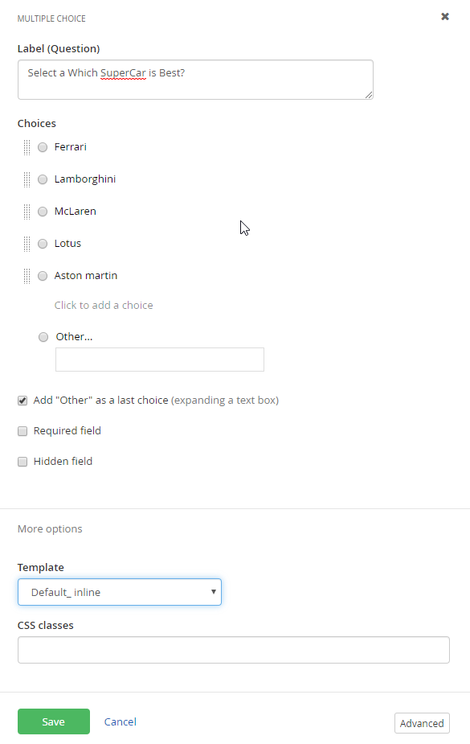
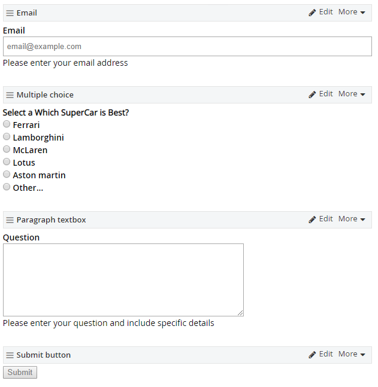
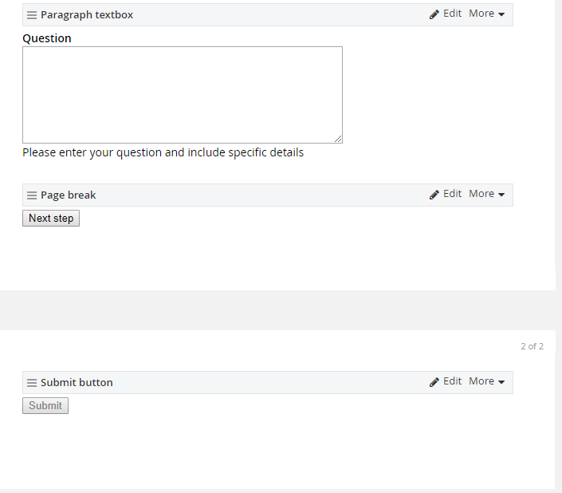
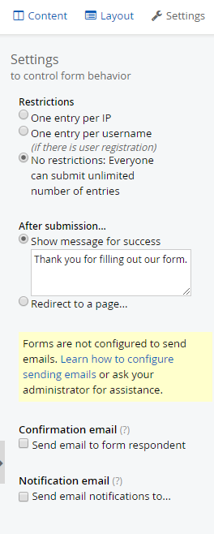
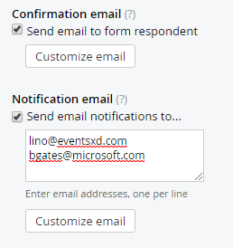
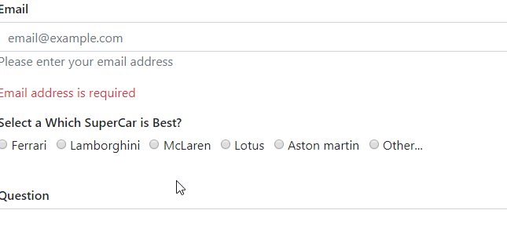
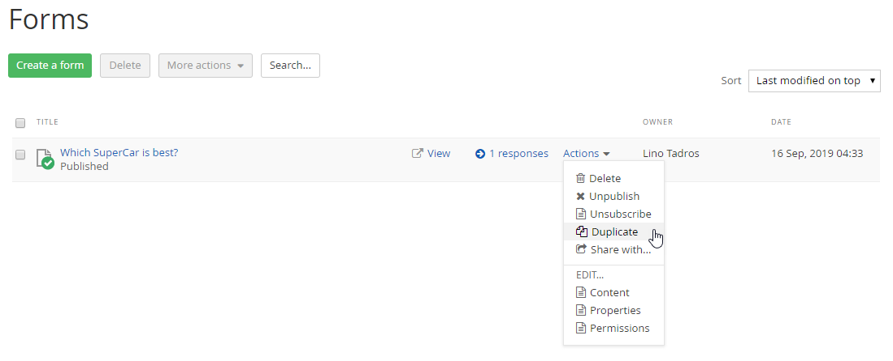

Forms
=====

> If you want to get information from users, you certainly don\'t want
> to wait for a developer to create a form. Building forms on-the-fly is
> one of the most heavily requested features of Sitefinity. You might
> need to record maintenance requests, user ideas, letters to the
> editor, contact info or any of hundreds of different types of data
> your organization needs to record and stores.
>
> Using Sitefinity you can create your own form easily, without any
> programming. The user fills out the form online, clicks the submit
> button, and the information is stored in the Sitefinity database.
> Forms can either be contained to a single page, or spread across
> multiple pages for a better user experience. You can then review
> responses sent by users or you can export responses to Excel for
> further processing.

##### Creating a Form

> Follow these steps to create a form:

1.  Click the administration menu Content \> Forms item.

2.  Click the Create a form button.

3.  Assign the form Title. You can also assign a name if developers will
    be using the form. The name is filled in automatically based on the
    title but you can also click the change button and use your own
    organization's naming convention.

4.  Under Advanced, leave "MVC only" as the Web framework. The Web
    framework determines how the Form is rendered, and with what Page
    widgets you can use the Form in. MVC only gives you access to a
    smoother experience and unlocks the additional "Page Break" feature,
    which allows you to divide a form into multiple sections. Click the
    Create and go to add content button.

5.  The form designer looks very much like the designer for pages,
    except with a different set of widgets. Drag a Textbox widget to the
    box area on the form. Sitefinity knows that you will need a submit
    button to collect the information, so a submit button is added
    automatically along with the Textbox widget.

6.  Click the Textbox widget Edit link. The Textbox dialog displays
    showing links for Label and text for the content and instructional
    text and Limitations to validate the Textbox input.

7.  Under Label and text, enter the following:

-   Label: "Email".

-   Placeholder: "<my.email@example.com>".

-   Instructional text: \"Please enter your email address\".

-   Required field: check this box. This will prevent the form from
    being submitted until this field is filled in.

8.  In Limitations \> Range, enter a Min of 5. In the Error message
    displayed\... enter \"Email must be at least 5 characters long\".

9.  Click the Save button to close the dialog. The form should look
    something like the screenshot below.

10. Drag a Multiple choice widget onto the form. Click the Edit link.

11. In Label, enter \"Your question is about\...\"

12. The Choices section will have three choices predefined. Change the
    text for the First Choice to \"Classic Cars\" and the Second Choice
    to \"Performance Cars\". Click the x button next to the Third Choice
    to remove it.

13. Select the Add Other as a last choice check box.

14. Select the More Options link. In the Template, select
    Default\_Inline.

15. Click the Save button. The Multiple choice widget on the page should
    now look something like the screenshot below.

16. Drag a Paragraph textbox widget onto the form. Click the Edit link.
    Enter the following Label and text:

    -   Label: \"Question\".

    -   Add Instructional text: \"Please enter your question and include
        specific details\".

    -   Required field: Select this checkbox.

17. Click the Save button. The form should now look like the screenshot
    below.

18. Splitting a Form across multiple pages is easy. Drag a Page Page
    Break widget onto the form, just above the Submit button. Sitefinity
    will automatically divide the form visually for you into two pages,
    providing a common footer that appears on all pages, and showing the
    separation.

19. On the new page, above the Submit button, drag another Textbox
    widget out. Give it a Label of "Final Thoughts" and mark it as a
    Required field.

20. On the upper right side of the form, above the widgets, locate the
    Settings button and click it. This will display the Settings area to
    the right of the form.

> Restrictions can be tailored to the particulars of a form. For
> example, for an informal poll you could restrict to only a single IP
> address, that is, each computer would only be able to submit the form
> one time. Attempting to submit the form a second time displays an
> error message to the user. The One entry per username option could be
> useful to collect user registration information. The No Restrictions
> option makes sense for general questions or trouble tickets to a
> support group.
>
> Confirmation options control what the page does when the page is
> submitted. By default a success messaged is displayed on the page. The
> Redirect to a page\... option requires the full Url of the page in the
> form of: <http://mydomain.com/mypage>.
>
> Send email notification for responses to... automatically emails to
> the address associated with your Sitefinity login and to multiple in a
> List of email addresses... The Validate emails verifies the format of
> the email addresses but does not check that they exist. So if you
> entered "\@carconduit.net", that would fail as an invalid email
> address. On the other hand, if "<bob@carconduit.net>" does not exist,
> it will still be valid.

21. Click the Publish button.

##### Adding a Form to a Page

> To add an existing form to a page:

1.  Click the Pages menu item.

2.  Create a new page. For its template, click the Select another
    Template button and select a Bootstrap MVC template of your
    choosing. Otherwise, the form will appear compacted.

3.  Drag a Form widget onto the page. This widget should have "MVC"
    within its logo since we are on an MVC-enabled page. On default
    (hybrid) pages, you will see duplicate widgets for most content: The
    standard widget, and the MVC widget.

4.  Click the Select a form link on the Form widget.

5.  Select a form from the list.

6.  Click the Save button.

7.  Click the Publish button.

8.  Click the View button for the page that contains the form.

9.  Click the Next step button without filling out the form. An error
    message appears to indicate that the field is required. If you type
    a single character into the field and try to advance again, it now
    shows that it must be at least 5 characters long. These errors are
    due to the Required field and Limitations Range \> Min length
    settings.

> **Required message**

> **Minimum length message**

10. Fill out the form and submit it.

> A success message defined in the form settings dispays on the page and
> lets the user know the information was received.

##### Viewing Reponses

> Sitefinity maintains a list of all the responses for each form. The
> following will walk you through how to review responses and export
> responses to Excel.

1.  Click the administration menu Content \> Forms. Notice the link to
    the responses.

2.  Click the responses link. The Responses for\... page displays key
    information about each response, one column shows for every field on
    the form.

3.  If you click one of the response items, the detail shows up to the
    right. This detail includes the date and time the response was
    submitted and the IP address origin where the response was sent
    from.

4.  Click the Export as Excel button. This will prompt for a location on
    your hard drive where you can save the Excel file. Displaying
    responses in Excel shows detailed information that includes all the
    form fields.

##### Duplicating Forms

> If you need a form that is identical or nearly identical to an
> existing form, the Duplicate feature will create a copy, but will not
> copy the responses for the existing form. Also, the email
> notifications will not be copied. For example, starting with the
> example from Creating a Form you
> could duplicate the "Ask CarConduit a question" and make a copy
> specifically for reviewers. To copy an existing form, click he
> Duplicate option from the Forms, Actions menu.

> Enter a new Title and either Create and go to add content or Create
> and return to Forms. If you go to add content, you can add or remove
> widgets to customize the form. For example, you might want to know
> what business or publication the reviewer represents and you could add
> a short text that asks that question.

> The new form appears with the form that is was copied from, but does
> not carry over the responses from the original.

