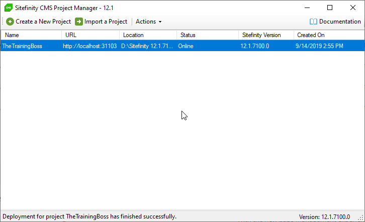
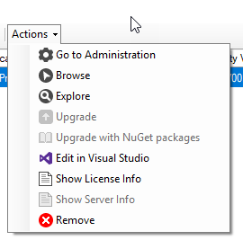
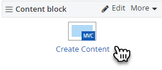
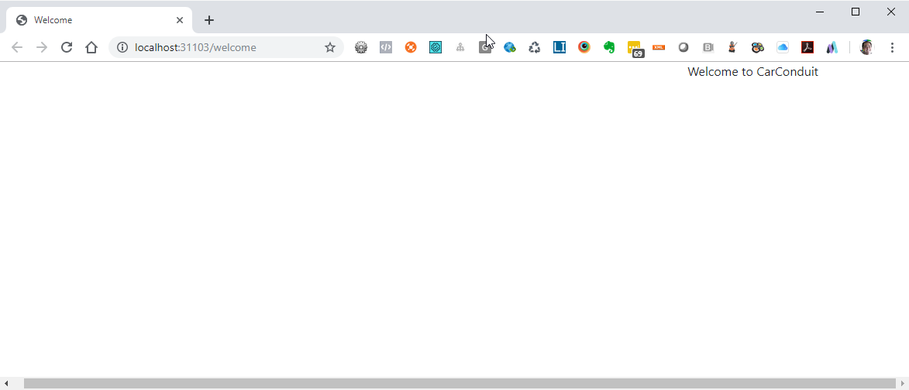
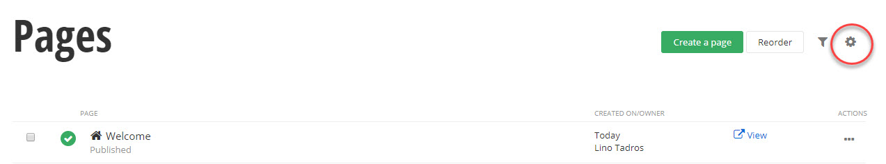
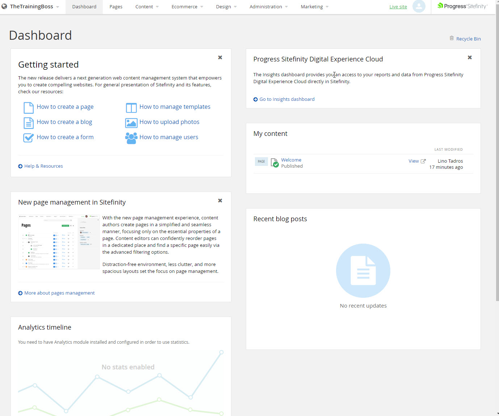

Getting Started
===============

This section explains how to create a minimal Sitefinity website. The
website will contain a single welcome page populated with text.

#### Note: 
For information on installing Sitefinity, please see the
[Install, upgrade and deploy Page](http://docs.sitefinity.com/install-sitefinity) of
the online documentation.

##### Sitefinity Project Manager

The Sitefinity Project Manager is the initial starting point for
creating, managing and browsing your Sitefinity website. Use this
application to:

-   Create a New Project brings up the Create New Project Wizard where
    you can create a Sitefinity project on your local file system, in an
    IIS (Internet Information Services) website on your machine, a
    remote web site or using FTP to a remote web site.

-   Import a Project prompts you to add an existing project.

-   The Actions menu and right-click, context menu contains similar
    options to perform against any of the selected projects.

 

From the Actions menu you can:

-   Go to the Administration backend of the site.

-   Browse to display the live site.

-   Explore the Sitefinity project in the file system.

-   Upgrade a project to the latest version.

-   Upgrade with NuGet packages allows the project to upgrade using
    NuGet

-   Edit the project in Visual Studio opens the Sitefinity project in
    Visual Studio.

-   Show the License Information to see the license constraints such as
    the product version, number of concurrent users allowed, number of
    published pages allowed, etc.

-   Show Server Info displays information about the Microsoft IIS
    Express server, which is Sitefinity integrated web server.

-   Remove eliminates the project from the Project Manager and
    optionally, will delete the actual files that make up the project.

##### Creating Projects

> Sitefinity projects can be created using major technology platforms
> for websites including:

-   Right in your own local file system.

-   Using IIS (Internet Information Services).

-   Remotely, through a FTP (File Transfer Protocol) or HTTP (Hypertext
    Transfer Protocol).

> The Sitefinity Project Manager makes it easy to get started building
> your own websites in a local, demo environment. You don\'t have to use
> IIS (Internet Information Services) or spend days making sure the web
> site will work. The Sitefinity installation includes everything you
> need to get started building your website.
>
#### Note: 
> The project manager is intended to let you try out and get
> familiar with Sitefinity CMS quickly and easily. Putting your project
> on a production server is an administration task. For more
> information, please see the online documentation
> [Deployment](http://docs.sitefinity.com/deployment) or
> look for book for Sitefinity for Admins and Designers.

##### Creating a Minimal Sitefinity Website

> This section will walk you through, step-by-step, to create a minimal
> Sitefinity website stored in your local file system. In this example
> we\'re not going to go into the details, but simply go through the
> steps. This project will be launched automatically after completing
> the steps.

##### Creating a Project

1.  From the Sitefinity Project Manager click the Create a New Project
    button from the toolbar at the top of the window.

1.  The Create New Project Wizard displays. Enter the Project Name
    *\"CarConduit\"*. Click the Next button to continue.

2.  

4.  The Activate a License page of the wizard displays. Enter your Email
    address and Password from your Sitefinity account. If you have a
    license file downloaded, select the Use a License File You Have
    Downloaded option and choose the file using the Browse button. If
    you have already created a project, then you will be able to select
    from existing licenses.

5.  Select the Sitefinity edition that fits the requirements of your
    project. The

> [Compare All Editions](http://www.sitefinity.com/editions) link navigates to
> [[http://www.sitefinity.com/editions]](http://www.sitefinity.com/editions)
> where a matrix compares product capabilities, licensing and pricing.

6.  Select the Free Trial or Licensed option. Subsequent steps will
    verify your Sitefinity login against your licenses. Click the Next
    button to continue.

7.  The Confirm License page will display the status of your license.
    Check the Open the Administration of this Project\... option. Click
    the Finish button to close the wizard.

> The new project will be added to the list in the Sitefinity Project
> Manager. It may take a minute before the project shows in the Project
> Manager. At this point Sitefinity has created everything needed for
> the website except for the database.

8.  The Status column for the project will update briefly, then a
    browser window will open to display the Project Startup screen. The
    first step of the project startup is to configure the database. This
    example assumes you have Microsoft SQL Server Express installed on
    your machine with the default instance name of SQLExpress. Click the
    Continue button.

#### Note: 
> If you have a full version of SQL Server installed, click
> the Microsoft SQL Server option. You will need to provide
> authentication information, the Server and Database names before
> clicking the continue button. If you don\'t have SQL Server Express,
> you can download it from www.microsoft.com/express/database/
> Each database type will have its own set of authentication entry
> requirements. The screenshot below shows the entries required for
> each.

9.  The second project setup step is to register the administrator for
    the site. Enter the First name, Last name, and Email that will be
    used to login to your new website and finally, a Password. Click the
    I\'m Done button. The administrator will be granted all possible
    rights for the project, including the ability to add content, pages
    and new users.

10. If you are prompted to login to the new site, enter the Email and
    Password from the previous step and click the Login button.

 

11. After logging in, the site administration Dashboard page will
    display. From here you can use the menu to navigate between
    administration tasks.

##### Creating a Page

> The next steps will help you create a welcome page for your website.

1.  From the administration site, click the Pages menu option.

2.  Click the Create a Page link.

3.  The Create a Page entry form will display. Enter "Welcome" in the
    Name field.

4.  Scroll further down the form and enter \"Welcome to CarConduit\" in
    the Title for search engines field.

5.  Scroll to the bottom of the form, leave the remaining entry fields
    at their defaults and click the Create and go to add content button.

6.  The editor for your new welcome page has a set of content boxes
    surrounded by dotted lines. The right site of the page is titled
    Drag widgets and contains a number of widgets that can be dragged
    into the content areas. Drag a Content block widget over to one of
    the boxes and drop it there.

7.  Click the Enter Content link.

8.  In the Edit dialog that displays, enter the text *Welcome to
    CarConduit!* Click the Save button to close the edit dialog.

9.  At this point we have a minimal page that is working and retrieving
    data from the database but is still in draft mode. The page can\'t
    be accessed from the outside world yet. At this point you have the
    option to click the Save as Draft button and continue to work on the
    page without publishing it. Instead, click the Publish button to
    make the new page visible in your new website. This step will return you to Pages administration.

10. In Pages list locate the Welcome page in the list and click the View
    link.

 

11. The new page will display in the browser. The address bar shows a
    localhost address, followed by the project name, then the page name,
    i.e.

> */CarConduit/welcome*. Also the title Welcome to CarConduit appears at
> the top of the page. Finally, the content *Welcome to CarConduit!*
> displays in the page body.

##### Setting the Default Home Page

> How do you set a default landing page to display when the user enters
> the website in the browser address bar?

1.  In the Administration list of pages, click the Actions drop down
    list and select the Set as Homepage link.

> Notice that the home icon appears next to the page name.

2.  Click the Live site button at the top right of the screen.

> The default page displays automatically without having to write out
> the complete URL in the browser address bar.

##### Dashboard

> The Dashboard is the first visible page when you navigate to
> Sitefinity administration. The Dashboard has a main menu across the
> top, links to a Getting Started video and documentation below that and
> a series of panels with an Analytics timeline, a summary of your most
> recent content, a summary of everyone's content and a listing of
> recent blog posts.

##### About Pages and Content

> Sitefinity websites are built from two major pieces: pages and
> content. *Pages* are containers of data. *Content* is the data that
> will be placed in the containers. Once you create a page, the page
> goes straight into the database. Likewise, any content you create is
> saved immediately into the database. You can backup and restore the
> database and automatically recreate your entire website.

##### Front End vs. Back End

> Pages and content can be placed in either *front-end* or *back-end*
> locations. *Front-end* refers to the live published site that the end
> user will see. *Back-end* refers to the administration portion that is
> used to create sites in Sitefinity. The back-end is hidden from the
> user.