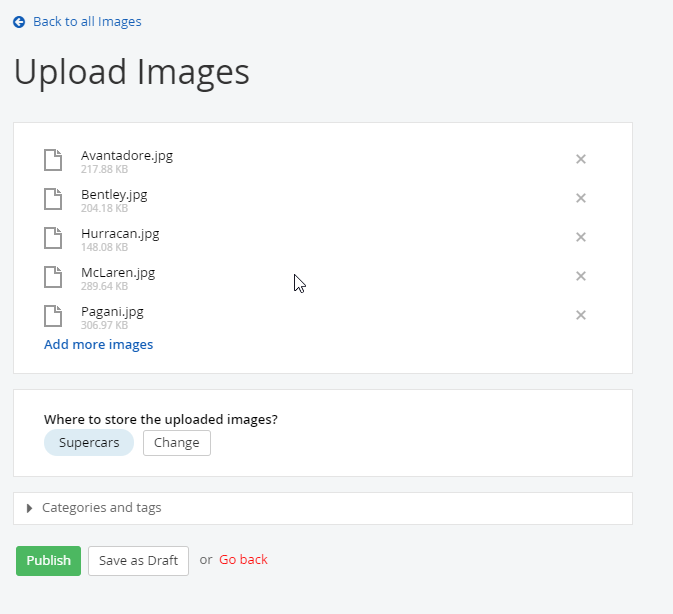
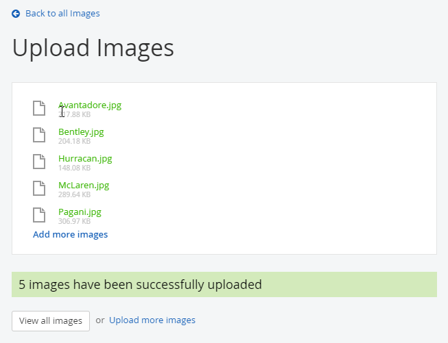
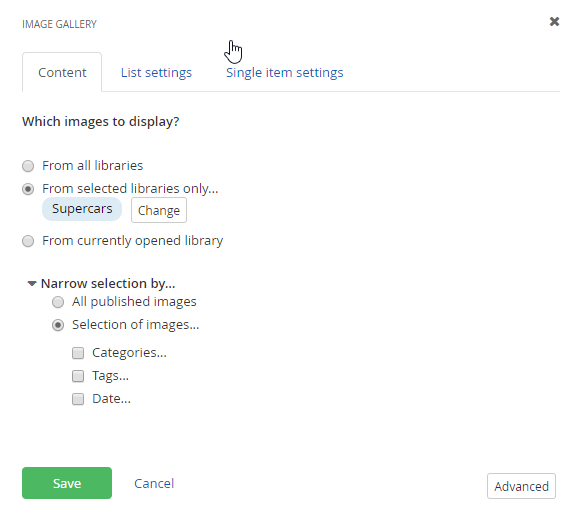
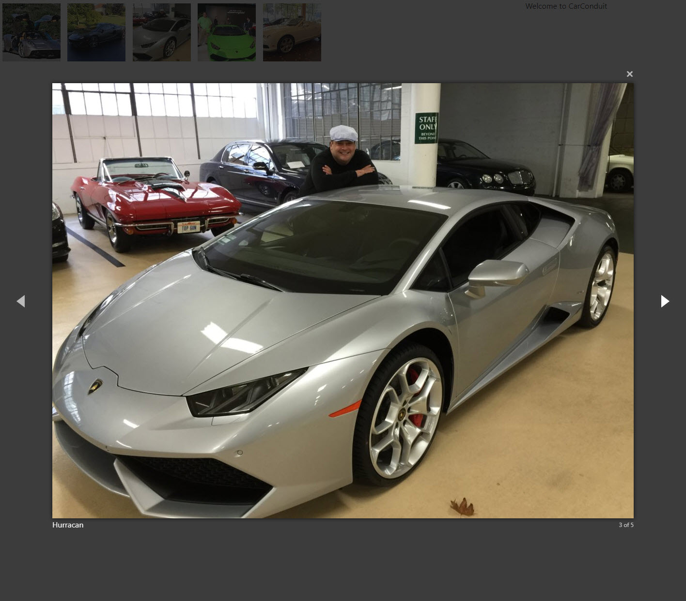

Images
======

Images are stored centrally so that they can be used throughout your
website. Sitefinity will help present the image in different sizes and
will also create thumbnails automatically. Thumbnails are smaller
versions of an image that can be previewed before opening a larger
version.

##### Image Libraries

Images are stored in Libraries. Libraries are logical groupings of
images to make it easier for you to find images, to display only
subsets of the available images and to manage groups of images. For
example, you might have images of signatures that are security
sensitive that you want to keep separate from other images. Libraries
can be secured separately by setting permissions per library. Image
libraries can be arranged in a tree structure hierarchy.

##### Creating Image Libraries

This walk-through demonstrates how to create a library to hold your images.

1.  From the administration page, click the Content \> Images menu item.

2.  In the Images page, click the Create a library button.

3.  Enter an Image Library name, click the Click to add a description
    link and describe the library contents. Finally, click the Create
    and go back button.

##### Uploading Images

This walk-through demonstrates how to populate a library with images
by uploading from your computer.

1.  Click the Upload Images button.

2.  In the Upload images page, click the Select image from your computer
    link.

3.  In the Windows Open dialog that displays, navigate to the location
    of image files on your computer. Select and open one or more image
    files.

4.  In the Upload Images page, click the Change button located next to
    the Where to store uploaded images? Select a library and click the
    Upload button.

5.  Wait a moment as all the images are uploaded. When the images have
    been successfully uploaded message displays, click the View all
    images button to return to the Images page.

6.  Click the link for the library where you saved your images.

7.  Review the uploaded images in the library. Each image has a checkbox
    so that you can operate on selected images at one time. Selected
    images can be deleted, published, moved to another library or edited
    in bulk. Editing in bulk means you can change title, alternative
    text, description, categories and tags, all at one time.

##### Displaying Image Content

The Image widget used on a page has a relatively simple interface
where you choose an image file from your computer or select it from
images that are already uploaded.

Editing the Image widget allows you to set the image, size, margin and
the behavior when the user clicks the image. The Edit all properties
button allows you to set a Title and Alternative text. Alternative
text is used by search engines and for text-to-speech readers.

Use the optional Image Size drop down to show the image in small,
medium, original size, one of several predefined thumbnail dimensions
or in any Custom size.

When the page is previewed, the Title shows up as a tooltip in most
modern browsers.

The Image Gallery widget can show all published images or just images
from a specific library. Filter the images that display by selecting
only images in certain categories and tags. Filter by date to show
images published in certain time periods such as last week or within a
custom date range.

The List Settings tab of the dialog allows the formatting of the way the images are displayed.
You can display the images as a simple list of full size images. You
can also display the collection as a list of thumbnails the user can
click to show the full image in a detail page. The full image can
also be shown in a lightbox style overlay or by showing the full-size
image on the same page.

The screenshot below shows the Thumbnails + Overlay (lightbox) gallery type.

#### Next Topic
[Videos](../Videos/readme.md)