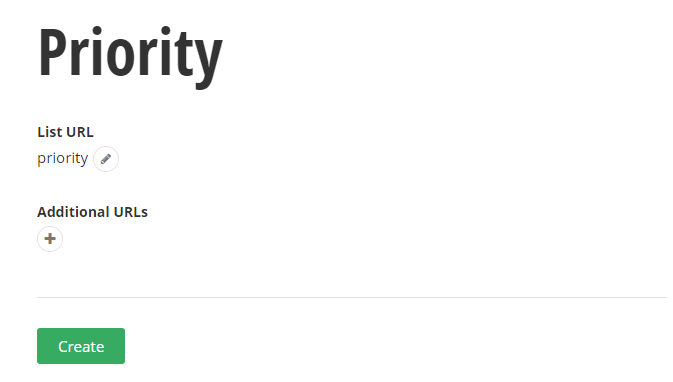
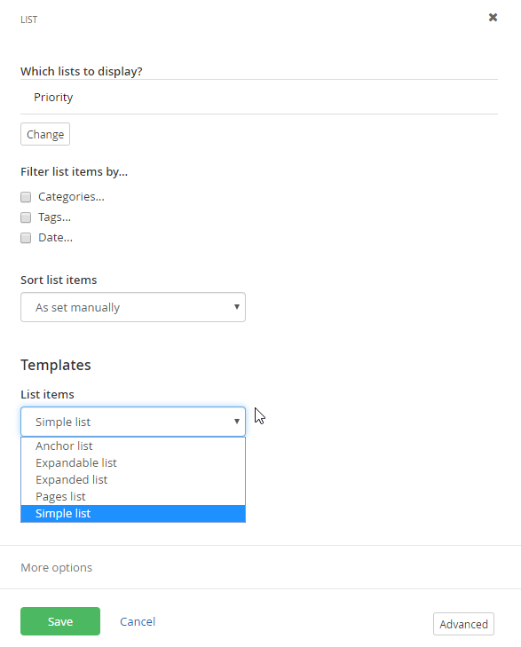

Lists
=====

A List stores a series of values and descriptions. Lists are useful to
show relatively small collections of codes or other designations. For
example, you can use lists to track priorities, color coding or
quality flags. These can be displayed in the page as simple lists,
expandable lists or anchors. Each List has a title for the list as a
whole, for example \"Priority\". Each list has a number of items,
where each item has its own Title and Content such as \"High\",
\"Medium\" and \"Low\" for example.

##### Creating Lists

This walk-through demonstrates creating a simple list of priorities.

1.  From the administration menu, click Content \> Lists.

2.  Click the Create a List button.

3.  Enter a Title for the list. In this example we will create a list of
    priorities.

4.  Click the Create this list button.

5.  Click the Create a list item button.

6.  For the first item, enter the Title \"High\", and content in the
    editor as \"High Priority\". Click the Publish button.

7.  Click the Create a list item button. Enter the Title \"Medium\" and
    content \"Medium Priority\". Click the Publish button.

8.  Click the Create a list item button. Enter the Title \"Low\" and
    content \"Low Priority\". Click the Publish button. The list
    should now look something like the screenshot below.

Using Lists in Pages
----------------------

This walk-through demonstrates adding a simple \"Priority\" list to a page.

1.  Navigate to a page that will contain the list.

2.  Drag the List widget to the page.

3.  Click the Set which list to display link.

4.  In the Content tab of the Edit dialog, click the Select lists
    button. Check the \"Priority\" list and click the Done selecting
    button.

    

5.  Click the Settings link.

6.  Select the Expandable list radio button.

7.  Click the Save button to close the dialog and view the changes.

#### Next Topic
[Content Blocks](../Content%20Blocks/readme.md)