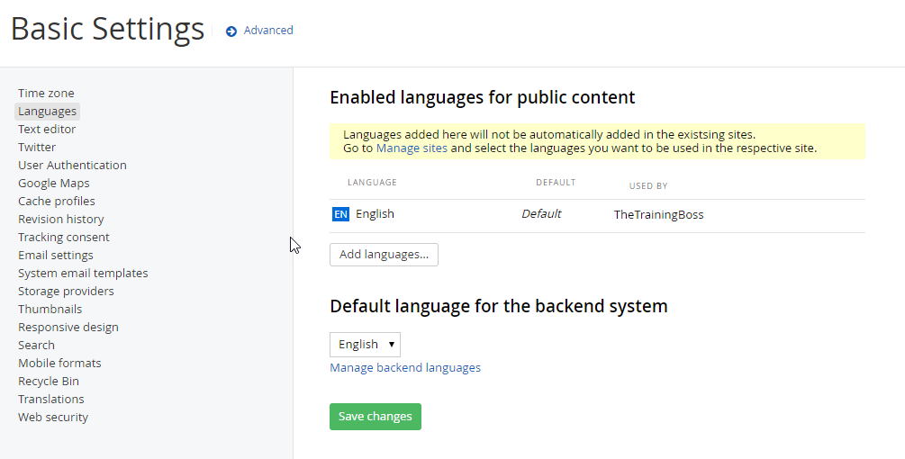
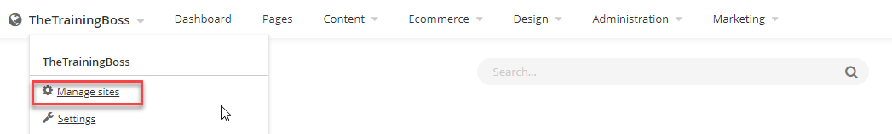
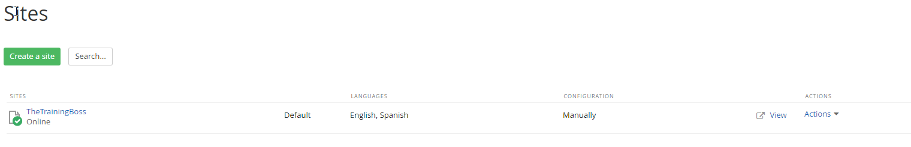
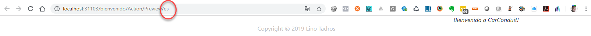
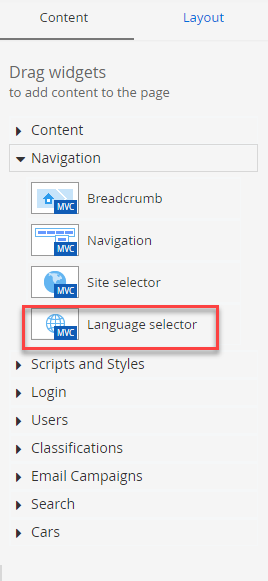

Localization
============

Localization allows you to display your website in any language. The
ability to localize your entire site to any language is baked right
into Sitefinity. Not only text, but any other content relevant to the
culture of your website visitor is configurable. The back- end of the
website is also fully localizable. All menu items, button text,
labels, etc. are localizable. Search for \"Language Packs\" here:

[*http://www.sitefinity.com/marketplace/modules.aspx.*](http://www.sitefinity.com/marketplace/modules.aspx)

##### Localizing Front End Pages

In this next walk through we will add the Spanish language and
localize a front-end page to reflect the language choice.

1.  Select the administration menu Settings option.

2.  From the list on the left side of the page select the Languages option.

3.  Click the Add languages\... button.

4.  Use the search box to locate *Spanish* in the list and select the
    check box.

5.  Click the Done button. Now the new *Spanish* language entry shows up
    under the default *English* entry.

**Note:**
If you are running the enterprise version with Multisite, you will also need to add the Spanish language from the **Manage Sites**

Below the Languages for public content section is the Default language
for the backend system. You can change the language for the backend
system by clicking the Manage backend languages link and adding
languages there. Leave the default setting for this example.

6.  Click the Save changes button.

Select the administration menu Pages option. This option will take
extra time because Sitefinity needs to accommodate the new languages
by making database changes. When the list refreshes, all the pages in
the site are \"localization ready\" and have a new Translations
column.

7.  Click the ES Add link for the home *Welcome* page (if you don't have
    the page built, go ahead and create a welcome page now).

8.  Create a page (ES) displays so you can supply a new page Name, URL
    and decide whether you want to copy the content and widgets from a different language or start from scratch.

9.  Click the Create and go to add content button.

The Spanish page displays. 

10. Click the content block Edit button (if you don't have a Content
    Block on the page, add one now).

13. Paste *Bienvenido a CarConduit!* into the editor window. Click the
    Save button.

14. Click the Publish button. Note that publishing pushes out all the
    translations.

15. View the page. Notice the URL in the address bar uses the culture
    code *es*. The translated content shows at the head of the page.

User Language Selection
-----------------------

You can use the Language selector widget right in your page so that
the user can dynamically choose the language they want to view the
page in.

1.  Open the localized page for editing again.

2.  Open the Navigation section of the right hand menu. Drag the
    Language selector widget to the top of the page.

3.  Click the language selector widget Edit button. In the Display
    language selector as\... option, select Drop-down menu.

Also notice the checkbox option to include the current language in the
selector.

What to do with languages without translations? Your options are to
Hide the link to the missing translation or Redirect to the home
page\...

4.  Click the Save button to close the dialog.

Publish and view the page. Use the drop down language selector to show
both translations of the page.

#### Next Topic
[Page Administration](../Page%20Administration/readme.md)