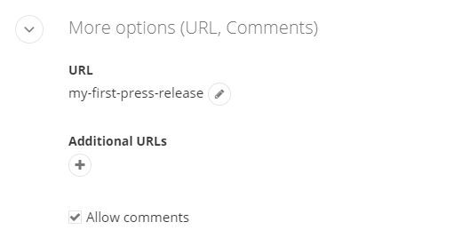
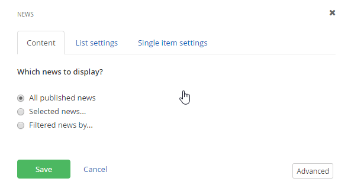

News
====

##### Creating a News Item

News has four sections. The top section is for the Title and the main
content of the news article. You can also add a summary which comes in
handy for when the widget only displays the titles and summaries.

1.  From the administration menu, click Content \> News.

2.  Click the Create a news item button.

3.  Enter a Title and add content text for your news article. You'll want to add a
    summary because you can display it in a list of news without
    reproducing the entire news item.

4.  In the Categories and Tags area of the page, use the + image to add
    categories to initially add categories or use the Change button
    after that. You may also press enter in between tags to create a list of Tags.
    Categories and Tags help you organize content and allow search
    engines to locate and rank your content. Categories are used when
    searching the website while Tags are used by external search
    engines.

5.  In the Additional info section, record where the Author, Source name
    and Source URL for where the news article came from.

6.  In the More options section, you can change the default URL for the
    news item to one of your choosing. Unselect the Allow comments to
    prevent adding comments by anybody. If you want to tailor several
    URLs for different audiences, Add additional urls under the Additional URLS section.

7.  Click the Publish button.

Using News Widgets
------------------

This walk-through shows how to display your published news items on a
page using a News widget.

1.  Create and publish a second news item

2.  Create a page and name it *News*.

3.  Drag the News widget to the page.

4.  Notice that all news items you have created show up in the list
    along with the one line summary and a link to the full news story.

5.  Click the Edit link at the top of the News widget. Notice the three
    different sections you can use to tailor the presentation of the
    news: Content, List Settings and Single Item Settings. Content lets
    you show all of the published news, a single news item or filter new
    by a combination of categories, tags and dates. Use the One
    particular news item only\... option if you want the entire news
    article displayed directly on the page. Leave the default settings
    with the All published news option selected.

6.  Click the List Settings option to configure how multiple news items
    will be displayed by the News widget on a page.

-   Use paging limits the news items that show at one time and provide
    links for overflow news items. This option lets you control the
    amount of real estate that gets used on the page.

-   Use limit shows only X number of items. You can use this option
    along with the Sort news drop down to show a few of the newest
    items.

-   No limit and paging just dumps all your news items out on the page
    in a list.

-   The Sort news drop down list allows you to order news items by Last
    published on top, Last Modified on top, By Title (A-Z), by Title
    (Z-A) or As set in Advanced Mode. 
    
    #### Note: 
    The Advanced Mode allows a developer to customize the sort via Advanced Settings.

-   List template determines how the news content will be formatted on
    the page. Typically you will see only one item in the list and that is the default view of the News Template but your designers and developers can create more views for you to choose from in that list.

7.  Click the Single Item Settings of the News dialog. Single Item
    Settings let you choose between Auto-generated page or select an
    existing page. Typically, you will use the Auto-generated page
    option. If you have a custom page built to display the news, choose
    the Select existing page\... option to include this custom page
    instead. Leave the default settings here and click the Save button
    to close the dialog.

#### Note: 
What does the Advanced button do? This option is available
on widget dialogs and shows a list of all possible properties for the
widget. For example, if your organization\'s designer adds a CSS
(Cascading Style Sheet) file to the Sitefinity project, you could
enter the name of a style in the CssClass property. Clicking the
Simple button returns you to the original settings view.

8.  Click the Publish button for the page.

9.  Click the View button for the page.

10. Click the link for one of the news items. This automatically
    generated page displays the full news article along with a comment
    section.

#### Next Topic
[Blogs](../Blogs/readme.md)