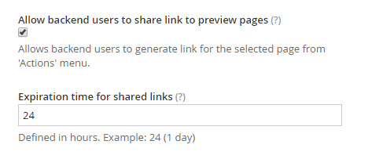
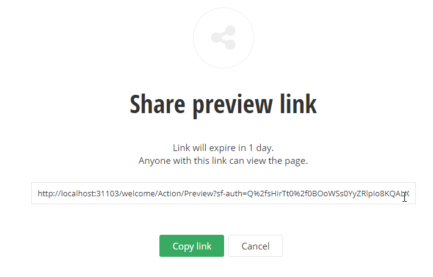
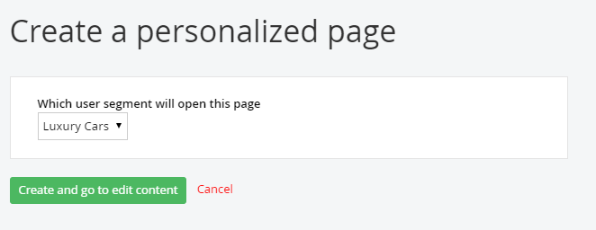
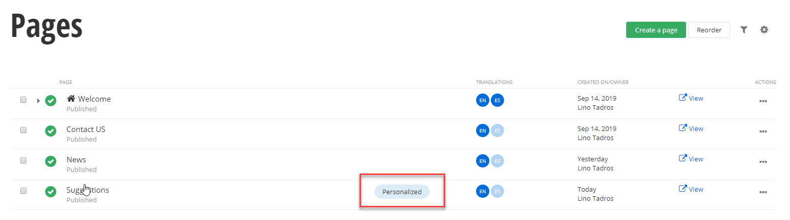

Page Administration
===================

As your own website builds in size and complexity, you need to work on
all your pages in one place. For example, you may want to search for a
certain set of pages, then publish them all. Pages administration
allows you to work on all your pages at one time. The top of pages
administration contains a set of buttons that create, delete and
perform other actions on pages. Below that is a list of pages, and to
the right, the Manage Pages area.

##### Page List

Pages are listed in a tree structure.
The screenshot below shows a *Welcome* page, with a *Contact Us* page
underneath it. Notice the house icon that lets us know that *Welcome*
page is the default home page. Also notice the green check marks that
indicate these pages are published. Click the name of the page to edit
the page or click the View link to preview the page at any time in a
separate browser window. The Actions menu provides the full set of
options possible for the page, such as deleting, editing, etc. The
Date/Owner column shows the creation date of the page and the person
that created it.

##### Actions

The top section of the Actions menu allows you to Delete the page
completely from the system while Unpublish makes the page invisible to
the public.

#### Note: 
By default, Sitefinity sends deleted pages to a [recycle
bin](http://docs.sitefinity.com/recycle-bin)

Use Duplicate if you want to use the existing page as a starting
point. Set as Homepage makes the selected page the default if you
navigate to the website without specifying a particular page. Share
preview link\... creates a temporary link (expires in one day by
default) that you can paste into an email or instant message.

Create a child page adds a new page underneath the current page in the
tree hierarchy.

The Edit\... section of the Actions menu allows you to go back and
change the Content or Title and Properties. Permissions determines who
can see and perform other actions on the page. Revision History allows
you to see each of the changes made to the page, who made these
changes and when. If a later version has serious mistakes, you can
revert to any earlier version.

The Change section of the Actions menu allows you to change the Template for the
page. For example, if you want the page that has a single column and
header and footer to use the Apple Promo style layout with three
columns, then you can change the template for the entire page.
Changing page Owner lets you pass off certain pages to other team
members so that they can search for pages that they have
responsibility for.

Use the Move\... section Up and Down options to move the page in the
tree hierarchy.

More options may show up on this menu depending on the state of the
page. For example, if the page is locked, the Unlock option will
display here. Note that all items in the menu will only show up if you
have the appropriate permissions. For example, you might not see the
Change Owner option if you don\'t have the correct permissions.

##### Revision History

When you click the Save button, content is recorded in the revision
history (shown on the right of the screenshot below). The revision
history allows you to compare versions, roll back to earlier versions
and add notes to particular versions.

##### Manage Pages

As you build your production website, it becomes harder to locate
pages when you want to maintain them. The Manage Pages area to the
right of the page list allows you to filter pages quickly. The filters
in the screenshot below are not random, but reflect Telerik\'s
experience working with Sitefinity customers in real-world situations.
For

example, lack of descriptions or keywords are not best practice for Search
Engine Optimization.

You can use the With No Keywords filter for example to get the pages
where keywords were left out. You can, of course, just filter to show
only your own pages. Using the by Date modified\... filter you can
look at the most recent changes, or use a custom date and time range.

The Manage also \> Templates option is a shortcut for Design \> Page
Templates.

The Permissions for all pages option allows you to change the access
to all pages at one time. This option controls what roles can view,
edit, modify, and change permissions and so forth.

The Custom fields for page]{.underline option allows you to attach extra information to your page.

##### Function Bar

The buttons along the top of the pages list work against all selected
pages at one time. The checkboxes to the left of each page indicate
which pages are affected. You can Create a child of the selected page
to extend the hierarchy of pages. The More actions drop down menu
includes the ability to change the page Template (i.e. the predefined
overall layout of the page). You can also restructure your page by
dragging and dropping pages.

To narrow down a long list of items, click the Search\... button,
enter the text to search for and click the Search button next to the
text entry. The search is not case sensitive and looks for titles that
contain the search text. Click the Close Search button to return to
the unfiltered list of items.

##### Sharing Pages with Unauthorized Users

You may need to share page links with people that don't have a user
name or password in your Sitefinity site. For example, you may want
reviewers to see pages even though they are not authorized on your
system. You can even share a link to the draft of a page before it
becomes published, as well as have the link expire on a given day.

You will need to change administration settings to allow sharing with
unauthorized users and also create a preview link.

Using the Sitefinity administration menu, first navigate to
Administration \> Settings, then click the Advanced link. Then click
the Pages node of the left hand tree view. Verify that the Allow
backend users to share link to preview pages option is checked. Also
inspect the Expiration time for shared links entry for the number of
hours before the shared links expire. If you make any changes from the
default values, click the Save changes button.

To obtain a link to share with unauthorized users, navigate to Pages,
drop down the Actions menu for the page you want to share and click
the Share preview link option.

The Share secure link to this item dialog appears and provides a link
that you can paste in an email or Instant Message. Notice that the
dialog tells you how long the link will be valid for before it
expires.

##### Custom Fields for Pages

The ability to create your own arbitrary fields for pages has been a
top customer request. The *custom fields for pages* feature now allow
you to specify additional details for a page. Once a custom field is
created, the field is associated with the page from then on. It's an
all-in-one tool that you can use for multiple purposes as your
requirements dictate. You can use custom fields to associate
information with the page such as manufacturer, costs or priorities.
You can also use custom fields to customize how a particular page is rendered. For example, you could include
custom banner images, icons or other styling for each page based on a
custom field.

#### Note: 
You can [define custom fields just like this for the other
content types]{.underline} and for [custom data types]{.underline}.

To create a custom field, navigate to Pages from the administration
menu. On the right- hand side under Manage Pages, click the Custom
fields link.

This takes you to the Pages Data Fields page that lists both custom
and default fields. In the Custom fields area, click the Add a
field... button.

In the Add a field dialog, select the Type of data you want in your
custom field from the drop-down list. Choices include Short text, Long
text, Multiple Choice, Yes / No, Currency, Date and Time, Number,
Classification, Related data, Related Media and unknown.

Classification will let you choose from a list of choices such as
Category, Tags or Departments. Related data will let you choose from a
list of content types like News, Blog posts, Events or Pages. Related
media choices are Images, Videos or Documents and other files.

Here is an example that contains a simple Short text field named
MoreInformation. The Name is used in code and in the database, so no
spaces are allowed in the name. Enter a Name and click the Continue
button.

Next up, the Settings dialog allows you to enter the Label and
Instructional text that will display with the field when editing the
page's Title and Properties. Enter those items and click the Done
button.

When you have added as many custom fields as you require, click the
Save changes button.

Now, navigate to any specific page and click the Title and Properties
link at the top of the screen.

In the Edit the Page screen that shows, scroll down to the bottom to
find the entry for your new field. Enter content to the new field and
then click the Save changes button.

##### Personalization

Personalization lets you display different versions of a page to those
that belong to a particular *user segment*. A *user segment* is a
collection of characteristics that define a group of people, such as
how long the user stays on the site, the time of day, the user's
preferred language, the number of blog posts the user has contributed,
what items or types of items they've purchased, what page they landed
on and many others. If a user spends a long time on the *Luxury Car
Trends* page you could display a *Suggestions for You* page that has
luxury cars and products. A user that purchases sleeping bags and camp
stoves could be shown outdoor gear. The user effectively gets a custom
page.

Before you can personalize pages, your administrator needs to set up
user segments in Marketing \> Personalization. For this example, there
is a *Luxury Cars* segment and a *Clothes* segment.

To personalize a page, you can either start from the Pages
administration and select Personalization from the Actions drop down
list or you can edit a page and click the Personalize this page
button. In this example, we start by editing a new page called
*Suggestions*. The page has a single content block at the top with
text *Suggestions for you* in a heading style. From here:

1.  Click the Personalize this page from the top right row of buttons.

2.  Select a user segment from the drop down list, then click the Create
    and go to edit content button.

Notice that the page title *Suggestions* is appended with a drop down
list that displays *Luxury Cars*. The list will include each
personalization and an entry for *Everyone*.

3.  In this example an Image widget is added that displays a luxury car.

4.  You can repeat these steps, starting with clicking the Personalize
    this page button, for every user segment. For example, we can
    personalize the page for the Clothes user segment by adding an
    Ecommerce product list widget.

The Pages list will now show a Personalized link. Clicking the link
will allow you to edit any of the personalized pages.

#### Next Topic
[Wrap up](../Wrap%20Up/readme.md)