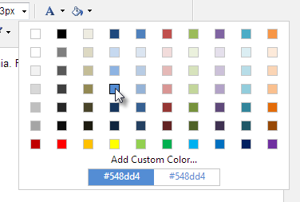
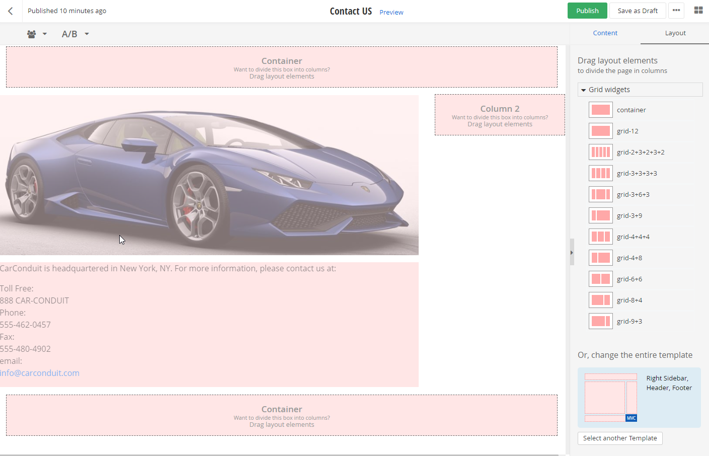
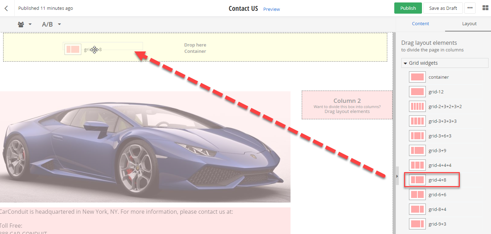
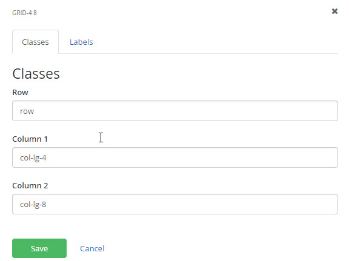
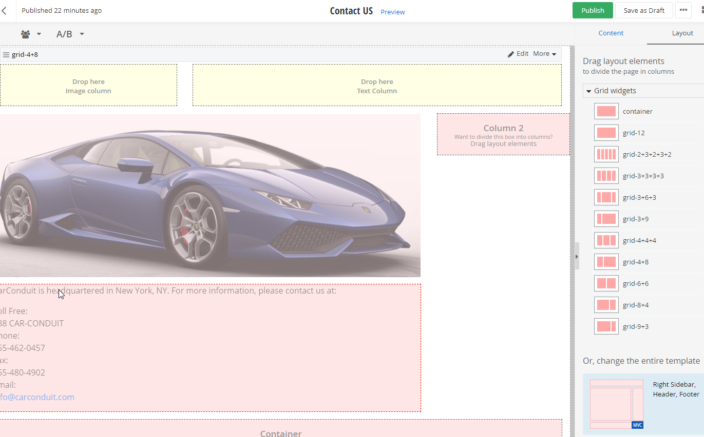
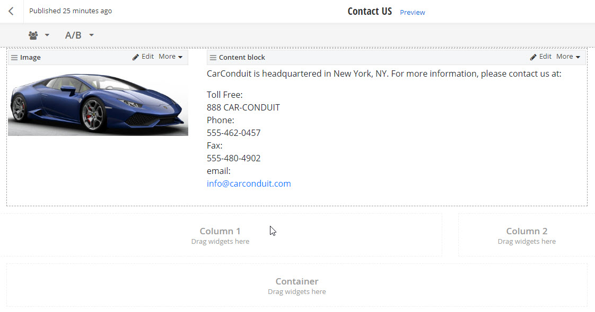

Pages
=====

Clicking the Pages menu item allows you to create new pages, rework
the layout of an existing page or add content to pages. The Pages
screen also allows you to work on your site as a whole. You can
restructure your site by moving some pages underneath other pages,
delete pages, publish pages so they can be seen by the public, manage
permissions and so on. The screenshot below shows the welcome page
being published from the Actions menu.

##### Page Settings

In the Getting Started section, we did a quick
walk-through of building a page without paying much attention to the
detail. As a business user, do you care about any of these other
settings for creating pages? Absolutely! The page settings help get
your page noticed by search engines like Google, Bing and Yahoo. Other
settings determine how your entire page is arranged. Let\'s create
another page and look at the settings:

1.  From the administration site, click the Pages menu option.

2.  Click the Create a Page link. The top section of the screen that
    displays assigns the page name, location and includes some special
    purpose options.

3.  The Name will display in the navigation. The Name *Contact Us* shown
    in the screenshot above will appear in menus and other widgets.

4.  In the Put this page\... section, you can place the page At the top
    level of the site, or Under parent page\.... In the screenshot
    above, the *Contact Us* page is placed under the *Welcome* page.

5.  URL is a powerful component of Sitefinity that specifies how the
    page will be accessed in the browser and by internet search engines.
    Notice that URL does not end in a suffix like \".aspx\" as do legacy
    websites. Sitefinity routing allows the URL to be completely
    different from the Name of the page and does not have to match up
    with any technical naming convention. By default, the URL will be
    the name of the page, where spaces are replaced with dashes. If you
    check the Enable multiple URLs or this page... option, a text box
    for Additional URLs opens where you can add new URLs, one per line.
    So if there are existing links to your page like "/contacts" or
    "/friends", these will navigate to the page.

6.  The Show in Navigation checkbox by default makes the *Contact Us*
    page visible in all navigation widgets. Uncheck this option if you
    want the page available but not immediately visible from navigation
    menus.

7.  The Use this page only to group other pages option makes the page a
    holder for other pages. If you select this option, the remaining
    sections that come below (e.g. Title and Description) are eliminated.

8.  This page redirects to another page option indicates that the page
    doesn't have content, but is used to bounce the user to another
    page, typically a page on an external website.

9.  Title for Search Engines appears in the page title and is also
    important for *Search Engine Optimization (SEO)*. Be sure to enter
    something here so that Google or Bing will not ignore your page.
    Remember, leaving this blank means your page will have a lower
    search engine ranking.

#### Note: 
Google robots look for the dash symbol. Google responds best
when the web site name is followed by a dash \"-\", then a short
description. For example, \"Company XYZ - Home Page\".

10. The Description, Keywords section is another section that\'s
    important to define for the best ranking by search engines. Make the
    Description short and sweet (two sentences max). 
    In the Keywords entry, add the most important words first.

11. The choices on the Advanced Options page only need to be changed if
    a designer or developer has a specific need.

 

 The other options fill very specific needs:

-   Allow site search to index this page is enabled by default and
    allows internal site search to find the page.

-   Allow external search engines to index this page is enabled by
    default and allows external search engines such as Google to include
    this page. The Priority in Sitemap setting lets crawlers know how
    important this page is relative to other pages. You can enter values
    between 0.0 and 1.0.

-   Check the Require SSL option to make the page use the HTTPS
    protocol. HTTPS is used to provide secure communication for
    sensitive information, credit card numbers for example.

-   Enable ViewState is unchecked by default. ViewState is used by the
    browser to know how to reload the page when the browser Back button
    is clicked. You should only check this option if you need ViewState
    and know why you need it. As a business user, you will not need to
    use this setting, unless your designer requires it.

-   Include RadScriptManager is enabled when required by certain AJAX
    controls. Set this checkbox if your designer or developer requires
    AJAX support.

-   Allow Parameter Validation needs to be checked if you\'re passing
    parameters to your page.

-   Caching Options should be As set for the whole site. Later you can
    set caching for the entire site at one time from Administration \>
    Settings \> Advanced Settings \> System \> Output Cache Settings.

-   Canonical Url is a feature that smooths out small differences in
    URLs that allow search engines to find it easily and keep the page
    higher in the rankings. For example, you may have a URL that can be
    addressed in the following ways:

 - http://progress.com/training>
 - https://progress.com/training
 - http://www.progress.com/training

Sitefinity generates canonical urls by default for the whole site (see
Administration \> Settings \> Advanced settings \> System \> Content
Locations \> Static Pages Canonical Url) or can disabled for the page
using this drop down list.

-   The HTML included in the \<head\> tag entry allows a developer to
    add script links, style sheet links and meta tags. The text box is
    used to add certain HTML tags that aren\'t built into Sitefinity
    already. The screenshot below shows an example of a meta tag used to
    refresh the content every 15 seconds from the server.

1.  Click the Create and go to add content button to create and edit the
    page.

##### Editing Pages

After clicking the Create and Add Content button, the new page will
display. If you want to navigate back to change any of the page
information, click the Title & Properties link.

The title of the page shows at the top along with the current page
status (should show as Draft). The page is not published and will not
be visible to users from the browser. The page designer shows on the
left and widgets on the right. Notice the buttons Content and Layout
at the top right that toggle between the two main views of the
designer. Layout shows where the content will go while Content shows
the widgets that will display in the page.

##### Editing Page Content

In this walk-through, we will add some generic HTML content with our
contact information, and an image that represents the company and
dresses up the page.

1.  Open the *Contact Us* page for editing.

2.  The Drag widgets area on the right side has a list of all the
    controls that can be dragged to the box areas on the left side.
    Sitefinity comes with a set of basic widgets for Content,
    Navigation, RadControls, Data, Scripts and Styles, Login, Search,
    Classification, Newsletters and so on. We\'ll start out working with
    the widgets under the Content group.

3.  From the Drag Widgets area on the right side of the page, drag the
    Content block widget to any empty box area.

4.  Click the Enter Content link. Note that you can also click the Edit
    link at the top right of the widget. Both actions display a text
    editor.

5.  The editor allows you work with text or directly with HTML, insert
    links, add images, media or Flash. Click the HTML button located
    just below the editor window. Paste the following into the editor
    window:

\<p\>CarConduit is headquartered in New York, NY. For more information, please contact us at:\</p\>

\<p\>Toll Free:\  888 CAR-CONDUIT \ 

Phone:\ 

555-462-0457 \ 

Fax:\ 

555-480-4902 \ 

email:\ 

\<a href=\"[mailto:info\@carconduit.com](mailto:info@carconduit.com)\"\><info@carconduit.com>\</a\>\</p\>

6.  Click the Design button, also located at the bottom of the editor
    window.

7.  Click the More formatting options button, located in the upper right
    hand side of the editor. Additional insertion and formatting options
    will show up on the editor toolbar.

The screenshot below shows some of the options you may not recognize.
In particular, notice the Image Manager used to insert \*.gif, \*.jpg
and \*.png images directly from your computer or out of the Sitefinity
database. The Paste Word button is used to get material from Word
documents without the usual large amount of formatting. The Format
Stripper is a related button that has a drop down selection of options
where you can strip out all the CSS, Word, Span or font elements from
the content.

8.  Select the word *CarConduit* with the mouse and click the Hyperlink
    Manager {width="0.16499890638670167in"
    height="0.17in"} button. Enter a web address, complete with the
    *http://* prefix, click the More options link and enter a Tooltip.
    Click the Insert the Link button.

9.  The editor can automatically detect web and email addresses. Select
    [*info\@carconduit.com*,](mailto:info@carconduit.com) then click the
    Hyperlink Manager
    . Notice that the LinkTo: Email
    option is already selected and the email address is already filled
    in.

10. Select the text *Toll Free* and select a blue foreground color.
    Repeat this for the text *Phone*, *Fax* and *email*.

11. Click the HTML tab. Notice the *\<a\>* tag for the CarConduit
    hyperlink, the *mailto* link for the contact email and the *span* with color styles.

12. Click the Save button to close the editor. The content block should
    now look something like the screenshot below.

13. Drag the Image widget to an empty area in the top left of the page.

14. Click the Select an image link.

15. In the Image dialog that displays, notice that you can Select image
    from images already stored in the Sitefinity database or Upload
    Image to upload and use new images from your computer.

16. Click the Upload image link.

17. In the Select an image dialog that displays, click the Select image
    from your computer link.

18. In the standard Windows explorer dialog that displays, select an
    image on your local computer and click the Open button.

19. The dialog now allows you to change the image, provide an image
    Title and Alternative text. You can associate categories and tags to
    the image. Click the Upload button to close the dialog.

20. The Image dialog now displays the uploaded image. From here you can
    click the Change image button to select another image from a list of
    images that been uploaded or click the Edit all properties to
    display a full page editor where you can change all properties of
    the image. Click the Save button to close the dialog.

21. Click the Publish button.

22. From the page list, click the View link next to the *Contact Us* to
    see the finished page.

The contact information is rather squashed to the right side. To see
how this is fixed, read on to the Editing Layout section coming up next.

#### Note: 
Are content blocks included in searches? Once indexing is
turned on, the content block is included in the search indexing
automatically. News, blogs, etc. are all included in searches.

##### Page Editing Layout

In the Editing Content example, we had an image of a truck pushed to the left side of the page and
contact information squashed well over to the right hand side. This is
because the predefined areas for content had too much space on the
left and too little on the right. By editing the layout, you can set
the proportions of the areas where content will go.

1.  Open the *Contact Us* page for editing. This page was created in the
    previous Editing Content example.

2.  Click the Layout button. The left side of the page shows the layout
    designer and predefined areas that will hold content. Each empty box
    in the designer has a hint to *Drag layout elements* to divide the
    area into columns.

3.  From the right side, titled Drag layout elements, drag the 25% + 75%
    layout element into the Header box at the top of the page.

4.  Now the top box is sub-divided into two areas, one with 25% width
    and the other with 75%. Click the Edit button.

5.  Move the mouse between the two columns and drag the resize handles
    to reapportion the column widths. Set the left column to around 20%
    and the right column to around 80%.

6.  On the right side of the designer, the Edit Layout Element area
    allows you to fine- tune the box sizes in either percent (the
    default) or pixels. Enter the value \"30\" in the space for
    Column 1. Column 2 is marked as auto-sized and will automatically
    change to \"70%\".

7.  Click the Spaces link. The amounts below increase the space between
    the outside edge of the content and the area surrounding the
    content. Change the first column spacing to have 5 pixels on each
    side. Change the second column to have 5 pixels on the top, right
    and bottom, and 20 pixels to the left. As you edit the amounts,
    notice the changes to the columns displayed to the left.

8.  Click the Classes and Labels link. Each column in the screenshot is
    using a predefined CSS (Cascading Style Sheet) class that\'s built
    into the system. You can also use Wrapper style to change the look
    and feel of the entire box area. If your designer supplies styles
    for the project, you can apply those styles here. In the Labels area
    at the bottom of the panel, you can write in labels for each column
    that will show in the layout design. The example labels Column 1 as
    "Image Column" and Column 2 as "Text Column".

9.  Click the Done button. The layout now shows a set of place holders
    with the new column names.

10. Click the Content button.

11. Drag the image widget that is already on the page, up to the left
    box.

12. Drag the content block widget up to the right box.

Now the layout of the page looks like this:

13. Click the Preview button to see the new layout of the page. The
    content is now arranged with both widgets having the correct amount
    of space.

##### Tour of the HTML Editor

The HTML Editor buttons initially have a minimal set of options. You
can click the More Formatting Options button located on the right hand
side of the button bar. The screenshot below shows key editor
features:

-   Image Manager: The Select an image dialog displays in response to
    this button. You can load images from your computer or use images
    that have already been uploaded to the Sitefinity database.

-   Hyperlink/Remove Link: The Insert a link dialog that displays in
    response to this button allows you to create links for web
    addresses, pages from your Sitefinity site or email. Use the dialog
    to set the Web address and Text to display. Options in the dialog
    allow you to set the Tooltip, the CSS class and if the link should
    be opened in a new window.

-   Spell Check is performed directly in the HTML editor. A message at
    the top of the editor notifies that the editor is in Spell checking
    mode. Buttons to the right allow you to finish spellchecking or
    cancel. The list that drops down under each misspelled word contains
    alternative correct spellings and options to Ignore, change manually
    or to add the highlighted word to the dictionary.

-   Paste From Word inserts content without losing the Word formatting.
    For example, if you have a heading, subheading and some paragraph
    text, a standard paste will pick up on the fact that there\'s a
    heading and display it as such, but will lose the detailed font
    style formatting. The Paste From Word option retains the detailed
    font formatting. The screenshot below shows a dialog where content
    pasted from Word retains its styling.

-   The Tables button drops down a list where you can define a table by
    dragging the mouse graphically, or use the buttons below to invoke
    the Table Wizard, add/merge/delete rows and columns and to set table
    properties.

-   The Symbols button drops down a list of characters that would
    otherwise be unavailable from the keyboard. For example, when you
    need to paste the copyright symbol in a document, you can select it from this list.
    Select a symbol with the mouse to insert it into the HTML Editor.

-   The Format Stripper button allows you to remove all excess
    formatting, or just certain aspects, such as CSS formatting. Word
    formatting is famous for being verbose, so Strip Word Formatting
    will remove all that extra HTML.

-   The Find & Replace button displays a dialog that can search for a
    given word or replace a found word with another. The search is
    performed from the current cursor position with the search Direction
    traveling either Up or Down. The dialog includes industry standard
    Search Options, Match case and Match whole words.

-   The Media Manager button displays a dialog that works like Insert an
    Image except that the Insert a Video dialog accepts HTML5 compatible
    video formats including \*.mp4, \*.ogg and \*.webm.

-   The Document Manager option allows you to insert any document file.
    You an upload a file from your desktop or use uploaded files using
    any one of the predefined categories on the right side of the
    dialog. Once you've selected a file, click the Done button to close
    the dialog.

Next, the Insert the document or other file dialog appears. Clicking
the Save button inserts a link to the file in the HTML Editor using
the text from the Title entry.

#### Next Topic
[News](../News/readme.md)