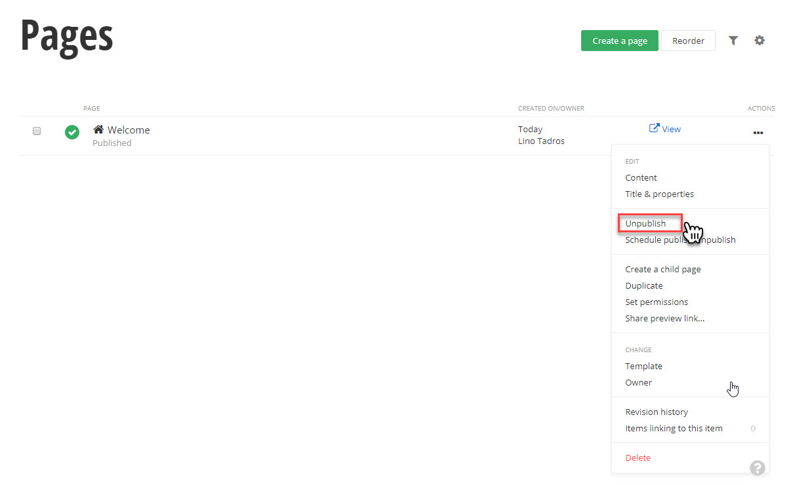
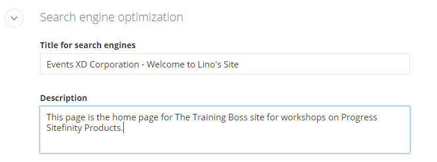
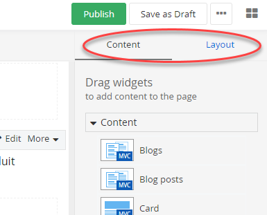
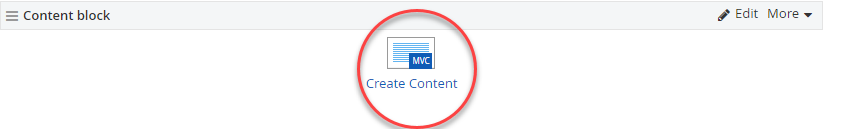
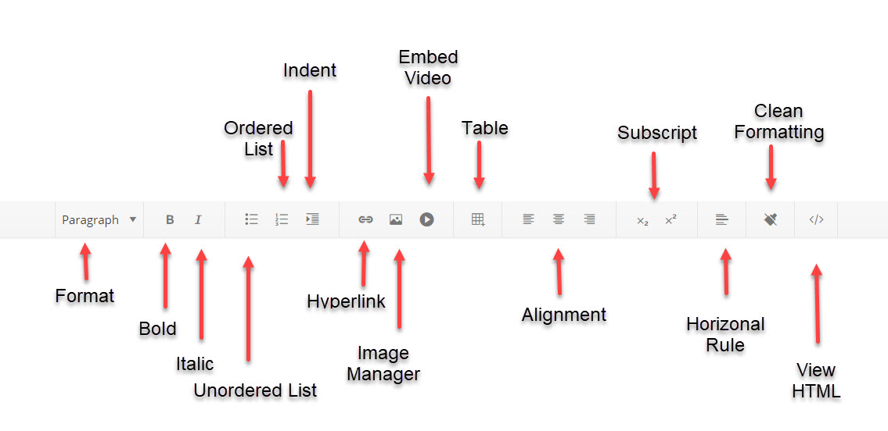
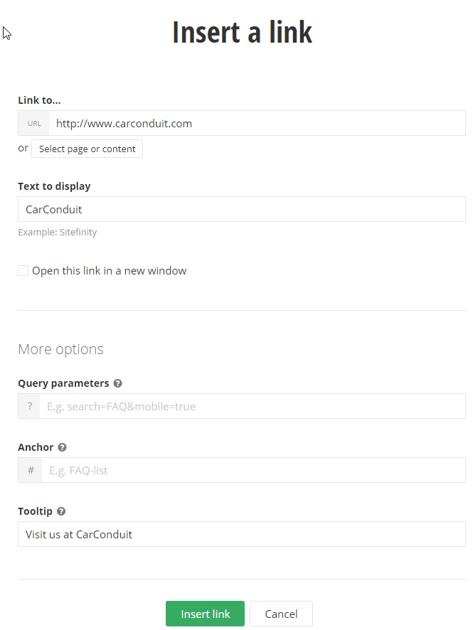
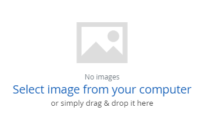
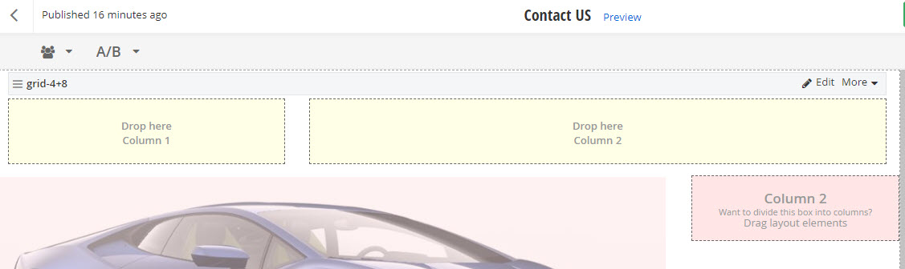
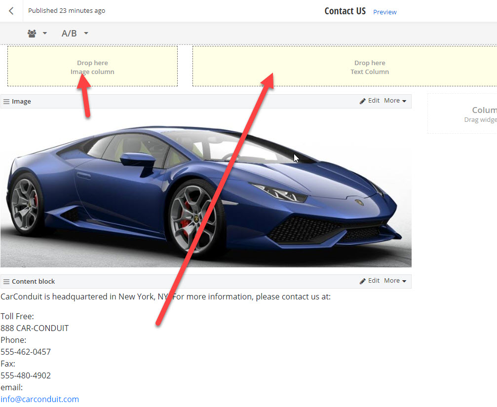

Pages
=====

Clicking the Pages menu item allows you to create new pages, rework
the layout of an existing page or add content to pages. The Pages
screen also allows you to work on your site as a whole. You can
restructure your site by moving some pages underneath other pages,
delete pages, publish pages so they can be seen by the public, manage
permissions and so on. The screenshot below shows the welcome page
being unpublished from the Actions menu.

##### Page Settings

In the Getting Started section, we did a quick "Create Page" for building a page without paying much attention to the
detail. As a business user, do you care about any of these other settings for creating pages? **Absolutely!** The page settings help get
your page noticed by search engines like Google, Bing and Yahoo. Other settings determine how your entire page is arranged. The way to see the complete set of properties for a page is by choosing the **Title & Peoperties" option from the Actions menu.
These are the options that you will be presented with for the "Welcome Page":

1.  The Name will display in the navigation. The Name *Welcome* shown
    in the screenshot above will appear in menus and other widgets.

2.  In the Put this page\... section, you can place the page At the top
    level of the site, or Under parent page\.... In the screenshot
    above, the *Welcome* page is placed at the root of the site.
    
3.  The Show in Navigation checkbox by default makes the *Welcome*
    page visible in all navigation widgets. Uncheck this option if you
    want the page available but not immediately visible from navigation
    menus.    
4.  The Use this page only to group other pages option makes the page a
    holder for other pages. If you select this option, the remaining
    sections that come below (e.g. Title and Description) are eliminated.

5.  This page redirects to another page option indicates that the page
    doesn't have content, but is used to bounce the user to another
    page, typically a page on an external website.

6.  URL is a powerful component of Sitefinity that specifies how the
    page will be accessed in the browser and by internet search engines.
    Notice that URL does not end in a suffix like \".aspx\" as do legacy
    websites. Sitefinity routing allows the URL to be completely
    different from the Name of the page and does not have to match up
    with any technical naming convention. By default, the URL will be
    the name of the page, where spaces are replaced with dashes. If you
    check the Enable multiple URLs or this page... option, a text box
    for Additional URLs opens where you can add new URLs, one per line.
    So if there are existing links to your page like "/contacts" or
    "/friends", these will navigate to the page.

7.  Title for Search Engines appears in the page title and is also
    important for *Search Engine Optimization (SEO)*. Be sure to enter
    something here so that Google or Bing will not ignore your page.
    Remember, leaving this blank means your page will have a lower
    search engine ranking.

#### Note: 
Google robots look for the dash symbol. Google responds best
when the web site name is followed by a dash \"-\", then a short
description. For example, \"Company XYZ - Home Page\".

10. The Description section is another section that\'s
    important to define for the best ranking by search engines. Make the
    Description short and sweet (two sentences max). 

11. The choices on the Advanced Options page only need to be changed if a designer or developer has a specific need. It is best if your as a Business Analyst leave this section to the technical team.

 

 The other options fill very specific needs:

-   Allow site search to index this page is enabled by default and
    allows internal site search to find the page.

-   Allow external search engines to index this page is enabled by
    default and allows external search engines such as Google to include
    this page. The Priority in Sitemap setting lets crawlers know how
    important this page is relative to other pages. You can enter values
    between 0.0 and 1.0.

-   Check the Require SSL option to make the page use the HTTPS
    protocol. HTTPS is used to provide secure communication for
    sensitive information, credit card numbers for example.

-   Enable ViewState is unchecked by default. ViewState is used by the
    browser to know how to reload the page when the browser Back button
    is clicked. You should only check this option if you need ViewState
    and know why you need it. As a business user, you will not need to
    use this setting, unless your designer requires it.

-   Include RadScriptManager is enabled when required by certain AJAX
    controls. Set this checkbox if your designer or developer requires
    AJAX support.

-   Allow Parameter Validation needs to be checked if you\'re passing
    parameters to your page.

-   Caching Options should be As set for the whole site. Later you can
    set caching for the entire site at one time from Administration \>
    Settings \> Advanced Settings \> System \> Output Cache Settings.

-   Canonical Url is a feature that smooths out small differences in
    URLs that allow search engines to find it easily and keep the page
    higher in the rankings. For example, you may have a URL that can be
    addressed in the following ways:

 - http://progress.com/training>
 - https://progress.com/training
 - http://www.progress.com/training

Sitefinity generates canonical urls by default for the whole site (see
Administration \> Settings \> Advanced settings \> System \> Content
Locations \> Static Pages Canonical Url) or can be disabled for the page
using this drop down list.

-   The HTML included in the \<head\> tag entry allows a developer to
    add script links, style sheet links and meta tags. The text box is
    used to add certain HTML tags that aren\'t built into Sitefinity
    already. The following example adds the meta tag "Author" to assign "Lino Tadros" yo be place in the head section of the page.
    
    <meta name="author" content="Lino Tadros" />

1.  Click the Save Changes to complete your modifications to the properties of the page.

##### Editing Pages

The page designer shows on the left and widgets on the right. Notice the hyperlinks **Content** and **Layout** at the top right that toggle between the two main views of the designer. Layout shows where the content will go while Content shows the widgets that will display in the page.

##### Editing Page Content

In this walk-through, we will add some generic HTML content with our
contact information to a new page called "Contact Us", and an image that represents the company and dresses up the page.

1.  Let's create a second page and call it "Contact Us"
   
2.  Open the *Contact Us* page for editing.

3.  The Drag widgets area on the right side has a list of all the controls that can be dragged to the box areas on the left side.
    Sitefinity comes with a set of basic widgets for Content, Navigation, Scripts and Styles, Login, Search, and many others. You get to choose between MVC based widgets and Web Forms widgets. **It is really recommended that you work with MVC based widgets going forward in Sitefinity**
    We\'ll start out working with the MVC widgets under the Content group.

4.  From the Drag Widgets area on the right side of the page, drag the Content block widget to any empty box area.

4.  Click the Create Content link. Note that you can also click the Edit link at the top right of the widget. Both actions display a text editor.

5.  The editor allows you work with text or directly with HTML, insert links, add images, media, etc... Click the View HTML button located at the end of the toolbar buttons as in the picture below:
    

6. Paste the following into the editor window:

\<p\>CarConduit is headquartered in New York, NY. For more information, please contact us at:\</p\>

\<p\>Toll Free:\  888 CAR-CONDUIT \ 

Phone:\ 

555-462-0457 \ 

Fax:\ 

555-480-4902 \ 

email:\ 

\<a href=\"[mailto:info\@carconduit.com](mailto:info@carconduit.com)\"\><info@carconduit.com>\</a\>\</p\>

7.  Click the Done button, located at the top right of the editor window. the following view of the editor will look like this:

The screenshot below shows some of the options you may not recognize.
In particular, notice the Image Manager used to insert \*.gif, \*.jpg
and \*.png images directly from your computer or out of the Sitefinity
database. The Embed Video button allows you to embed a video from YouTube, Vimeo, Viddler, etc... The Clean Formatting
button is a related button that strips out all the CSS, Word, Span or font elements from
the content.

8.  Select the word *CarConduit* with the mouse and click the Hyperlink
    Manager button. Enter a web address, complete with the
    *http://* prefix, click the More options link and enter a Tooltip.
    Click the Insert Link button.

9.  The editor can automatically detect web and email addresses. Select
    [*info\@carconduit.com*,](mailto:info@carconduit.com) then click the
    Hyperlink Manager.
    Notice that the LinkTo: Email option is already selected and the email address is already filled in.

12. Click the Save button to close the editor. 

13. Drag the Image widget to an empty area in the top left of the page.

14. Click the Select an image link.

15. In the Image dialog that displays, notice that you can Select image
    from images already stored in the Sitefinity database or Upload
    Image to upload and use new images from your computer.

16. Click the Upload image link.

17. In the Select an image dialog that displays, click the Select image
    from your computer link.

18. In the standard Windows explorer dialog that displays, select an
    image on your local computer and click the Open button.

19. The dialog now allows you to change the image, provide an image
    Title and Alternative text. You can associate categories and tags to
    the image. Make sure to select or create a new library.
    Click the Upload button to close the dialog.

20. The Image dialog now displays the uploaded image. From here you can
    click the Change image button to select another image from a list of
    images that been uploaded or click the Edit all properties to
    display a full page editor where you can change all properties of
    the image. Click the Save button to close the dialog.

21. Click the Publish button.

22. From the page list, click the View link next to the *Contact Us* to
    see the finished page.

#### Note: 
Are content blocks included in searches? Once indexing is
turned on, the content block is included in the search indexing
automatically. News, blogs, etc. are all included in searches.

##### Page Editing Layout

In the Editing Content example, we had an image of a Supercar in the left column on top of the contact information. By editing the layout, you can set
the proportions of the areas where content will go.

1.  Open the *Contact Us* page for editing. This page was created in the
    previous Editing Content example.

2.  Click the Layout button. The left side of the page shows the layout
    designer and predefined areas that will hold content. Each empty box
    in the designer has a hint to *Drag layout elements* to divide the
    area into columns.

3.  From the right side, titled Drag layout elements, drag the Grid 4 + 8 layout element into the Header box at the top of the page.

4.  Now the top box is sub-divided into two areas, one with 25% width
    and the other with 75%. As Bootstrap (the technology used for the layouts) defines each row with 12 total boxes. You can choose to split the layout elements however you like as long as they total 12 at the end.
    Click the Edit button.

5.  You will be able to set the CSS classes associated with each of the 2 columns and even for the entire row.  You will also be able to give meaningful names to the columns under the labels tab.

 

6.  Click the Save button. The layout now shows a set of place holders
    with the new column names.

10. Click the Content button.

11. Drag the image widget that is already on the page, up to the left
    box and Drag the content block widget up to the right box

Now the layout of the page looks like this:

13. Click the Preview button to see the new layout of the page. The
    content is now arranged with both widgets having the correct amount
    of space.

##### Special Video button in the HTML Editor

A lot of times when you are trying to place a video on a page, you will find yourself using the Video Widget which allows you to pick a video from the Sitefinity database you already uploaded or upload a new video from your computer to the Sitefinity Database.
But other times, the video is already available on YouTube, Vimeo, Viddler, Amazon S3, Azure Media Services or other video stream providers, so there is no need to download the video and uploaded to the Sitefinity database.  You can just display the video directly from its original provider on your page and same the streaming power needed on your server to provide that functionality to millions of users.

1. To accomplish this drop a Content Block on your page in any layout element. Click on the "Embed Video" button in the middle of the toolbar

2. Get the embed code from Youtube or any other provider for your video

3. Paste that code in the embed video screen

4. set the width and height that you desire

5. click Insert, then Save and Voila!

#### Next Topic
[News](../News/readme.md)