Sitefinity Business Workshop
-------------------------------

###### ©2019 Alain "Lino" Tadros

> All rights reserved. No parts of this work may be reproduced in any
> form or by any means - graphic, electronic, or mechanical, including
> photocopying, recording, taping, or information storage and retrieval
> systems - without the written permission of the publisher.
>
> Products that are referred to in this document may be either
> trademarks and/or registered trademarks of the respective owners. The
> publisher and the author make no claim to these trademarks.
>
> While every precaution has been taken in the preparation of this
> document, the publisher and the author assume no responsibility for
> errors or omissions, or for damages resulting from the use of
> information contained in this document or from the use of programs and
> source code that may accompany it. In no event shall the publisher and
> the author be liable for any loss of profit or any other commercial
> damage caused or alleged to have been caused directly or indirectly by
> this document
>
#### Table of Contents

[Introduction](./Introduction/readme.md)
-------------------------------------------

[Getting Started](./Getting%20Started/readme.md)
------------------------------------------------

[Pages](./Pages/readme.md)
-----------------------------

[News](./News/readme.md)
------------------------

[Blogs](./Blogs/readme.md)
-----------------------------

[Events](./Events/readme.md)
----------------------------

[Images](./Images/readme.md)
------------------------------

[Videos](./Videos/readme.md)
-----------------------------

[Documents & Files](./Documents%20and%20Files/readme.md)
--------------------------------------------------------

[Forms](./Forms/readme.md)
----------------------------

[Lists](./Lists/readme.md)
--------------------------

[Content Blocks](./Content%20Blocks/readme.md)
----------------------------------------------

[Email Campaigns](./Email%20Campaigns/readme.md)
------------------------------------------------

[ECommerce](./ECommerce/readme.md)
-------------------------------------

[Custom Modules](./Custom%20Modules/readme.md)
----------------------------------------------

[Localization](./Localization/readme.md)
----------------------------------------

[Page Administration](./Page%20Administration/readme.md)
--------------------------------------------------------

[Wrap Up](./Wrap%20Up/readme.md)
--------------------------------

> 198 \| CUSTOM MODULES

Custom Modules
==============

> Sitefinity has numerous content modules right out of the box such as
> news, events, and blogs and so on. The built-in types cover many
> standard scenarios, but your organization may need to store custom
> data, for example \"Press Releases\", \"Stock Quotes\" or \"Employee
> Bio\". Such custom types of data are stored in Sitefinity custom
> *modules*. Modules allow you to extend Sitefinity with custom content
> administration pages and front end page widgets. The administration
> back-end pages allow you to enter new data and the widgets display the
> data in various formats in your pages.
>
> This section explains how to work with modules that handle custom data
> and includes how to create a custom module, add content to the module
> and add a module widget to a page. You will also learn how to
> customize the columns on the backend grid that displays module data.
>
> Once your module is created, you can temporarily deactivate it from
> use without having to delete it. This prevents changes to the module
> while preserving module data. You can also export the entire module
> along with any data that it has or just the module structure by
> itself. In this way you can import the structure to another Sitefinity
> site without having to describe all the fields of the module by hand.
> You can also completely delete a module and it will vanish from the
> site.
>
> The steps to create custom content types and use those types in a page
> are:

1.  [[ Create an empty custom
    module]{.underline}](#create-a-new-custom-module)

2.  [[ Add module content]{.underline}](#_bookmark25)

3.  [[ Add the module widget to a
    page]{.underline}](#sorting-custom-data)

##### Create a New Custom Module

> These steps demonstrate how to create a new module that lists used
> cars for sale similar to a Craigslist or classified ad entry. Each
> entry will have a *Title*, *Year*, *Make*, *Model*, *Image*, *Price*,
> *Contact Email* and *Notes*.

CUSTOM MODULES \| 199

1.  From the Sitefinity main menu select Administration \> Module
    Builder.

2.  Click the Create a Module link.

{width="2.3816590113735785in"
height="1.7825in"}

3.  Enter a Name and Description for the module as a whole and click the
    Continue button.

{width="4.6960487751531055in" height="2.125in"}

4.  At the top of the Define a content type page that shows next, enter
    the *singular*

> name of the Content type.

{width="4.644864391951006in"
height="2.5678116797900263in"}

> 200 \| CUSTOM MODULES
>
> **Note**: The Content type entry will automatically fill in the
> Developer name of this content type. Developers can use this name to
> work with your data in a program. You can alter the developer name,
> but be sure to remove any spaces if you do.
>
> The Parent content type can be specified if you have another custom
> content type that the current entry should fit under. For example, if
> you had another content type called *Want Ads*, this could be a parent
> content type of *Car*.

CUSTOM MODULES \| 201

5.  Below the content type is an area for adding a list of fields used
    to store the content. By default, the standard content Title is
    already in the list.

    a.  Click the Add a field\... button.

    b.  Enter the Name of the field (again without spaces). For this
        example use the name *Year*.

    c.  From the drop down list, select the Type of data this field
        represents. This example describes the *Year* field as a Number.
        Leave the Interface widget for entering data at its default.

6.  There are at least two interface widgets listed for each type. The
    first editor in the drop down list is the built-in editor for the
    type, such as a Textbox for a Short text type. Leave the default
    selection.

7.  Click the Continue button to finish defining the field.

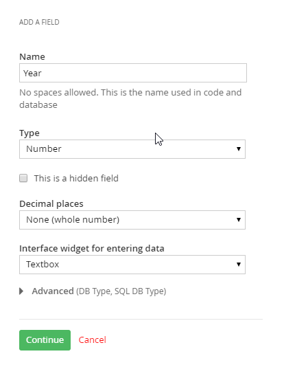{width="3.7305555555555556in"
height="4.290277777777778in"}

> 202 \| CUSTOM MODULES

8.  After hitting the Continue button on the Add a field dialog, a new
    dialog shows in its place to define the interface widget. In the
    example below the Number box requires a Label that will be shown on
    the widget and Instructional text that will show as a prompt. Select
    the This is a required field checkbox to force entry in this field.

{width="3.7305555555555556in" height="4.475in"}

CUSTOM MODULES \| 203

9.  Click the Limitations link. The limitations area allows you to put
    constraints on what you allow entered in a field. The limitations
    you can apply vary depending on the type of field. The number box
    editor allows a simple Min and Max limit on allowed values. Click
    the Done button to finish creating the field.

{width="3.7305555555555556in"
height="2.165277777777778in"}

10. The Fields of this item area shows the new custom *Year* field.

{width="4.6416524496937885in"
height="1.6396872265966753in"}

> 204 \| CUSTOM MODULES

11. Add the fields with the following names and properties:

    d.  Name: *Make*, Type: Short text

    e.  Name: *Model*, Type: Short text

    f.  Name: *Image*, Type: Related media (images, video, files), What
        kind of media: Images.

    g.  Name: *Price*, Type: Number, Unit: \$

    h.  Name: *ContactEmail*, Type: Short text

> Now the fields should look like the screenshot below.

{width="4.429875328083989in"
height="2.682811679790026in"}

> **Note**: The image selector limitations in the Add a field dialog
> includes a throttle for the number of images that may be uploaded,
> their size and their type (for example \*.png or \*.jpg). You should
> carefully consider what should be allowed and place limits that don't
> allow users to exceed these requirements.

CUSTOM MODULES \| 205

12. Once all the fields are defined, select the field that will be used
    as the identifier of the content from the drop down list. The drop
    down list will only show Short Text fields that are marked as
    Required. Leave the *Title* as the identifier of the content.

{width="4.683249125109361in"
height="1.1145833333333333in"}

13. Click the Finish button to create the module.

14. Click the Activate this Module button. The page for your module will
    include an option to Deactivate the module, go back to add or edit
    fields, and edit the Name and description of the module. The Backend
    screen tweaks option determines how the module records are displayed
    and how the screen to create or edit a module record is displayed.

{width="6.2in" height="4.235416666666667in"}

> 206 \| CUSTOM MODULES

15. The module will now appear in three locations in Sitefinity.

-   Administration \> Module Builder: Use this option to add or change
    fields, edit the name and description, make changes to the backend
    screens and to activate/deactivate the module.

-   Content \> \[your module name\]: Use this option to add, update and
    delete data for your module, and to publish/unpublish rows of data.

-   The right hand menu of widgets on each page designer will include an
    icon that represents your module data. Drag the widget to the page
    to present the new dat[]{#_bookmark25 .anchor}a.

##### Editing Custom Modules

> If you need to add or delete fields, click the link or the content
> type.

{width="3.05in" height="3.0652777777777778in"}

> Be aware that if you delete a field, the operation will remove the
> field and any data that was entered into it.

{width="4.135416666666667in"
height="1.1104166666666666in"}

> There is no direct way to edit the type of a field, say change a short
> text to a long text, but you can delete a field and then re-add it and
> assign a new type.

CUSTOM MODULES \| 207

##### Working with Module Content

> From the Content menu select your new content item. This example shows
> a new *Cars*
>
> menu item for module of the same name.

{width="2.7581288276465443in"
height="2.96875in"}

> The first time you enter the screen you will see a \"Create a \[my
> module type\]\" link that you can click to create a new item.

{width="3.220138888888889in"
height="2.720138888888889in"}

> 208 \| CUSTOM MODULES
>
> Enter the fields you defined when creating the module. When complete,
> click the Publish button.

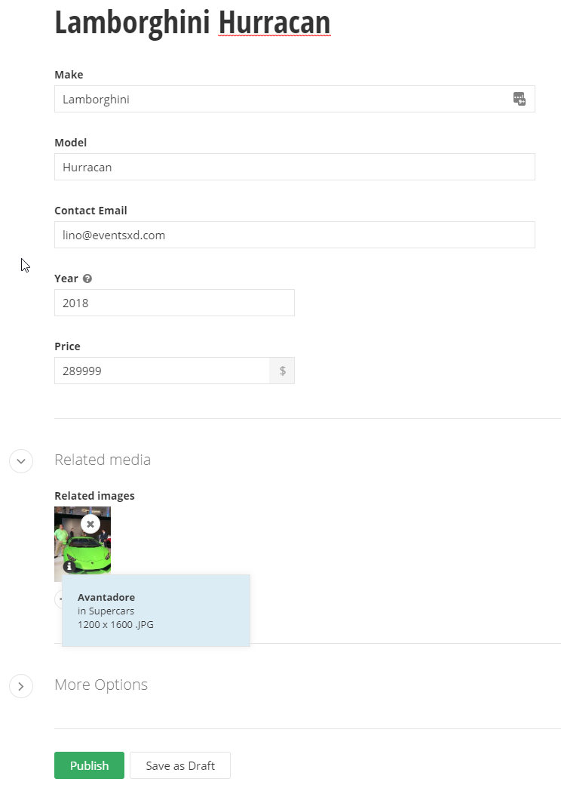{width="5.285858486439195in"
height="5.867603893263342in"}

> After adding several entries, you can see the actions and stock
> columns *Author* and
>
> *Publication Date* that come along with all content.

{width="6.510416666666667in"
height="1.5902777777777777in"}

CUSTOM MODULES \| 209

##### Sorting Custom Data

> By default, you can sort custom data by Title, Last Created or Last
> Modified. To sort by any of your custom fields, select the Custom
> Sorting drop down option.

{width="1.7393110236220473in"
height="2.1041666666666665in"}

> In the Custom sorting dialog you select one of your custom fields from
> the drop down list and choose if the sort order will be Ascending or
> Descending. If you want additional sorts click the Add another sorting
> rule.

{width="4.53in" height="2.5in"}

> 210 \| CUSTOM MODULES
>
> In this example we will sort by Make and then Model within Make. Click
> the Save button to apply the new sort order.

{width="4.5311111111111115in"
height="3.3958333333333335in"}

##### Customize the Grid List of Module Content

> You won't be able to tell easily if the data has been sorted or
> filtered because the default listing only shows columns for the title,
> actions, author and publication data. To add columns to the listing,
> first navigate to Administration \> Module Builder, then click the
> module you are interested in. In this example we will click the custom
> Cars module [created in previous topics]{.underline}. Then click the
> Backend screen tweaks link.

{width="6.810416666666667in"
height="1.9604166666666667in"}

CUSTOM MODULES \| 211

> Click the Add / remove columns in the table (grid) button.

{width="6.030555555555556in"
height="3.4451388888888888in"}

> The Existing columns will allow you to drag and drop the columns in
> any order you want to see. The custom fields are listed on the right
> side and can be dragged into any column of the grid. In this example,
> the Make and Model are dragged in just after the Title column. When
> you have the arrangement of columns that you want, click the Save
> Changes button.

{width="6.520138888888889in"
height="2.0104166666666665in"}

> 212 \| CUSTOM MODULES
>
> Now you can apply a custom sort on your data as shown in the
> screenshot below that is sorted first by Make and then Model.

{width="6.785416666666666in"
height="1.6604166666666667in"}

##### Filtering Custom Data

> The filtering for your custom data changes depending on the columns
> available in the module. For starters, you can filter by ownership
> such as All Cars or just My Car or work flow status such as
> Drafts/Published/Scheduled. If you add Classification columns to your
> data such as Categories or Tags, and then populate those fields, new
> filter criteria show up in the Manage bar. For example the by
> Categories... filter shows up in the Manage bar shown below because a
> Classification category field was added to the Car custom content
> type. The Category content type has entries for 1960s and 1970s. The
> Car records were then edited to add either a 1960s or 1970s category.
>
> Click the by Categories... link to select from the choices that exist
> in the data.

{width="2.269435695538058in"
height="3.3541666666666665in"}

CUSTOM MODULES \| 213

> Any categories that have been added to a Car record will show up in
> the filter list that will also show the number of records in
> parenthesis where this data occurs. Click the category that you want
> to filter by to see the matching records appear.

{width="6.520138888888889in"
height="0.9402777777777778in"}

> If you have defined a custom classification, the new classification
> will appear in the filter list. For example, if you were to create a
> new classification, Manufacturers, added that classification as a
> custom field for the module and then populated module items
> Manufacturer field, you will see by Manufacturers... below the
> categories and tags filters.

{width="1.7055555555555555in"
height="1.1305555555555555in"}

> Then you can select the classification element (the Chrysler
> manufacturer in this screenshot) to show only the custom data with
> this classification.

{width="2.9604166666666667in"
height="2.915277777777778in"}

##### Revision History

> Each content item for your custom module has a revision history so
> that you will know who changed the data, when the change occurred and
> what data fields were altered. You can view the history from inside
> each Module Builder module. To see revision
>
> 214 \| CUSTOM MODULES
>
> history for a custom module's content, select the module from the
> Content menu. Locate the record you're interested in and select
> Revision History from the drop down Actions menu.

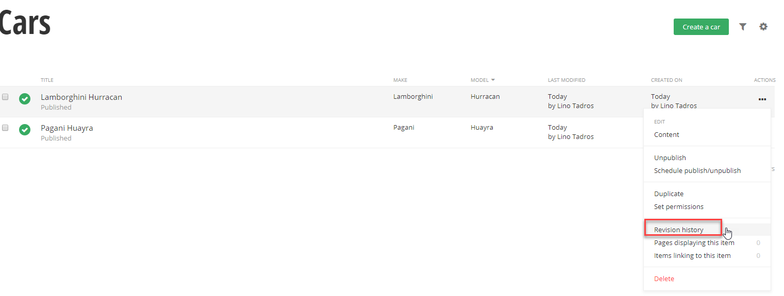{width="6.820138888888889in"
height="3.0652777777777778in"}

> The revision history will have a version item for each time the record
> has been edited. From this list you can quickly see how many edits
> occurred, who made the edits and when.

{width="6.820138888888889in"
height="3.4555555555555557in"}

CUSTOM MODULES \| 215

> Click the Write note link to include background or justification for
> the change. Click the Save button to keep your changes with the
> revision.

{width="3.560416666666667in"
height="2.0652777777777778in"}

> The notes appear in the listing of revisions.

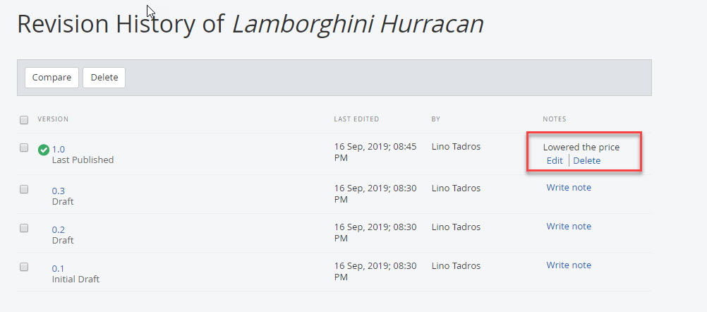{width="6.56749343832021in"
height="0.7291666666666666in"}

> To find out exactly which field data was changed, select two revisions
> using the checkboxes and then click the Compare button.

{width="3.0104166666666665in"
height="2.620138888888889in"}

> 216 \| CUSTOM MODULES
>
> While the revision note is the change the person editing record
> *thought* they made, the comparison highlights each actual data
> change. The example below shows that "1970" was added to the title in
> the latest revision. If someone incorrectly edits a record, you can
> click the Revert to this version button to roll back changes to an
> earlier time.

{width="6.820138888888889in"
height="3.435416666666667in"}

CUSTOM MODULES \| 217

##### Add the Module to a Page

1.  Drag the widget for your new module onto the page.

{width="2.2852209098862644in"
height="5.767707786526684in"}

> 218 \| CUSTOM MODULES
>
> The module will be listed using the default configuration and layout.
> The example below shows all published cars in a list and the layout
> for each item shows the Title and published date.

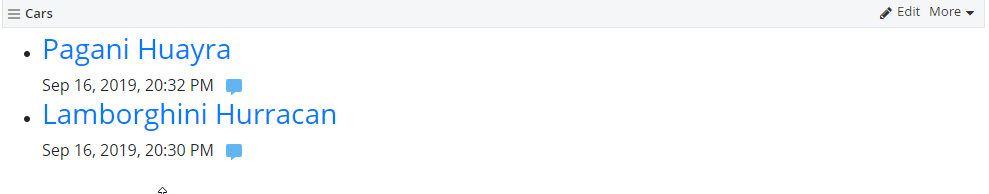{width="5.413702974628172in"
height="1.7395833333333333in"}

2.  Publish the page.

3.  View the completed page.

4.  Click one of the items to see the detail.

{width="4.560416666666667in"
height="4.790277777777778in"}

CUSTOM MODULES \| 219

##### Customizing the Backend Grid

> The stock backend grid shows only the identifying field and built-in
> content field's Publication Date and Author. You can customize the
> backend grid to show the columns from your module.

1.  To customize this list to include the year, make and model, select
    the menu Administration \> Module Builder.

2.  Select the link for your module.

3.  Select the Backend screens tweaks link.

{width="6.1in" height="1.0652777777777778in"}

> 220 \| CUSTOM MODULES

4.  Click the Add / Remove columns in the table button.

{width="5.885416666666667in" height="3.125in"}

5.  Representative examples of the existing columns display in a grid.
    Notice that some columns can be moved by dragging. Only the *Author*
    column can be deleted. Click the small x button to remove the
    *Author* column.

{width="6.020138888888889in"
height="2.160416666666667in"}

CUSTOM MODULES \| 221

6.  Drag the columns from your module to the right end of the grid and
    drop them there.

{width="6.020138888888889in"
height="2.1805555555555554in"}

7.  Click the Save Changes button.

8.  From the menu select Content \> \[your module\]. The grid now shows
    the other columns defined in your module.

{width="6.010416666666667in"
height="1.1902777777777778in"}

> 222 \| LOCALIZATION

Localization
============

> Localization allows you to display your website in any language. The
> ability to localize your entire site to any language is baked right
> into Sitefinity. Not only text, but any other content relevant to the
> culture of your website visitor is configurable. The back- end of the
> website is also fully localizable. All menu items, button text,
> labels, etc. are localizable. Search for \"Language Packs\" here:
>
> [*http://www.sitefinity.com/marketplace/modules.aspx.*](http://www.sitefinity.com/marketplace/modules.aspx)

##### Localizing Front End Pages

> In this next walk through we will add the Spanish language and
> localize a front-end page to reflect the language choice.

1.  Select the administration menu Settings option.

2.  From the list on the left side of the page select the Languages
    option.

3.  Click the Add languages\... button.

4.  Use the search box to locate *Spanish* in the list and select the
    check box.

{width="4.072413604549431in"
height="1.96875in"}

LOCALIZATION \| 223

5.  Click the Done button. Now the new *Spanish* language entry shows up
    under the default *English* entry.

{width="4.4233344269466315in"
height="1.9078116797900262in"}

> Below the Languages for public content section is the Default language
> for the backend system. You can change the language for the backend
> system by clicking the Manage backend languages link and adding
> languages there. Leave the default setting for this example.

6.  Click the Save changes button.

> Select the administration menu Pages option. This option will take
> extra time because Sitefinity needs to accommodate the new languages
> by making database changes. When the list refreshes, all the pages in
> the site are \"localization ready\" and have a new Translations
> column.

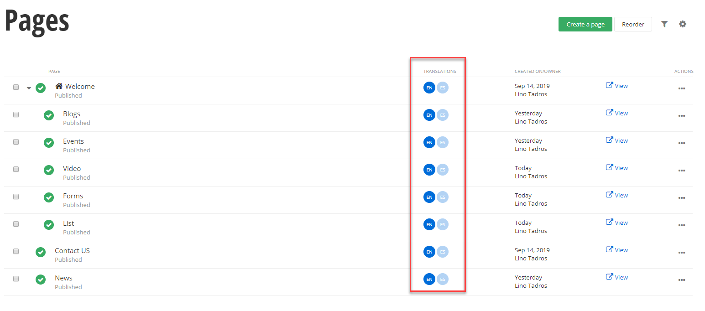{width="5.989786745406824in"
height="2.8102077865266843in"}

> 224 \| LOCALIZATION

7.  Click the ES Add link for the home *Welcome* page (if you don't have
    the page built, go ahead and create a welcome page now).

{width="4.151536526684165in"
height="1.1240616797900262in"}

8.  Create a page (ES) displays so you can supply a new page Name, URL
    and Title in the appropriate language.

{width="3.4861843832020996in"
height="2.37875in"}

LOCALIZATION \| 225

9.  Click the Create and go to add content button.

10. At this point your options are Copy from another language, or Start
    from Scratch. The first option is especially productive if you have
    images that you want to copy between versions. Click the Copy from
    another language link.

11. The Copy content from another language dialog displays. The English
    language is the only version available for this page, so the drop
    down list is disabled. Select the Keep all language versions synced
    check box. Click the Done button to close the dialog.

{width="3.55in" height="2.925in"}

> The translated page displays. Notice the message at the top of the
> page that lets you know that the pages are synced and what kind of
> behavior you can expect while designing the page.
>
> 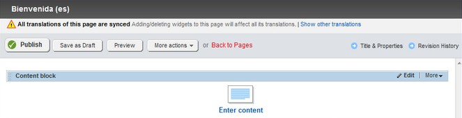{width="6.020138888888889in"
> height="1.5604166666666666in"}
>
> 226 \| LOCALIZATION

12. Click the content block Edit button (if you don't have a Content
    Block on the page, add one now).

13. Paste *Bienvenido a CarConduit!* into the editor window. Click the
    Save button.

14. Click the Publish button. Note that publishing pushes out all the
    translations.

15. View the page. Notice the URL in the address bar uses the culture
    code *es*. The translated content shows at the head of the page.

{width="4.270138888888889in"
height="2.4055555555555554in"}

LOCALIZATION \| 227

##### User Language Selection

> You can use the Language selector widget right in your page so that
> the user can dynamically choose the language they want to view the
> page in.

1.  Open the localized page for editing again.

2.  Open the Navigation section of the right hand menu. Drag the
    Language selector widget to the top of the page.

3.  Click the language selector widget Edit button. In the Display
    language selector as\... option, select Drop-down menu.

> Also notice the checkbox option to include the current language in the
> selector.
>
> What to do with languages without translations? Your options are to
> Hide the link to the missing translation or Redirect to the home
> page\...

{width="3.469408355205599in"
height="3.588020559930009in"}

> 228 \| LOCALIZATION

4.  Click the Save button to close the dialog.

> Publish and view the page. Use the drop down language selector to show
> both translations of the page.

{width="1.2393536745406823in"
height="0.7995833333333333in"}

> PAGE ADMINISTRATION \| 229

Page Administration
===================

> As your own website builds in size and complexity, you need to work on
> all your pages in one place. For example, you may want to search for a
> certain set of pages, then publish them all. Pages administration
> allows you to work on all your pages at one time. The top of pages
> administration contains a set of buttons that create, delete and
> perform other actions on pages. Below that is a list of pages, and to
> the right, the Manage Pages area.

{width="6.520138888888889in" height="3.425in"}

##### Page List

> {width="0.125in"
> height="0.10454505686789152in"}{width="0.14499890638670165in"
> height="0.14499890638670165in"}Pages are listed in a tree structure.
> The screenshot below shows a *Welcome* page, with a *Contact Us* page
> underneath it. Notice the house icon that lets us know that *Welcome*
> page is the default home page. Also notice the green check marks that
> indicate these pages are published. Click the name of the page to edit
> the page or click the View link to preview the page at any time in a
> separate browser window. The Actions menu provides the full set of
> options possible for the page, such as deleting, editing, etc. The
> Date/Owner column shows the creation date of the page and the person
> that created it.

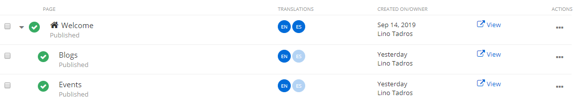{width="5.422534995625547in"
height="0.9178116797900262in"}

> 230 \| PAGE ADMINISTRATION

##### Actions

> The top section of the Actions menu allows you to Delete the page
> completely from the system while Unpublish makes the page invisible to
> the public.
>
> **Note**: By default, Sitefinity sends deleted pages to a [[recycle
> bin]{.underline}.](http://docs.sitefinity.com/recycle-bin)
>
> Use Duplicate if you want to use the existing page as a starting
> point. Set as Homepage makes the selected page the default if you
> navigate to the website without specifying a particular page. Share
> preview link\... creates a temporary link (expires in one day by
> default) that you can paste into an email or instant message.
>
> Create a child page adds a new page underneath the current page in the
> tree hierarchy.
>
> The Edit\... section of the Actions menu allows you to go back and
> change the Content or Title and Properties. Permissions determines who
> can see and perform other actions on the page. Revision History allows
> you to see each of the changes made to the page, who made these
> changes and when. If a later version has serious mistakes, you can
> revert to any earlier version.
>
> PAGE ADMINISTRATION \| 231
>
> {width="2.91in" height="6.115in"}The Change
> section of the Actions menu allows you to change the Template for the
> page. For example, if you want the page that has a single column and
> header and footer to use the Apple Promo style layout with three
> columns, then you can change the template for the entire page.
> Changing page Owner lets you pass off certain pages to other team
> members so that they can search for pages that they have
> responsibility for.
>
> Use the Move\... section Up and Down options to move the page in the
> tree hierarchy.
>
> More options may show up on this menu depending on the state of the
> page. For example, if the page is locked, the Unlock option will
> display here. Note that all items in the menu will only show up if you
> have the appropriate permissions. For example, you might not see the
> Change Owner option if you don\'t have the correct permissions.
>
> 232 \| PAGE ADMINISTRATION

##### Revision History

> When you click the Save button, content is recorded in the revision
> history (shown on the right of the screenshot below). The revision
> history allows you to compare versions, roll back to earlier versions
> and add notes to particular versions.

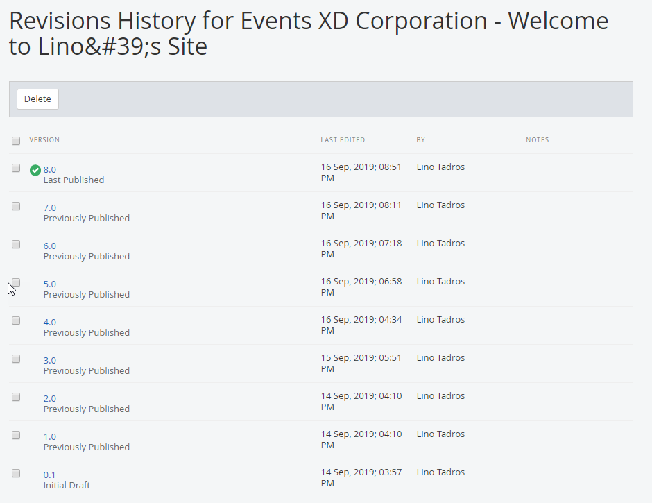{width="6.520138888888889in"
height="3.6055555555555556in"}

> PAGE ADMINISTRATION \| 233

##### Manage Pages

> As you build your production website, it becomes harder to locate
> pages when you want to maintain them. The Manage Pages area to the
> right of the page list allows you to filter pages quickly. The filters
> in the screenshot below are not random, but reflect Telerik\'s
> experience working with Sitefinity customers in real-world situations.
> For
>
> {width="3.06in" height="6.05in"}example,
> lack of descriptions or keywords are not best practice for Search
> Engine Optimization.
>
> You can use the With No Keywords filter for example to get the pages
> where keywords were left out. You can, of course, just filter to show
> only your own pages. Using the by Date modified\... filter you can
> look at the most recent changes, or use a custom date and time range.
>
> The Manage also \> Templates option is a shortcut for Design \> Page
> Templates.
>
> The Permissions for all pages option allows you to change the access
> to all pages at one time. This option controls what roles can view,
> edit, modify, and change permissions and so forth.
>
> The [[Custom fields for page]{.underline}](#_bookmark5) option allows
> you to attach extra information to your page.
>
> 234 \| PAGE ADMINISTRATION

##### Function Bar

> The buttons along the top of the pages list work against all selected
> pages at one time. The checkboxes to the left of each page indicate
> which pages are affected. You can Create a child of the selected page
> to extend the hierarchy of pages. The More actions drop down menu
> includes the ability to change the page Template (i.e. the predefined
> overall layout of the page). You can also restructure your page by
> dragging and dropping pages.

{width="5.185416666666667in" height="2.175in"}

> To narrow down a long list of items, click the Search\... button,
> enter the text to search for and click the Search button next to the
> text entry. The search is not case sensitive and looks for titles that
> contain the search text. Click the Close Search button to return to
> the unfiltered list of items.

{width="6.520138888888889in"
height="1.8305555555555555in"}

##### Sharing Pages with Unauthorized Users

> You may need to share page links with people that don't have a user
> name or password in your Sitefinity site. For example, you may want
> reviewers to see pages even though they are not authorized on your
> system. You can even share a link to the draft of a page before it
> becomes published, as well as have the link expire on a given day.
>
> PAGE ADMINISTRATION \| 235
>
> You will need to change administration settings to allow sharing with
> unauthorized users and also create a preview link.
>
> Using the Sitefinity administration menu, first navigate to
> Administration \> Settings, then click the Advanced link. Then click
> the Pages node of the left hand tree view. Verify that the Allow
> backend users to share link to preview pages option is checked. Also
> inspect the Expiration time for shared links entry for the number of
> hours before the shared links expire. If you make any changes from the
> default values, click the Save changes button.

{width="6.520138888888889in"
height="4.445138888888889in"}

> 236 \| PAGE ADMINISTRATION
>
> To obtain a link to share with unauthorized users, navigate to Pages,
> drop down the Actions menu for the page you want to share and click
> the Share preview link option.

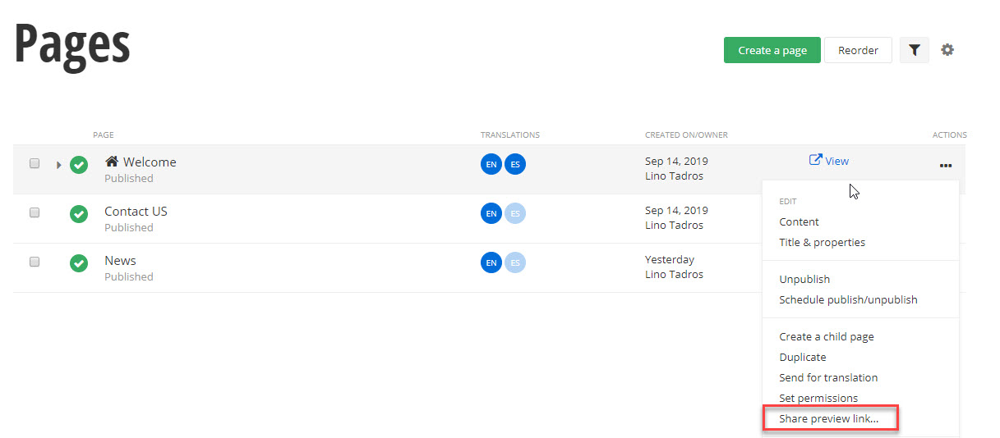{width="6.520138888888889in"
height="2.6902777777777778in"}

> The Share secure link to this item dialog appears and provides a link
> that you can paste in an email or Instant Message. Notice that the
> dialog tells you how long the link will be valid for before it
> expires.

{width="4.118534558180228in"
height="2.4270833333333335in"}

##### Custom Fields for Pages

> The ability to create your own arbitrary fields for pages has been a
> top customer request. The *custom fields for pages* feature now allow
> you to specify additional details for a page. Once a custom field is
> created, the field is associated with the page from then on. It's an
> all-in-one tool that you can use for multiple purposes as your
> requirements dictate. You can use custom fields to associate
> information with the page such as manufacturer, costs or priorities.
> You can also use custom fields to customize
>
> PAGE ADMINISTRATION \| 237
>
> how a particular page is rendered. For example, you could include
> custom banner images, icons or other styling for each page based on a
> custom field.
>
> **Note**: You can [define custom fields just like this for the other
> content types]{.underline} and for [custom data types]{.underline}.
>
> To create a custom field, navigate to Pages from the administration
> menu. On the right- hand side under Manage Pages, click the Custom
> fields link.

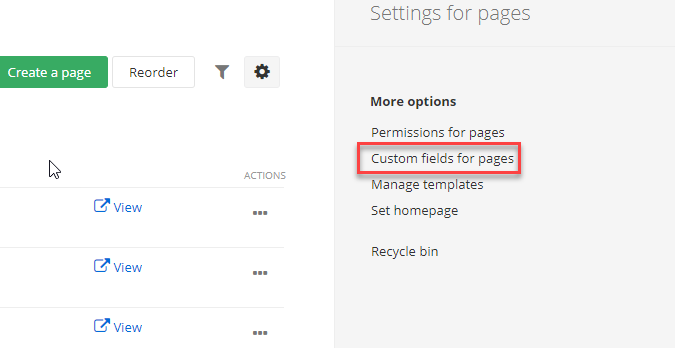{width="2.3555555555555556in"
height="1.3652777777777778in"}

> This takes you to the Pages Data Fields page that lists both custom
> and default fields. In the Custom fields area, click the Add a
> field... button.

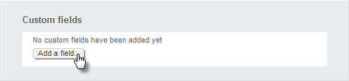{width="5.378198818897638in"
height="1.2445833333333334in"}

> 238 \| PAGE ADMINISTRATION
>
> In the Add a field dialog, select the Type of data you want in your
> custom field from the drop-down list. Choices include Short text, Long
> text, Multiple Choice, Yes / No, Currency, Date and Time, Number,
> Classification, Related data, Related Media and unknown.
>
> Classification will let you choose from a list of choices such as
> Category, Tags or Departments. Related data will let you choose from a
> list of content types like News, Blog posts, Events or Pages. Related
> media choices are Images, Videos or Documents and other files.
>
> Here is an example that contains a simple Short text field named
> MoreInformation. The Name is used in code and in the database, so no
> spaces are allowed in the name. Enter a Name and click the Continue
> button.

{width="4.0746445756780405in"
height="4.228124453193351in"}

> PAGE ADMINISTRATION \| 239
>
> Next up, the Settings dialog allows you to enter the Label and
> Instructional text that will display with the field when editing the
> page's Title and Properties. Enter those items and click the Done
> button.

{width="4.114664260717411in"
height="5.114583333333333in"}

> When you have added as many custom fields as you require, click the
> Save changes button.

{width="5.154951881014873in"
height="2.124374453193351in"}

> 240 \| PAGE ADMINISTRATION
>
> Now, navigate to any specific page and click the Title and Properties
> link at the top of the screen.

{width="1.8in" height="1.0805555555555555in"}

> In the Edit the Page screen that shows, scroll down to the bottom to
> find the entry for your new field. Enter content to the new field and
> then click the Save changes button.

{width="6.446680883639545in" height="1.9375in"}

##### Personalization

> Personalization lets you display different versions of a page to those
> that belong to a particular *user segment*. A *user segment* is a
> collection of characteristics that define a group of people, such as
> how long the user stays on the site, the time of day, the user's
> preferred language, the number of blog posts the user has contributed,
> what items or types of items they've purchased, what page they landed
> on and many others. If a user spends a long time on the *Luxury Car
> Trends* page you could display a *Suggestions for You* page that has
> luxury cars and products. A user that purchases sleeping bags and camp
> stoves could be shown outdoor gear. The user effectively gets a custom
> page.
>
> Before you can personalize pages, your administrator needs to set up
> user segments in Marketing \> Personalization. For this example, there
> is a *Luxury Cars* segment and a *Clothes* segment.
>
> PAGE ADMINISTRATION \| 241
>
> To personalize a page, you can either start from the Pages
> administration and select Personalization from the Actions drop down
> list or you can edit a page and click the Personalize this page
> button. In this example, we start by editing a new page called
> *Suggestions*. The page has a single content block at the top with
> text *Suggestions for you* in a heading style. From here:

1.  Click the Personalize this page from the top right row of buttons.

{width="6.020138888888889in"
height="2.8354166666666667in"}

2.  Select a user segment from the drop down list, then click the Create
    and go to edit content button.

{width="4.425in" height="2.790277777777778in"}

> 242 \| PAGE ADMINISTRATION
>
> Notice that the page title *Suggestions* is appended with a drop down
> list that displays *Luxury Cars*. The list will include each
> personalization and an entry for *Everyone*.

{width="5.330555555555556in"
height="2.4902777777777776in"}

3.  In this example an Image widget is added that displays a luxury car.

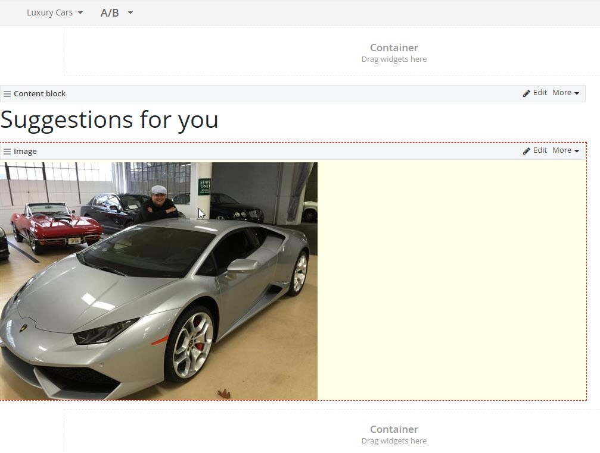{width="6.020138888888889in"
height="3.040277777777778in"}

> PAGE ADMINISTRATION \| 243

4.  You can repeat these steps, starting with clicking the Personalize
    this page button, for every user segment. For example, we can
    personalize the page for the Clothes user segment by adding an
    Ecommerce product list widget.

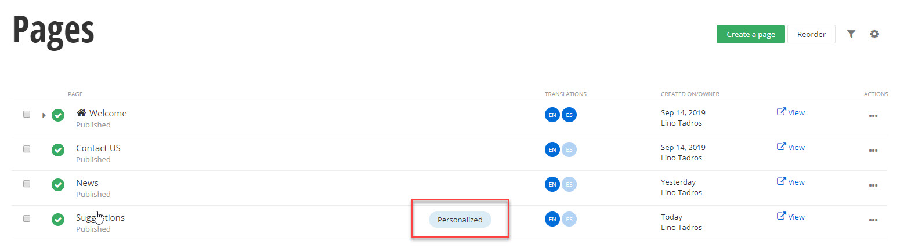{width="6.020138888888889in"
height="4.935416666666667in"}

> The Pages list will now show a Personalized link. Clicking the link
> will allow you to edit any of the personalized pages.

{width="5.936059711286089in"
height="0.38437445319335084in"}