Sitefinity Business Workshop
-------------------------------

###### ©2019 Alain "Lino" Tadros

> All rights reserved. No parts of this work may be reproduced in any
> form or by any means - graphic, electronic, or mechanical, including
> photocopying, recording, taping, or information storage and retrieval
> systems - without the written permission of the publisher.
>
> Products that are referred to in this document may be either
> trademarks and/or registered trademarks of the respective owners. The
> publisher and the author make no claim to these trademarks.
>
> While every precaution has been taken in the preparation of this
> document, the publisher and the author assume no responsibility for
> errors or omissions, or for damages resulting from the use of
> information contained in this document or from the use of programs and
> source code that may accompany it. In no event shall the publisher and
> the author be liable for any loss of profit or any other commercial
> damage caused or alleged to have been caused directly or indirectly by
> this document
>
#### Table of Contents

[Introduction](./Introduction/readme.md)
-------------------------------------------

[Getting Started](./Getting%20Started/readme.md)
------------------------------------------------

[Pages](./Pages/readme.md)
-----------------------------

[News](./News/readme.md)
------------------------

[Blogs](./Blogs/readme.md)
-----------------------------

[Events](./Events/readme.md)
----------------------------

[Images](./Images/readme.md)
------------------------------

[Videos](./Videos/readme.md)
-----------------------------

[Documents & Files](./Documents%20and%20Files/readme.md)
--------------------------------------------------------

[Forms](./Forms/readme.md)
----------------------------

[Lists](./Lists/readme.md)
--------------------------

[Content Blocks](./Content%20Blocks/readme.md)
----------------------------------------------

[Email Campaigns](./Email%20Campaigns/readme.md)
------------------------------------------------

[ECommerce](./ECommerce/readme.md)
-------------------------------------

[Custom Modules](./Custom%20Modules/readme.md)
----------------------------------------------

[Localization](./Localization/readme.md)
----------------------------------------

[Page Administration](./Page%20Administration/readme.md)
--------------------------------------------------------

[Wrap Up](./Wrap%20Up/readme.md)
--------------------------------

DOCUMENTS & FILES \| 99

Documents & Files
=================

> Use Documents when you want to include a link to a PDF, Word, Excel or
> other file. Documents are contained in Libraries. You can display
> links to a single document or all documents in a library.

##### Create Libraries and Documents

1.  From the administration menu Content, select the Documents & Files
    option.

2.  Click the Create a library link.

3.  Enter the Library name. Select the Click to add a description link
    and enter some descriptive text there.

{width="3.9522911198600177in"
height="2.15625in"}

4.  Open the Root Library settings area. You don\'t want huge file
    uploaded to the server hard drive. Pick a maximum size, for example
    2 MB, per file and enter it as the Max document/file size.

{width="2.4902777777777776in" height="1.75in"}

> 100 \| DOCUMENTS & FILES

5.  Click the link to your new library to open it.

6.  Click the Upload documents and other files button.

7.  Click the Select document from your computer link.

8.  Navigate to a file and select the file.

9.  Click the Add more documents button and select another type of file.

10. Click the Upload and Publish button.

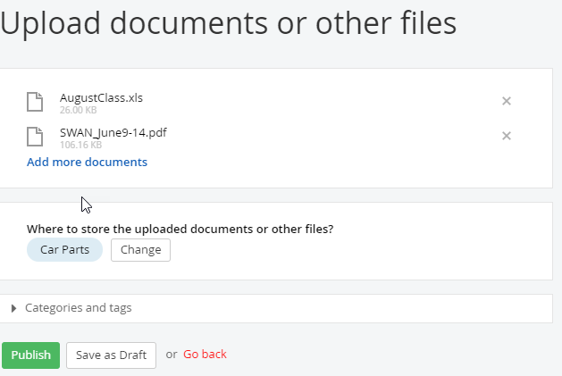{width="6.020138888888889in"
height="3.4854166666666666in"}

11. Click the View all items button. Click the link for the library you
    just created. The screenshot below shows a Word and a PDF file
    listed in the library. Sitefinity detects the type of files that are
    uploaded and displays the matching icon.

{width="6.020138888888889in"
height="1.6305555555555555in"}

DOCUMENTS & FILES \| 101

12. Click Embed link to this file of the first file in the list. This
    link can be used to paste into an email.

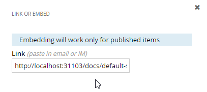{width="3.29in" height="1.5in"}

13. Close the window.

> 102 \| DOCUMENTS & FILES

##### Add Document Links to Pages

> How do you add a link to a document or show a list of documents on the
> page?

1.  Click the Pages menu item.

2.  Open the *Welcome* page for editing.

3.  Drag a Document link from the Content widgets to the bottom of the
    page, below any of the other widgets or boxes on the page. This will
    automatically create a new area on the page.

4.  Click the Document link widget Edit button. This brings up the
    Document dialog.

5.  Click the Select document.

6.  Select one of the files and click the Done button.

7.  Click the Save button.

{width="5.9751859142607175in"
height="4.013332239720035in"}

DOCUMENTS & FILES \| 103

8.  Click the Preview button. The link displays along with an
    appropriate icon. Click the document link. Depending on the default
    behavior and configuration of your browser, the document may display
    in the browser or prompt to download.

9.  Close the preview.

10. Delete the Document link widget from the page using the More \>
    Delete link.

11. Drag a Download list widget to the bottom of the page. By default,
    the list will show all the documents from all libraries.

12. Click the Download List widget Edit button. Using the dialog, you
    can include all documents, from a selected library or upload new
    documents. The documents can be sorted by Last published, Last
    Modified, As they are ordered in library and As set in Advanced
    mode.

{width="4.096335301837271in"
height="3.7743744531933507in"}

> 104 \| DOCUMENTS & FILES

13. Click the Settings link to manage the layout details of the widget.
    There are two areas, Select type and Fine tune the selected type.

{width="3.3854166666666665in" height="2.8in"}

> The type selected outputs one of these formats:

-   The List type displays with the link at the top of each file.

{width="1.625in" height="0.95in"}

-   The Table type arranges the document information in a grid with the
    link to the right side of each entry.

{width="3.7152777777777777in"
height="1.1555555555555554in"}

-   The last two options display the list or table with a link to a
    detail page where you can download the file.

{width="1.3402777777777777in"
height="0.6451388888888889in"}

DOCUMENTS & FILES \| 105

-   The Fine tune\... part of the dialog changes slightly based on the
    selected type. The section at the top controls the number of files
    shown at one time. The lower part of the dialog controls whether
    icons are shown on the page and their size.

{width="2.4055555555555554in"
height="2.8201388888888888in"}

14. Click the Save button to close the Download list dialog.

15. Publish and view the page.

> 106 \| FORMS

Forms
=====

> If you want to get information from users, you certainly don\'t want
> to wait for a developer to create a form. Building forms on-the-fly is
> one of the most heavily requested features of Sitefinity. You might
> need to record maintenance requests, user ideas, letters to the
> editor, contact info or any of hundreds of different types of data
> your organization needs to record and stores.
>
> Using Sitefinity you can create your own form easily, without any
> programming. The user fills out the form online, clicks the submit
> button, and the information is stored in the Sitefinity database.
> Forms can either be contained to a single page, or spread across
> multiple pages for a better user experience. You can then review
> responses sent by users or you can export responses to Excel for
> further processing.

##### Creating a Form

> Follow these steps to create a form:

1.  Click the administration menu Content \> Forms item.

2.  Click the Create a form button.

3.  Assign the form Title. You can also assign a name if developers will
    be using the form. The name is filled in automatically based on the
    title but you can also click the change button and use your own
    organization's naming convention.

FORMS \| 107

4.  Under Advanced, leave "MVC only" as the Web framework. The Web
    framework determines how the Form is rendered, and with what Page
    widgets you can use the Form in. MVC only gives you access to a
    smoother experience and unlocks the additional "Page Break" feature,
    which allows you to divide a form into multiple sections. Click the
    Create and go to add content button.

{width="6.020138888888889in"
height="4.370138888888889in"}

5.  The form designer looks very much like the designer for pages,
    except with a different set of widgets. Drag a Textbox widget to the
    box area on the form. Sitefinity knows that you will need a submit
    button to collect the information, so a submit button is added
    automatically along with the Textbox widget.

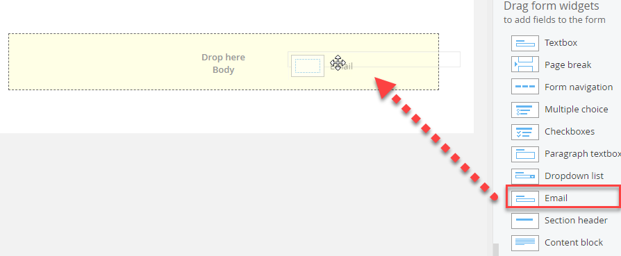{width="6.020138888888889in"
height="1.1701388888888888in"}

> 108 \| FORMS

6.  Click the Textbox widget Edit link. The Textbox dialog displays
    showing links for Label and text for the content and instructional
    text and Limitations to validate the Textbox input.

FORMS \| 109

7.  Under Label and text, enter the following:

-   Label: "Email".

-   Placeholder: "<my.email@example.com>".

-   Instructional text: \"Please enter your email address\".

-   Required field: check this box. This will prevent the form from
    being submitted until this field is filled in.

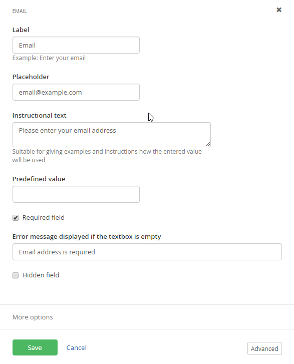{width="5.5152777777777775in" height="7.05in"}

> 110 \| FORMS

8.  In Limitations \> Range, enter a Min of 5. In the Error message
    displayed\... enter \"Email must be at least 5 characters long\".

9.  Click the Save button to close the dialog. The form should look
    something like the screenshot below.

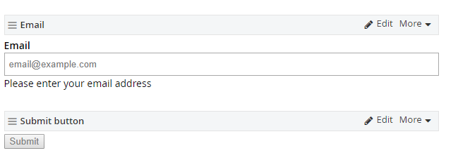{width="6.020138888888889in"
height="2.795138888888889in"}

10. Drag a Multiple choice widget onto the form. Click the Edit link.

11. In Label, enter \"Your question is about\...\"

12. The Choices section will have three choices predefined. Change the
    text for the First Choice to \"Classic Cars\" and the Second Choice
    to \"Performance Cars\". Click the x button next to the Third Choice
    to remove it.

13. Select the Add Other as a last choice check box.

14. Select the More Options link. In the Template, select
    Default\_Inline.

15. Click the Save button. The Multiple choice widget on the page should
    now look something like the screenshot below.

{width="3.525in" height="1.625in"}

FORMS \| 111

16. Drag a Paragraph textbox widget onto the form. Click the Edit link.
    Enter the following Label and text:

    -   Label: \"Question\".

    -   Add Instructional text: \"Please enter your question and include
        specific details\".

    -   Required field: Select this checkbox.

17. Click the Save button. The form should now look like the screenshot
    below.

{width="6.020138888888889in"
height="5.745138888888889in"}

> 112 \| FORMS

18. Splitting a Form across multiple pages is easy. Drag a Page Page
    Break widget onto the form, just above the Submit button. Sitefinity
    will automatically divide the form visually for you into two pages,
    providing a common footer that appears on all pages, and showing the
    separation.

{width="5.740277777777778in"
height="6.120138888888889in"}

19. On the new page, above the Submit button, drag another Textbox
    widget out. Give it a Label of "Final Thoughts" and mark it as a
    Required field.

FORMS \| 113

20. On the upper right side of the form, above the widgets, locate the
    Settings button and click it. This will display the Settings area to
    the right of the form.

{width="2.670138888888889in"
height="8.205555555555556in"}

> 114 \| FORMS
>
> Restrictions can be tailored to the particulars of a form. For
> example, for an informal poll you could restrict to only a single IP
> address, that is, each computer would only be able to submit the form
> one time. Attempting to submit the form a second time displays an
> error message to the user. The One entry per username option could be
> useful to collect user registration information. The No Restrictions
> option makes sense for general questions or trouble tickets to a
> support group.
>
> Confirmation options control what the page does when the page is
> submitted. By default a success messaged is displayed on the page. The
> Redirect to a page\... option requires the full Url of the page in the
> form of: <http://mydomain.com/mypage>.
>
> Send email notification for responses to... automatically emails to
> the address associated with your Sitefinity login and to multiple in a
> List of email addresses... The Validate emails verifies the format of
> the email addresses but does not check that they exist. So if you
> entered "\@carconduit.net", that would fail as an invalid email
> address. On the other hand, if "<bob@carconduit.net>" does not exist,
> it will still be valid.

{width="2.810416666666667in"
height="2.665277777777778in"}

21. Click the Publish button.

FORMS \| 115

##### Adding a Form to a Page

> To add an existing form to a page:

1.  Click the Pages menu item.

2.  Create a new page. For its template, click the Select another
    Template button and select a Bootstrap MVC template of your
    choosing. Otherwise, the form will appear compacted.

3.  Drag a Form widget onto the page. This widget should have "MVC"
    within its logo since we are on an MVC-enabled page. On default
    (hybrid) pages, you will see duplicate widgets for most content: The
    standard widget, and the MVC widget.

4.  Click the Select a form link on the Form widget.

5.  Select a form from the list.

6.  Click the Save button.

7.  Click the Publish button.

8.  Click the View button for the page that contains the form.

9.  Click the Next step button without filling out the form. An error
    message appears to indicate that the field is required. If you type
    a single character into the field and try to advance again, it now
    shows that it must be at least 5 characters long. These errors are
    due to the Required field and Limitations Range \> Min length
    settings.

> **Required message**

{width="3.1951388888888888in"
height="0.9451388888888889in"}

> **Minimum length message**

{width="3.935416666666667in" height="1.075in"}

> 116 \| FORMS

10. Fill out the form and submit it.

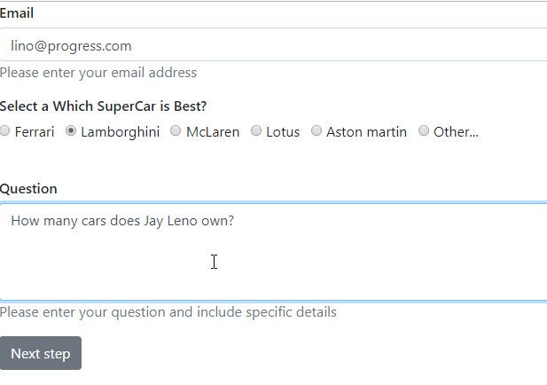{width="6.020138888888889in"
height="2.0in"}{width="3.175in"
height="0.7902777777777777in"}

> A success message defined in the form settings dispays on the page and
> lets the user know the information was received.

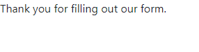{width="2.9854166666666666in"
height="0.3902777777777778in"}

##### Viewing Reponses

> Sitefinity maintains a list of all the responses for each form. The
> following will walk you through how to review responses and export
> responses to Excel.

1.  Click the administration menu Content \> Forms. Notice the link to
    the responses.

{width="6.080555555555556in"
height="0.9604166666666667in"}

FORMS \| 117

2.  Click the responses link. The Responses for\... page displays key
    information about each response, one column shows for every field on
    the form.

{width="6.020138888888889in"
height="1.1305555555555555in"}

3.  If you click one of the response items, the detail shows up to the
    right. This detail includes the date and time the response was
    submitted and the IP address origin where the response was sent
    from.

{width="4.105555555555555in" height="2.925in"}

4.  Click the Export as Excel button. This will prompt for a location on
    your hard drive where you can save the Excel file. Displaying
    responses in Excel shows detailed information that includes all the
    form fields.

{width="4.940277777777778in"
height="0.5902777777777778in"}

> 118 \| FORMS

##### Duplicating Forms

> If you need a form that is identical or nearly identical to an
> existing form, the Duplicate feature will create a copy, but will not
> copy the responses for the existing form. Also, the email
> notifications will not be copied. For example, starting with the
> example from [[Creating a Form]{.underline},](#creating-a-form) you
> could duplicate the "Ask CarConduit a question" and make a copy
> specifically for reviewers. To copy an existing form, click he
> Duplicate option from the Forms, Actions menu.

{width="6.545138888888889in"
height="3.8805555555555555in"}

FORMS \| 119

> Enter a new Title and either Create and go to add content or Create
> and return to Forms. If you go to add content, you can add or remove
> widgets to customize the form. For example, you might want to know
> what business or publication the reviewer represents and you could add
> a short text that asks that question.

{width="6.520138888888889in" height="3.675in"}

> The new form appears with the form that is was copied from, but does
> not carry over the responses from the original.

{width="6.520138888888889in"
height="1.3055555555555556in"}

> 120 \| LISTS

Lists
=====

> A List stores a series of values and descriptions. Lists are useful to
> show relatively small collections of codes or other designations. For
> example, you can use lists to track priorities, color coding or
> quality flags. These can be displayed in the page as simple lists,
> expandable lists or anchors. Each List has a title for the list as a
> whole, for example \"Priority\". Each list has a number of items,
> where each item has its own Title and Content such as \"High\",
> \"Medium\" and \"Low\" for example.

##### Creating Lists

> This walk-through demonstrates creating a simple list of priorities.

1.  From the administration menu, click Content \> Lists.

2.  Click the Create a List button.

3.  Enter a Title for the list. In this example we will create a list of
    priorities.

4.  Click the Create this list button.

{width="5.953221784776903in"
height="2.38625in"}

LISTS \| 121

5.  Click the Create a list item button.

{width="4.440277777777778in"
height="2.9902777777777776in"}

6.  For the first item, enter the Title \"High\", and content in the
    HTML editor as \"High Priority\". Click the Publish button.

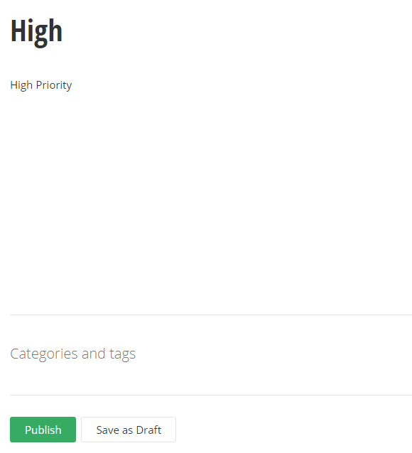{width="3.220138888888889in" height="2.825in"}

> 122 \| LISTS
>
> **Note**: Using the HTML editor, you can insert images that will
> display in the list. Click the Image Manager button to select images
> you already have uploaded or upload new images from your computer.

{width="4.195138888888889in"
height="2.2152777777777777in"}

7.  Click the Create a list item button. Enter the Title \"Medium\" and
    HTML content \"Medium Priority\". Click the Publish button.

8.  Click the Create a list item button. Enter the Title \"Low\" and
    HTML content \"Low Priority\". Click the Publish button. The list
    should now look something like the screenshot below.

{width="6.020138888888889in" height="2.7in"}

LISTS \| 123

##### Using Lists in Pages

> This walk-through demonstrates adding a simple \"Priority\" list to a
> page.

1.  Navigate to a page that will contain the list.

2.  Drag the List widget to the page.

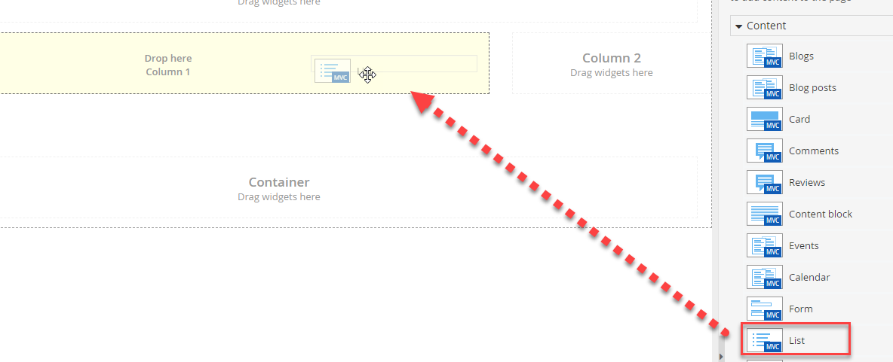{width="6.159597550306212in"
height="1.3303116797900263in"}

3.  Click the Set which list to display link.

4.  In the Content tab of the Edit dialog, click the Select lists
    button. Check the \"Priority\" list and click the Done selecting
    button.

5.  Click the Settings link.

6.  Select the Expandable list radio button.

7.  Click the Save button to close the dialog and view the changes.

{width="3.292739501312336in"
height="1.3715616797900263in"}

> 124 \| CONTENT BLOCKS

Content Blocks
==============

> News, Events and Content Blocks are similar to one another with only
> minor variations. The simplest item of the three is the Content Block
> which contains only a title and some HTML. Content blocks can be
> shared across multiple pages, just as with any other content, or can
> be ad-hoc, one-off material used in a single Content Block widget on a
> single page.
>
> The HTML for the content block can range from blocks of legal language
> to images and links, anything you want to include in various places on
> your site that needs to be maintained in a single spot.

##### Create a Content Block from the Content Menu

> If you want to create a content block that can be shared among pages
> and maintained from the Content menu:

1.  Drop down the Content menu and select Content blocks.

2.  If this is the first time visiting the Create a Content Block page
    you will see the \"No Content Blocks have been created yet\"
    message. Click the Create a content block link. This will display
    the Create a content block page.

{width="5.230555555555555in"
height="3.0854166666666667in"}

CONTENT BLOCKS \| 125

3.  Enter a Title. Below the title area, enter any text or HTML content
    in the HTML Editor.

{width="5.99932195975503in"
height="3.689582239720035in"}

4.  Click the Create this content block button.

5.  In place of the \"No Content Blocks have been created yet\", the
    items will display in a list that shows the item Title, a drop-down
    list of Actions, where the content block is being Used, the Owner
    and the Date.

{width="6.020138888888889in"
height="1.6902777777777778in"}

> 126 \| CONTENT BLOCKS

##### Use a Shared Content Block

> To use a content block that has already been created:

1.  Click the Pages menu item

2.  Add a new page or reuse an existing page. Click the page link to
    edit the content. Drag the Content block widget to the page.

{width="5.786438101487314in"
height="2.7083333333333335in"}

3.  Click the Edit link of the Content block widget.

> In the Edit dialog that displays, click the Select from existing
> shared content button.

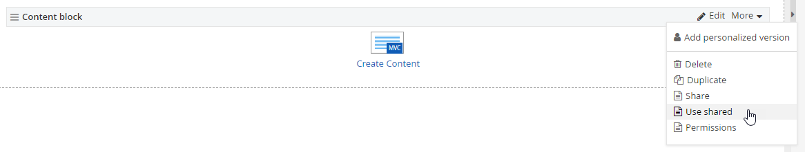{width="3.770138888888889in"
height="1.4701388888888889in"}

CONTENT BLOCKS \| 127

4.  You will see a list of content items. Select an existing content
    item, then click the Done selecting button to return to the edit
    dialog.

{width="4.1305555555555555in"
height="3.140277777777778in"}

> 128 \| CONTENT BLOCKS

5.  Back in the Edit dialog, click the Save Changes button.

{width="6.020138888888889in"
height="4.115277777777778in"}

> **Note**: The Edit dialog notifies you that the content is shared
> among any pages that reuse this particular Content Block. You can edit
> the content here and the changes will ripple out to all pages where
> it's used.

6.  The Content block widget title indicates that the content is shared.

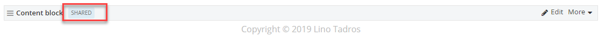{width="5.934440069991251in"
height="1.4143744531933509in"}

CONTENT BLOCKS \| 129

7.  Click the Publish button.

8.  View the page and the new content.

{width="6.020138888888889in"
height="2.0104166666666665in"}

> 130 \| CONTENT BLOCKS

##### Create Shared Content from the Content Block Widget

> You don't need to navigate to the Content menu to create shared
> content blocks. You can create and share them directly from the
> Content block widget by following these steps:

1.  Drop a Content block widget on a page.

2.  Edit your content using the HTML editor.

3.  Click the Share this content button.

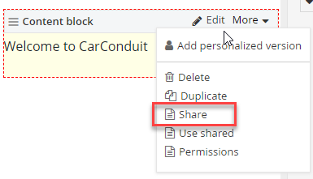{width="5.8in" height="4.590277777777778in"}

CONTENT BLOCKS \| 131

4.  Enter a Title for the content block, then click the Share this
    content button. The content will now be available in the list of
    shared content from the Content \> Content block menu option.

{width="3.3354166666666667in"
height="1.6652777777777779in"}

##### Social Sharing Options

> You can add buttons for content blocks simply by selecting the Enable
> social share buttons check box in the content editing dialog.

{width="2.8843110236220473in"
height="1.3096872265966755in"}

> The screenshot below shows a Content Block with the social share
> buttons included.

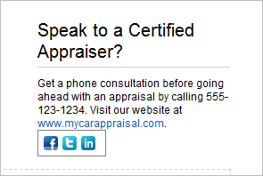{width="3.0628116797900264in"
height="2.041874453193351in"}

> 132 \| CONTENT BLOCKS
>
> You can configure the buttons that will show up from Administration \>
> Settings \> Social sharing. Select the sharing sites you want
> included, select the icons style for small icons or Icons with text
> and finally, click the Save Changes button.

{width="6.510416666666667in"
height="3.6305555555555555in"}

EMAIL CAMPAIGNS \| 133

Email Campaigns
===============

> Email campaigns are used for appropriate mass mailings such as
> newsletters, announcements and time-sensitive marketing. An email
> campaign has one or more *issues*, where each issue is the actual
> email sent out to users. For example, a monthly newsletter campaign
> can have issues for each month, such as the *January Issue* of the
> *Monthly Newsletter* campaign.
>
> The content for an issue can be as refined as a web page built by a
> professional designer, a complex rich-text document or simple
> plain-text content accessible from any email client. You can create
> personalized content for the email using the same process you already
> use to create pages in Sitefinity.
>
> You can enter the list of users manually, target users already
> registered with your site or import from a spreadsheet. Email
> campaigns are not simple, one-way blasts but allow sophisticated
> tracking of the customer's reaction using mechanisms like A/B
> campaigns that record two different email versions and track which
> messages are opened and what
>
> 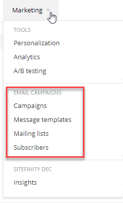{width="3.310416666666667in"
> height="3.4555555555555557in"}links are clicked through.
>
> Use the administration Marketing menu to define a campaign using a
> mailing list, content and how and when the email will be sent. The
> options for creating email campaigns are shown in the screenshot.
>
> As campaign issues go out, email campaign reporting details how the
> email was received; how many were delivered, opened and clicked
> through.
>
> 134 \| EMAIL CAMPAIGNS

##### Subscribers and Mailing Lists

> Subscribers form the pool of addresses that you can send email to.
> Each subscriber has a first name, last name and email address. Mailing
> lists are groups of subscribers where subscribers can be on more than
> one mailing list. You can get a list of subscribers automatically by
> using the email addresses of users already on your site or from people
> that have responded to forms. You can also import subscribers from
> spreadsheet files or by adding them individually using the Subscribers
> menu option.
>
> The Subscribe widget can be added to a page that site visitors can use
> to "opt-in" and decide to become subscribers. A matching Unsubscribe
> widget can be placed on another page to allow subscribers to opt-out
> of a mailing list. These last two options give your site visitors
> control over the email they receive and allow you to place content
> where it will be well received and get the best reaction.

##### Creating a Mailing List

> To launch a campaign, start by creating a mailing list of subscribers.
> This walk-through demonstrates how to initially setup your mailing
> list first by adding a single subscriber manually and then by adding
> more subscribers using a spreadsheet file. The spreadsheet file can be
> either comma delimited values (\*.csv) or tab delimited (\*.tsv). In
> the example, you'll see how to create a comma separated values file
> (\*.csv) in notepad. Note that you can also create \*.csv files in
> spreadsheet applications like Excel.

1.  Using Notepad, create a file called *Subscribers.csv*. Open the file
    and copy the data below into the file. The first row represents the
    header of the data. The last three rows are made up of email
    address, first name and last name.

### Email,First,Last rjones\@gmail.com,Riley,Jones pksmith\@gmail.com,Percy,Kant tborialis\@whitehall.uk,Terrance,Borialis

2.  From the Marketing menu item, click the Mailing lists menu option.

3.  Click the Create a mailing list link.

4.  Enter the Mailing list title *CarConduit Monthly Newsletter*.

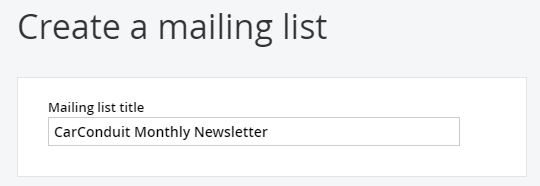{width="4.590277777777778in"
height="0.6854166666666667in"}

EMAIL CAMPAIGNS \| 135

5.  In the Mail settings area, enter a From name *CarConduit*. In the
    Subject enter

> *Monthly Newsletter*. In the Reply-to email enter
> [*reply\@cardconduit.net*.](mailto:reply@cardconduit.net) Leave the
> Unsubscribe page alone for now.

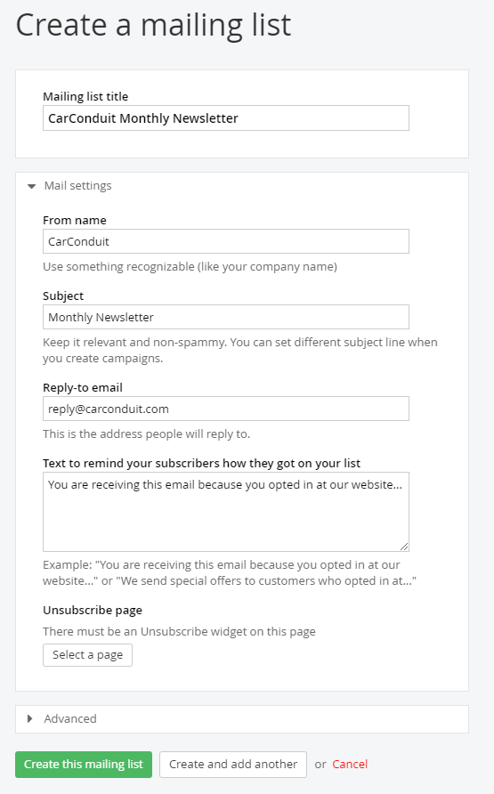{width="5.20706583552056in"
height="5.177083333333333in"}

6.  Leave the Advanced section default and click the Create this mailing
    list button. The new mailing list shows on the Mailing lists page
    showing that it has zero subscribers and has not been used for any
    issues of the campaign.

{width="6.195138888888889in"
height="1.7305555555555556in"}

> 136 \| EMAIL CAMPAIGNS

7.  From the Actions menu, select the Create new option from the
    Subscribers section.

{width="2.2805555555555554in" height="3.5in"}

8.  Enter a First name, Last name and Email address. The *CarConduit
    Monthly*

> *Newsletter* is already selected as one of the mailing lists to
> subscribe to, so leave that setting as-is. Click the Create this
> subscriber.

{width="5.204419291338582in"
height="3.7395833333333335in"}

EMAIL CAMPAIGNS \| 137

> Notice that the Subscribers column now has a single entry.

{width="4.060416666666667in"
height="0.8805555555555555in"}

9.  From the More actions menu, click the Import subscribers option.

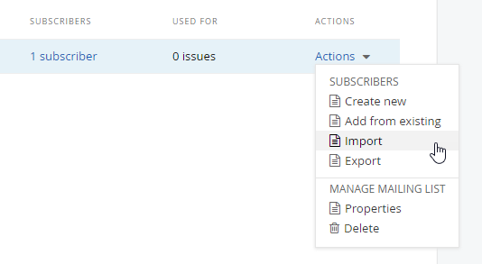{width="2.470138888888889in"
height="1.6055555555555556in"}

> 138 \| EMAIL CAMPAIGNS

10. In the text box at the top of the dialog, use the Browse button to
    locate and select the *Subscribers.csv* you created in step 1. Leave
    the default file format

> (Comma separated), columns to use (first, second and third) and Skip
> the first row (checked). In the Mailing lists section, click the
> Select mailing lists button.

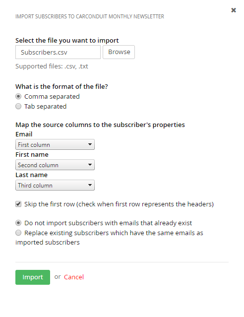{width="4.915277777777778in"
height="6.645138888888889in"}

EMAIL CAMPAIGNS \| 139

11. Check the *CarConduit Monthly Newsletter* box and then click the
    Done selecting button.

{width="4.020138888888889in"
height="2.420138888888889in"}

12. Leave the remaining defaults and click the Import button.

13. The Subscribers column now shows a link for 4 subscribers. Click the
    link.

{width="4.020138888888889in"
height="1.0652777777777778in"}

> 140 \| EMAIL CAMPAIGNS
>
> The manually added subscriber is now joined by the three imported
> email addresses.

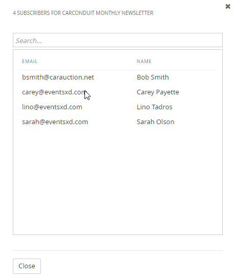{width="4.730555555555555in"
height="3.410416666666667in"}

14. Click the Close button.

##### Creating a Campaign and First Issue

> Creating the campaign brings the content and the mailing list
> together. Somewhere in your email you should have a "call to action",
> usually a link that the reader will click. In this example, there will
> be a fictitious car show that will have a registration link. Having
> links and tracking of those links allows you to asses a measurable
> payback from the campaign.

1.  Click the Marketing \> Campaigns menu option.

2.  Click the Create a campaign button.

3.  Enter the Campaign name as *CarConduit Monthly Newsletter*.

{width="5.170676946631671in"
height="1.0828116797900262in"}

EMAIL CAMPAIGNS \| 141

4.  In the Template section, leave the Start from scratch and Like a web
    page options selected.

{width="5.199301181102363in"
height="3.0416666666666665in"}

5.  In the Default mail settings, click the Select a mailing list
    button.

6.  Select the *CarConduit Monthly Newsletter* and click the Done
    selecting button.

{width="4.076661198600175in" height="2.3925in"}

> 142 \| EMAIL CAMPAIGNS
>
> The From name and Reply to email fields are filled in automatically.

{width="5.210906605424322in"
height="2.5729166666666665in"}

> Leave the Enable Google tracking box checked. This option is important
> for tracking subscriber reaction to the email.

{width="5.191855861767279in"
height="0.8229166666666666in"}

EMAIL CAMPAIGNS \| 143

7.  Click the Create and go to add the first issue button.

8.  In the Issue name text box enter *First Issue*. In the Message
    subject enter *CarConduit's First Monthly Newsletter!* Leave the
    other defaults and click the Go to add content button.

{width="5.207860892388451in"
height="5.072916666666667in"}

> 144 \| EMAIL CAMPAIGNS
>
> The content editor for campaign issues looks very much like those for
> standard pages. You have Content and Layout buttons that switch
> between views and a limited set of widgets that can be dragged from
> the right hand menu. There are a few key differences. Instead of
> publishing the content, the Send this issue button makes the issue
> live. Over on the right hand side, the Plain text button can be used
> to either automatically generate a plain text version or a plain text
> version entered manually.

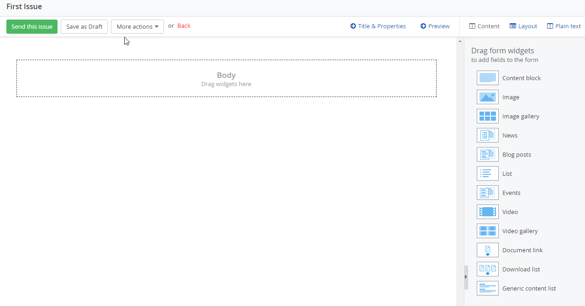{width="6.190277777777778in"
height="4.770138888888889in"}

EMAIL CAMPAIGNS \| 145

9.  Click the Layout button.

10. Drag a 75% + 25% layout element to the top of the page.

{width="6.020138888888889in"
height="2.5854166666666667in"}

11. Drag a 100% layout element below the first row.

{width="6.028448162729659in"
height="1.4568744531933508in"}

12. Click the Content button.

13. Drag a Content block widget to the left side of the top row.

14. Click the content block's Edit button.

15. Paste the following text into the HTML editor.

> Welcome . In this issue:
>
> The latest innovative technologies Classic car of the month
> Restoration tips and tricks
>
> LA Muscle cars
>
> Are you a gearhead?
>
> 146 \| EMAIL CAMPAIGNS

16. Put the text cursor just after the *Welcome*. In the drop down list
    of fields, make sure that First name is selected, then click the
    Insert button. The text should look something like the example
    below.

{width="4.645138888888889in"
height="2.9652777777777777in"}

17. Select the last five items, then click the bullet points button.

{width="3.3652777777777776in"
height="2.1152777777777776in"}

18. Click the Save button.

19. Drag an Image widget to the upper right of the page. Use an image
    from your computer's hard drive and set a custom size with a width
    of 100 and the height to be adjusted automatically.

20. Add a second Content block widget to the bottom container on the
    page. Click the Edit button. Click the More formatting options
    button.

EMAIL CAMPAIGNS \| 147

21. {width="0.145in"
    height="0.11499890638670167in"}In the top line of the dialog's HTML
    editor, add the text *LA Muscle Car Show*, select the text, then
    open the style drop down list and select the Heading 1 style. Then
    click the Align Center button.

22. Add a new line that states *Be sure to reserve a spot at the LA
    Muscle Car Show sponsored by CarConduit*. Highlight the *LA Muscle
    Car Show* portion of the sentence and then click the Hyperlink
    Manager {width="0.16499890638670167in"
    height="0.16499890638670167in"} button. Provide a web address, then
    click the Insert the link button.

{width="4.135416666666667in"
height="3.770138888888889in"}

> 148 \| EMAIL CAMPAIGNS

23. Click the Save button.

{width="6.020138888888889in"
height="3.4902777777777776in"}

24. The page should look something like the screenshot below.

{width="6.020138888888889in"
height="2.7402777777777776in"}

EMAIL CAMPAIGNS \| 149

25. Click the Send this issue button. This will send the issue to all
    email addresses in the subscriber list for the campaign.

> The email that arrives to the user's inbox will have any substitution
> variables replaced, such as the First Name "Bob" shown in the
> screenshot below.

{width="6.020138888888889in"
height="4.555555555555555in"}

> 150 \| EMAIL CAMPAIGNS

##### Issue Actions

> The Send this issue button to sends the email immediately or you can
> use the additional operations found under More actions. The screenshot
> below shows the operations you can perform against an issue:

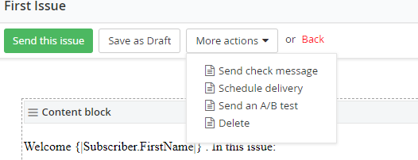{width="4.520138888888889in" height="1.975in"}

##### Send check message

> The Send check message option allows you to send the issue as a test
> to a single email address or to a list of emails separated with a
> comma. If the issue arrives at the email addresses, then you can be
> sure that your email configuration is properly setup.

{width="3.520138888888889in"
height="2.6152777777777776in"}

EMAIL CAMPAIGNS \| 151

##### Schedule delivery

> The Schedule delivery option takes a date and time that the email
> should be sent. When you have a future date and time entered, click
> the Schedule this issue button.

{width="3.520138888888889in"
height="2.0555555555555554in"}

##### Send an A/B test

> The Send an A/B test option allows you to create two versions of the
> issue and determine which email is more effective. You send version A
> of the issue to a small group of subscribers, and version B to another
> small group of subscribers. After the emails are sent, the responses
> are measured (using criteria such as number of emails opened or links
> clicked) and a winner is decided.
>
> The remaining emails are sent using the winning issue. When you click
> the Send an A/B test option, you have the opportunity to use the
> content from the original issue or to start from scratch.

{width="3.020138888888889in"
height="1.1201388888888888in"}

> After using one of the above options to edit the content, click the
> Send this A/B test button.

{width="3.020138888888889in"
height="1.5402777777777779in"}

> 152 \| EMAIL CAMPAIGNS
>
> The Send an A/B test page displays showing both A and B issues and
> provides buttons to edit both issues.

{width="6.520138888888889in"
height="2.415277777777778in"}

> Below the issues editing are options for the entire A/B campaign,
> including a Test name to help you recognize a particular test and a
> What are you testing? entry that describes what you are expecting to
> learn from the test. For example, you might try different variations
> of a graphic to see which gets more interest.

{width="5.172972440944882in" height="3.3in"}

EMAIL CAMPAIGNS \| 153

> The last set of entries in the A/B Test Settings screen determine the
> sample size, winning criteria and timing of the test. Use the Testing
> sample slider to define the percentage of users that will participate
> in the initial A/B test before sending the winning issue. In the
> Winning issue section, select if the winning issue will be determined
> by having More opened emails or More link clicks. You can decide to
> send the test immediately or schedule the test to be sent later.
> Finally, in the A/B test end section, pick a date and time that the
> winning issue should be determined and sent to the remaining users.

{width="5.21in" height="4.5in"}

> When you have completed your entries, click the Send this A/B test
> button.
>
> 154 \| EMAIL CAMPAIGNS

##### Reporting

> The fact that the user opens the email or clicks on links is recorded
> and available in the email campaign reporting. To navigate to
> reporting for a campaign, click the Email Campaigns \> Campaigns menu
> option, then click the link for a specific campaign. The screenshot
> below shows opening a campaign link. Notice the short hint below the
> link that shows that 3 issues were sent.

{width="2.9652777777777777in"
height="1.1652777777777779in"}

> After clicking the link, the Campaign Overview Report shows at the top
> of the page. The statistics for each issue are shown in an area graph
> so that you can easily see how many of each issue were delivered,
> opened and clicked through.

{width="6.45945428696413in"
height="2.5390616797900263in"}

EMAIL CAMPAIGNS \| 155

> Below the overview is a detail list of Issues and A/B tests. Notice
> the statistic columns that show how many times each issue has been
> sent to a subscriber, delivered, opened or clicked through.

{width="6.520138888888889in"
height="2.8201388888888888in"}

> Click the Full report link to get a detailed breakdown of the delivery
> rate, unique openings, unique clicks, number of users that
> unsubscribed after getting the issue and the percentage of emails that
> were opened in the first 48 hours. Each of these statistics is
> accompanied by hints on how to improve each statistic.

{width="6.548786089238845in"
height="1.4961450131233596in"}

> **Note**: If all of your emails are not delivered (bounced), this may
> be due to an invalid [email server address]{.underline}. Note that the
> email address is typically maintained by the administrator. If only
> some emails are not being delivered, this indicates that your list of
> subscribers needs to be updated.
>
> Below the overall statistics you can find a list of the last 10
> subscribers who clicked through a link in the issue, showing which
> subscriber clicked, the URL they clicked and the date and time that
> they clicked.
>
> 156 \| EMAIL CAMPAIGNS

{width="6.468596894138233in" height="1.225in"}

> You also get a different cut at the information organized by link.

{width="6.480226377952756in"
height="1.1265616797900262in"}

> You get a further breakdown of clicks by hour that may help you adjust
> the timing of your campaign. When your mouse passes over one of the
> bars in the chart, a popup hint will display the cumulative number of
> clicks for each hour.

{width="6.010416666666667in"
height="3.160416666666667in"}

EMAIL CAMPAIGNS \| 157

> Click the Report link on A/B Tests to show a breakdown of statistics
> for each version of the issue.

{width="6.520138888888889in"
height="1.9951388888888888in"}

> 158 \| EMAIL CAMPAIGNS

##### Message Templates

> When you create a new campaign you have the choice of creating the
> format from scratch or using a message template. Message templates
> allow you to reuse certain content and update other parts of the email
> and to setup a look-and-feel that is consistent across emails. To
> create a template:
>
> Navigate to Marketing \> Email Campaigns \> Message templates and then
> click the Create a message template link. Enter a Template name and
> select the type of template to create. In this example we will use the
> Like a web page option. Click the Create and go to add content button.

{width="6.456297025371828in"
height="4.145833333333333in"}

> In the designer, make sure the Content button is selected above the
> right hand menu. Drag form widgets from the right hand menu to create
> the parts of content that will be in every email.

EMAIL CAMPAIGNS \| 159

> For example, you may have a brief welcome message and graphic at the
> top of the page, an unsubscribe link toward the bottom of the page and
> a copyright notice at the very bottom. None of these items should need
> to change from one issue to the next.

{width="6.5153291776027995in"
height="1.59375in"}

> Now click the Layout button to establish areas on the form where
> content that changes with each issue goes. For example, you may want
> to add areas that will list the topic overview and the detail for the
> email, and you will want that content to go above the unsubscribe link
> and copyright notice.

{width="6.419515529308836in"
height="3.1406244531933507in"}

> 160 \| EMAIL CAMPAIGNS
>
> When you create a new campaign, instead of starting from scratch with
> a webpage, rich text or plain text, choose Use a template and then
> select a template from the drop down list. The screenshot below shows
> a new campaign being created using the *Newsletter template*. From
> there, click the Create and go to add the first issue button.

{width="5.157086614173228in"
height="7.198124453193351in"}

EMAIL CAMPAIGNS \| 161

##### Providing a Link to Subscribe

> You can allow the user to "opt in" to any email campaign on any page
> using the Subscribe form widget. Drop the Subscribe form widget from
> the Email Campaigns section to the page. You must click the Edit
> button and select a mailing list. Click the Save button when you have
> completed entering the Subscribe form settings.

{width="4.160596019247594in" height="4.04in"}

> The finished form looks something like the screenshot below.

{width="4.405555555555556in"
height="2.520138888888889in"}

> 162 \| EMAIL CAMPAIGNS
>
> When the Subscribe to the mailing list button is clicked by the user,
> their information is added to the selected mailing list.

EMAIL CAMPAIGNS \| 163

##### Providing a Link to Unsubscribe

> To setup a link in the email that lets the user easily unsubscribe on
> their own, do the following:

1.  Create a page with the Unsubscribe widget. You can just drag the
    widget onto the page and publish the page. Optionally, you can click
    the Edit button and change the text.

{width="5.970994094488189in"
height="0.9006244531933508in"}

2.  In the Mail settings for each mailing list, include a reference to
    an unsubscribe page that contains an Unsubscribe widget. You can
    navigate Mail settings using the Actions menu for a mailing list and
    selecting Properties.

{width="5.207222222222223in" height="4.6875in"}

> 164 \| EMAIL CAMPAIGNS

3.  Include an unsubscribe link in your issue content. You can use the
    fields drop down list in a Content Block editor to create the link.
    In the screenshot, the Unsubscribe link is selected and the Insert
    button adds the link to the content.

{width="6.020138888888889in"
height="3.520138888888889in"}

ECOMMERCE \| 165

Ecommerce
=========

##### Build the Products Catalog

> Before you can build a shopping page, a shopping cart and a checkout
> page, you need to setup a catalog of products you want to sell. The
> Ecommerce menu lets you define Products (T-Shirt, baseball cap), Types
> of Products (shirts, hats), and Departments (Clothing, Mens, and
> Womens) and Attributes (size, color).

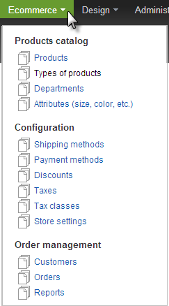{width="2.514132764654418in" height="4.5625in"}

##### Departments

> Departments are used to group products. In an example where we are
> selling caps and t-shirts, the department could be *Clothing*.
> Departments are hierarchical, so you could, for example, also create
> sub departments for *Mens*, *Womens*, *Girls* and *Boys* under the
> *Clothing* department.
>
> 166 \| ECOMMERCE

1.  To get started, click the Departments menu item.

2.  Click the Create a department link to create the first item. Enter
    the name of the department. You can also add a Description or
    customize the URL (not shown in the screenshot below). Then click
    Create and add another button.

{width="4.176876640419947in"
height="2.78125in"}

3.  To add a department below Clothing, enter the name of the new
    department, click the Select a parent radio button, and then select
    the Clothing from the list. Click the Create button.

4.  Create as many departments as you need to organize your products,
    then navigate back to the Departments page. The figure below shows
    Mens, Womens, Boys and Girls departments under the top level
    Clothing department.

{width="5.9814807524059495in"
height="2.9608333333333334in"}

ECOMMERCE \| 167

##### Types of products

> Product types help describe how a certain group of products will be
> delivered to the customer. The product can be a traditional shippable
> product, but could also be a downloadable product like software or
> music or even a service or other non-shippable product like a
> subscription.
>
> Fields are added to the product type to describe it further. By
> default, product types start out with Tags and Department fields. Your
> own custom fields take the place of product labeling such as brand
> names, manufacturer codes, ingredients, classifications and codes.
> Using the example of a t-shirt, you could add a brand name, country of
> manufacture, type of fiber and washing instructions.
>
> To create a product type:

1.  First select Types of products from the Ecommerce menu

2.  Click the Create product type button.

> 168 \| ECOMMERCE

3.  Enter the Name and the plural Name of the product type. Using the
    radio buttons under This type contains\..., choose how the product
    type should be delivered to the customer. Click the Create this
    product type and go define its fields button. The screenshot below
    shows a *Shirt* product type that will be delivered by conventional
    shipping.

{width="5.546134076990376in" height="4.0in"}

ECOMMERCE \| 169

4.  In the Product Fields page, click the Add a field\... button.

{width="4.98511811023622in"
height="3.0708333333333333in"}

5.  Select the Type of data from the drop down list and enter a Name.
    The name must contain blanks. The field in the screenshot below is
    named *Brand* and is the default Short text Type of data. Click the
    Continue button to go on to the Settings page.

{width="3.6365398075240596in"
height="3.611666666666667in"}

> 170 \| ECOMMERCE

6.  The Settings page has three tabs for defining how the field looks
    and behaves in Sitefinity. In the Labels and text tab, provide a
    Label that will be used when entering data for the product. The
    Instructional text will be displayed below the textbox for the
    field. You can add a Predefined value as a default. Select the Make
    required checkbox if this field must be filled. The Limitations tab
    is used for numeric and date fields to restrict what can be entered.
    The Appearance tab controls where the field will be shown.

7.  Click the Done button when you\'re finished defining the field.

{width="4.093016185476816in"
height="5.084061679790026in"}

ECOMMERCE \| 171

8.  Add as many fields as you need to describe the product. Then click
    the Save Changes button. This will return you to the Product types
    page.

{width="5.594040901137358in"
height="4.083748906386702in"}

> 172 \| ECOMMERCE

##### Attributes

> Products have traits like color or size called *attributes*. A
> t-shirt, for example, can come in small, medium and large sizes and
> also can be red, blue or green. Sitefinity can keep track of these,
> even to the point of tracking inventory for each combination. To
> define attributes:

1.  From the Ecommerce menu select Attributes.

2.  Click the Create an attribute link or button.

3.  Enter the name of the attribute. In the This attribute can be
    applied to area, select only the product types where the attribute
    makes sense. In the screenshot, the Color attribute applies to the
    Shirt product type, but not to Software or Song. Leave the other
    defaults and click the Create this attribute button.

{width="5.980633202099738in"
height="3.5385411198600174in"}

ECOMMERCE \| 173

4.  Now the Create a value page displays. Enter a Value, then click the
    Create and add another button. The screenshot below shows Red added
    as a value of the Color attribute. Click the Back to values link
    when you\'re done.

{width="4.991721347331583in"
height="1.5074989063867017in"}

> Enter a Description if the value itself is not self-describing. For
> example, the screenshot below show a Size attribute\'s M value stands
> for medium.

{width="3.3732895888014in"
height="3.0834372265966756in"}

> 174 \| ECOMMERCE

5.  The values are listed under the attribute. Click the All attributes
    link to continue defining attributes.

{width="3.392694663167104in"
height="2.3281244531933507in"}

6.  In the Attributes page, create as many attributes as needed to
    describe all the products you want to sell. The list of attributes
    in the screenshot below shows a summary of the values, and what
    product types the attribute applies to.

{width="4.979290244969379in"
height="1.6780205599300086in"}

ECOMMERCE \| 175

##### Products

> Now that [[Departments]{.underline},](#departments) [[Types of
> products]{.underline}](#types-of-products) and
> [[Attributes]{.underline}](#attributes) are defined, you can define
> the individual products. To create the product, you will need to have
> the product name, description, information for any of the fields that
> you defined, the shipping weight, the department that the product is
> part of, price and SKU (stock keeping unit). You may also want to get
> images of each product and have them available on your computer or
> upload them to an image library before defining products. The example
> that follows will create a t-shirt product in several different sizes
> and colors. To create a new product:

1.  From the Ecommerce menu select Products.

2.  You will have a choice of product types to start from. The
    screenshot below uses the Shirt product type.

{width="1.9805304024496937in"
height="2.7974989063867017in"}

> 176 \| ECOMMERCE

3.  In the first block of information you need to enter the product
    Title and Description, the shipping Weight of the product.

{width="6.020517279090114in"
height="4.0203116797900265in"}

ECOMMERCE \| 177

4.  The next block of entry includes the Departments and Tags. Select
    the Departments and sub departments that the product is part of and
    any Tags that will help people find the product. In the screenshot
    below, the *Clothing* and *Mens* departments are selected.

{width="5.947187226596675in"
height="3.6129166666666666in"}

> 178 \| ECOMMERCE

5.  Next, define the Price, SKU and inventory options for the product.
    The monetary units for the price can be adjusted later in the
    Ecommerce [[ Configuration]{.underline}.](#_bookmark22) The SKU
    (Stock Keeping Unit) can use the numbering system for your store.
    Sitefinity will keep track of basic inventory. The Track inventory
    radio button option allows you to enter a Quantity for all products,
    regardless of variations (such as color or size). You also have the
    option to Display the product, even if you\'re out of stock. If you
    want to allow back orders, also check the Allow orders even if not
    available option. The Track inventory by variations radio button
    will allow you to enter quantities later for each variation
    combination.

{width="5.9494214785651796in"
height="3.430833333333333in"}

ECOMMERCE \| 179

> Optionally, you can define Tier Pricing to encourage buyers to buy
> larger lots of product and Sale price for a certain period of dates.
> You can specify that the sale period start and end at specific times
> of the day.

{width="5.9435389326334205in"
height="4.5616666666666665in"}

> []{#_bookmark22 .anchor}180 \| ECOMMERCE

6.  Images really help sell the product. The next block of entry allows
    you to enter multiple images and documents. In the screenshot below,
    four t-shirts images display. Any one of the images can be tagged as
    Primary using the drop down Actions button. The Products List widget
    that will display on a page shows all the images, with the Primary
    image displaying larger and above the others. Use the Documents and
    other files button to upload documents for the customer that
    describe some aspect of the product in great detail, such as
    ingredients, manufacturing details or electronic specifications.

{width="6.002037401574803in"
height="2.7609372265966754in"}

7.  The More options section has a useful Role drop down. When the
    product is purchased, the role is assigned to the user, potentially
    giving them access to downloads or other resources.

{width="5.936053149606299in"
height="1.9242705599300087in"}

ECOMMERCE \| 181

##### Build Shopping Pages

> Before trying to build shopping pages, your Sitefinity administrator
> needs to perform [configuration steps]{.underline} that support the
> shopping experience, including setting up the store, payment methods,
> shipping methods and taxes. Once the configuration is complete you can
> create the shopping pages. Minimally, to create a Sitefinity shopping
> experience you need:

-   A products page that contains a Product list widget. This is the
    page visitors will use to shop and select products. This page will
    also contain a Shopping cart summary widget used to navigate to the
    shopping cart page.

-   A page containing a Shopping cart widget. The shopping cart will
    display selected products, quantities and totals. The user can
    select the Continue shopping widget to navigate back to the products
    list page or click the Checkout button to navigate to a checkout
    page to place their order.

-   A page that contains a Checkout widget. The Checkout widget is a
    wizard that walks the user through 5 steps: Shipping information \>
    Shipping options \> Payment \> Preview \> Confirmation.

> To build a page that allows shopping using configured ecommerce items,
> first add all three pages:

1.  Select Pages from the Sitefinity menu.

2.  Create three pages and name them *Products List*, *Checkout* and
    *Shopping Cart*

> respectively.
>
> Now build the *Products List* page.

1.  Select the Edit Content action from the menu next to the *Products
    List* page.

2.  Drag a Shopping cart summary widget to the top of the page.

{width="6.020138888888889in"
height="1.3152777777777778in"}

> 182 \| ECOMMERCE

3.  Click the widget's Edit button.

4.  Under the Link to checkout page, click the Select a page button and
    choose the

> *Checkout Page* you created in step 2.

5.  Under the Link to shopping cart, click the Select a page button and
    choose the

> *Shopping Cart* you created in step 2.

6.  Leave the Link to Product list page (you are already on the Product
    list page).

7.  Select 200x200 from the Size of thumbnails drop down list.

8.  Drop down the Shopping cart summary template and select Simple link.

9.  Click the Save button to finish configuring the shopping cart
    summary widget.

{width="4.1305555555555555in"
height="4.8805555555555555in"}

ECOMMERCE \| 183

10. The shopping cart summary widget now shows a minimal link at the top
    of the page.

{width="5.9816666666666665in"
height="0.37385389326334206in"}

11. Drag a Products List widget from the Ecommerce section onto the
    page, below the shopping cart summary. Leave the default settings.
    This will show all the products you have available in the catalog.

{width="6.025640857392826in"
height="2.741665573053368in"}

12. Click the Publish button.

> The next step is to build the shopping cart page:

1.  Select the Edit Content action from the menu next to the *Shopping
    cart* page.

2.  Drag a Shopping cart widget onto the page.

{width="6.020138888888889in"
height="1.4652777777777777in"}

> 184 \| ECOMMERCE

3.  Click the widget's Edit button.

4.  Under the Link to checkout page, click the Select a page button and
    choose the

> *Checkout Page* you created previously.

5.  Under the Link to Product list page, click the Select a page button
    and choose the

> *Product List* page you created previously.

6.  Select 200x200 pixels from the Size of thumbnails drop down list.

7.  Leave the other defaults and click the Save button.

{width="4.120138888888889in"
height="4.555555555555555in"}

ECOMMERCE \| 185

> The shopping cart widget should display on the page, but there are no
> products in the cart yet.

{width="5.735416666666667in"
height="1.5402777777777779in"}

> The last set of steps implement the checkout page.

1.  Select the Edit Content action from the menu next to the *Checkout*
    page.

2.  Drag a Checkout widget onto the page.

{width="6.020138888888889in" height="1.4in"}

> 186 \| ECOMMERCE

3.  Click the widget's Edit button. Notice that there are templates you
    can use to customize each step of the wizard, from shipping to
    confirmation. Also notice the option to send the merchant a copy of
    the confirmation email and the option to allow anonymous users to
    place orders. Leave the defaults and click the Cancel button.

4.  Click the Publish button.

##### Test the Shopping Pages

> These next steps test the usability of the shopping pages by choosing
> products, going to the shopping cart and finally placing the order.

1.  Click the Live site button.

2.  Add *products-list* to the browser path. The screenshot below shows
    an example (although the number following "localhost" will likely be
    different when you run it).

{width="5.981504811898513in"
height="4.8848950131233595in"}

ECOMMERCE \| 187

3.  Choose a product and click on the image or the title link.

{width="2.2604166666666665in" height="2.35in"}

4.  Click the Add to cart button. Notice that the Added to shopping cart
    message appears and the Shopping cart link shows a quantity of 1.

{width="6.020138888888889in"
height="2.1902777777777778in"}

> 188 \| ECOMMERCE

5.  Click the Shopping cart link. This step navigates to the shopping
    cart page. Notice the Continue shopping link that navigates back to
    the products list page and the Checkout button that navigates to the
    checkout page. Click the Checkout button.

{width="6.205555555555556in"
height="3.060416666666667in"}

ECOMMERCE \| 189

6.  The checkout page is a 5-step wizard that starts by collecting
    shipping information. Enter the required shipping address
    information and click the Continue button.

{width="6.020138888888889in" height="5.875in"}

> 190 \| ECOMMERCE

7.  The Shipping options step includes one or more [ Shipping
    Methods]{.underline} setup by the Sitefinity administrator. The
    screenshot below shows that only one shipping method *FedEx Ground
    Shipping* has been configured. Notice that Tax has been included in
    the order summary. [ Taxes]{.underline} are also configured by the
    Sitefinity administrator. Click the Continue button.

{width="6.020138888888889in"
height="2.6805555555555554in"}

ECOMMERCE \| 191

8.  The Payment step includes one or more [ Payment Methods]{.underline}
    setup by the Sitefinity administrator. The screenshot below show
    methods for Offline payment and Credit Card. Click the Continue
    button.

{width="6.020138888888889in"
height="4.085416666666666in"}

9.  The Preview step allows the customer to see the entire order
    including the total amount, payment details, shipping and billing
    addresses.

> 192 \| ECOMMERCE
>
> **Important note!** Be aware that you may be using "live" shipping and
> payment methods depending on how the Sitefinity administrator
> configures [Ecommerce options]{.underline}. For example, the
> administrator can set up a test shipping account to FedEx that sends
> email but does not actually try to ship product.
>
> On the other hand, if the shipping and payment options are configured
> with live accounts then you may be charged with shipping fees and
> credit card amounts.

10. If you are comfortable with the order details at this point, click
    the Place this order button.

{width="6.020138888888889in"
height="3.9402777777777778in"}

ECOMMERCE \| 193

11. The Confirmation step displays a message that the order has been
    placed successfully.

{width="6.020138888888889in"
height="2.515277777777778in"}

##### Order Management

> The Order Management section of the Ecommerce menu includes options
> for Customers, Orders and Reports. The Customers item list names of
> people that have placed orders, the amount of money spent, number of
> orders and the number for the last order completed.
>
> The Orders option lists each order by number and its current status.

{width="5.8in" height="2.020138888888889in"}

> From the Orders list you can use the Actions menu to delete the order.
> This changes its status to Deleted but does not completely remove the
> record. To see the current order details and status history, click the
> order number link.
>
> 194 \| ECOMMERCE
>
> The text to the right side of the order information is the current
> status of the order in large text and a list of statuses and dates
> listed below the current status (see the screenshot below).

{width="6.485400262467191in"
height="7.21875in"}

ECOMMERCE \| 195

> The Reports option includes a list of inventory and sales reports on
> the left bar.

{width="1.820138888888889in"
height="2.245138888888889in"}

> The Inventory report and Top selling report are displayed as a grid.
> The Export... button on top command bar creates a comma delimited file
> (.csv) of the information.

{width="6.520138888888889in"
height="1.7201388888888889in"}

> The Sales Summary report shows a high-level view of all the orders
> completed within a certain period of time. The Select Period drop down
> list can be set to Today, Yesterday, Last 7 Days, Last 30 Days, Last
> 90 days and a Custom period between two dates. The cumulative number
> of orders, subtotals, taxes, shipping, discounts and total sales are
> summarized at the top, a line chart shows in the center of the report
> and a detail grid by date displays at the bottom of the report.
>
> Both the Sales by period and Sales by region reports are displayed in
> a grid and can be exported in any selected format including comma
> delimited (csv), adobe (pdf), Excel and
>
> 196 \| ECOMMERCE
>
> Word. The Sales by period report requires a Currency. Start and End
> dates will default to the current date and a month from now.

{width="6.520138888888889in"
height="4.225in"}{width="6.520138888888889in"
height="3.4402777777777778in"}

ECOMMERCE \| 197

> The Sales by Region report wants a region selected from the drop down
> list and also a currency.

{width="6.520138888888889in"
height="3.3152777777777778in"}

> 198 \| CUSTOM MODULES

Custom Modules
==============

> Sitefinity has numerous content modules right out of the box such as
> news, events, and blogs and so on. The built-in types cover many
> standard scenarios, but your organization may need to store custom
> data, for example \"Press Releases\", \"Stock Quotes\" or \"Employee
> Bio\". Such custom types of data are stored in Sitefinity custom
> *modules*. Modules allow you to extend Sitefinity with custom content
> administration pages and front end page widgets. The administration
> back-end pages allow you to enter new data and the widgets display the
> data in various formats in your pages.
>
> This section explains how to work with modules that handle custom data
> and includes how to create a custom module, add content to the module
> and add a module widget to a page. You will also learn how to
> customize the columns on the backend grid that displays module data.
>
> Once your module is created, you can temporarily deactivate it from
> use without having to delete it. This prevents changes to the module
> while preserving module data. You can also export the entire module
> along with any data that it has or just the module structure by
> itself. In this way you can import the structure to another Sitefinity
> site without having to describe all the fields of the module by hand.
> You can also completely delete a module and it will vanish from the
> site.
>
> The steps to create custom content types and use those types in a page
> are:

1.  [[ Create an empty custom
    module]{.underline}](#create-a-new-custom-module)

2.  [[ Add module content]{.underline}](#_bookmark25)

3.  [[ Add the module widget to a
    page]{.underline}](#sorting-custom-data)

##### Create a New Custom Module

> These steps demonstrate how to create a new module that lists used
> cars for sale similar to a Craigslist or classified ad entry. Each
> entry will have a *Title*, *Year*, *Make*, *Model*, *Image*, *Price*,
> *Contact Email* and *Notes*.

CUSTOM MODULES \| 199

1.  From the Sitefinity main menu select Administration \> Module
    Builder.

2.  Click the Create a Module link.

{width="2.3816590113735785in"
height="1.7825in"}

3.  Enter a Name and Description for the module as a whole and click the
    Continue button.

{width="4.6960487751531055in" height="2.125in"}

4.  At the top of the Define a content type page that shows next, enter
    the *singular*

> name of the Content type.

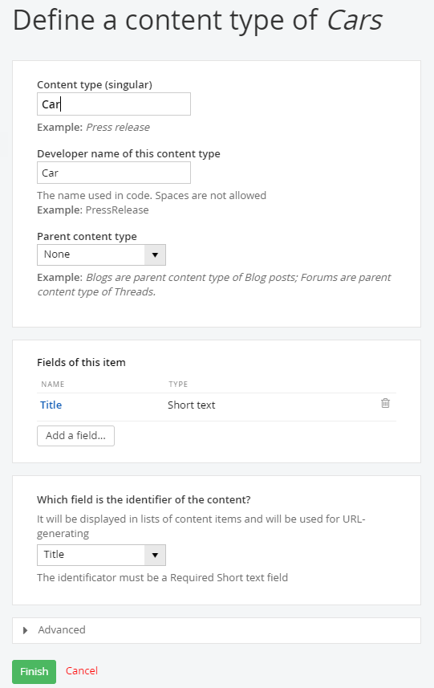{width="4.644864391951006in"
height="2.5678116797900263in"}

> 200 \| CUSTOM MODULES
>
> **Note**: The Content type entry will automatically fill in the
> Developer name of this content type. Developers can use this name to
> work with your data in a program. You can alter the developer name,
> but be sure to remove any spaces if you do.
>
> The Parent content type can be specified if you have another custom
> content type that the current entry should fit under. For example, if
> you had another content type called *Want Ads*, this could be a parent
> content type of *Car*.

CUSTOM MODULES \| 201

5.  Below the content type is an area for adding a list of fields used
    to store the content. By default, the standard content Title is
    already in the list.

    a.  Click the Add a field\... button.

    b.  Enter the Name of the field (again without spaces). For this
        example use the name *Year*.

    c.  From the drop down list, select the Type of data this field
        represents. This example describes the *Year* field as a Number.
        Leave the Interface widget for entering data at its default.

6.  There are at least two interface widgets listed for each type. The
    first editor in the drop down list is the built-in editor for the
    type, such as a Textbox for a Short text type. Leave the default
    selection.

7.  Click the Continue button to finish defining the field.

{width="3.7305555555555556in"
height="4.290277777777778in"}

> 202 \| CUSTOM MODULES

8.  After hitting the Continue button on the Add a field dialog, a new
    dialog shows in its place to define the interface widget. In the
    example below the Number box requires a Label that will be shown on
    the widget and Instructional text that will show as a prompt. Select
    the This is a required field checkbox to force entry in this field.

{width="3.7305555555555556in" height="4.475in"}

CUSTOM MODULES \| 203

9.  Click the Limitations link. The limitations area allows you to put
    constraints on what you allow entered in a field. The limitations
    you can apply vary depending on the type of field. The number box
    editor allows a simple Min and Max limit on allowed values. Click
    the Done button to finish creating the field.

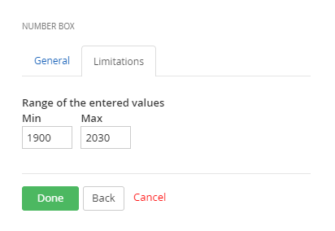{width="3.7305555555555556in"
height="2.165277777777778in"}

10. The Fields of this item area shows the new custom *Year* field.

{width="4.6416524496937885in"
height="1.6396872265966753in"}

> 204 \| CUSTOM MODULES

11. Add the fields with the following names and properties:

    d.  Name: *Make*, Type: Short text

    e.  Name: *Model*, Type: Short text

    f.  Name: *Image*, Type: Related media (images, video, files), What
        kind of media: Images.

    g.  Name: *Price*, Type: Number, Unit: \$

    h.  Name: *ContactEmail*, Type: Short text

> Now the fields should look like the screenshot below.

{width="4.429875328083989in"
height="2.682811679790026in"}

> **Note**: The image selector limitations in the Add a field dialog
> includes a throttle for the number of images that may be uploaded,
> their size and their type (for example \*.png or \*.jpg). You should
> carefully consider what should be allowed and place limits that don't
> allow users to exceed these requirements.

CUSTOM MODULES \| 205

12. Once all the fields are defined, select the field that will be used
    as the identifier of the content from the drop down list. The drop
    down list will only show Short Text fields that are marked as
    Required. Leave the *Title* as the identifier of the content.

{width="4.683249125109361in"
height="1.1145833333333333in"}

13. Click the Finish button to create the module.

14. Click the Activate this Module button. The page for your module will
    include an option to Deactivate the module, go back to add or edit
    fields, and edit the Name and description of the module. The Backend
    screen tweaks option determines how the module records are displayed
    and how the screen to create or edit a module record is displayed.

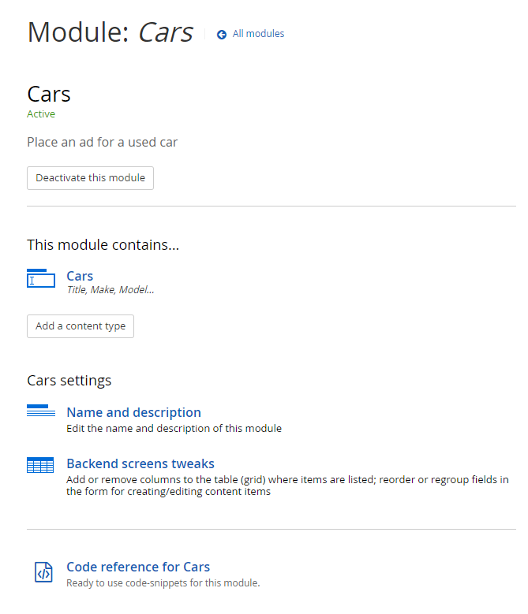{width="6.2in" height="4.235416666666667in"}

> 206 \| CUSTOM MODULES

15. The module will now appear in three locations in Sitefinity.

-   Administration \> Module Builder: Use this option to add or change
    fields, edit the name and description, make changes to the backend
    screens and to activate/deactivate the module.

-   Content \> \[your module name\]: Use this option to add, update and
    delete data for your module, and to publish/unpublish rows of data.

-   The right hand menu of widgets on each page designer will include an
    icon that represents your module data. Drag the widget to the page
    to present the new dat[]{#_bookmark25 .anchor}a.

##### Editing Custom Modules

> If you need to add or delete fields, click the link or the content
> type.

{width="3.05in" height="3.0652777777777778in"}

> Be aware that if you delete a field, the operation will remove the
> field and any data that was entered into it.

{width="4.135416666666667in"
height="1.1104166666666666in"}

> There is no direct way to edit the type of a field, say change a short
> text to a long text, but you can delete a field and then re-add it and
> assign a new type.

CUSTOM MODULES \| 207

##### Working with Module Content

> From the Content menu select your new content item. This example shows
> a new *Cars*
>
> menu item for module of the same name.

{width="2.7581288276465443in"
height="2.96875in"}

> The first time you enter the screen you will see a \"Create a \[my
> module type\]\" link that you can click to create a new item.

{width="3.220138888888889in"
height="2.720138888888889in"}

> 208 \| CUSTOM MODULES
>
> Enter the fields you defined when creating the module. When complete,
> click the Publish button.

{width="5.285858486439195in"
height="5.867603893263342in"}

> After adding several entries, you can see the actions and stock
> columns *Author* and
>
> *Publication Date* that come along with all content.

{width="6.510416666666667in"
height="1.5902777777777777in"}

CUSTOM MODULES \| 209

##### Sorting Custom Data

> By default, you can sort custom data by Title, Last Created or Last
> Modified. To sort by any of your custom fields, select the Custom
> Sorting drop down option.

{width="1.7393110236220473in"
height="2.1041666666666665in"}

> In the Custom sorting dialog you select one of your custom fields from
> the drop down list and choose if the sort order will be Ascending or
> Descending. If you want additional sorts click the Add another sorting
> rule.

{width="4.53in" height="2.5in"}

> 210 \| CUSTOM MODULES
>
> In this example we will sort by Make and then Model within Make. Click
> the Save button to apply the new sort order.

{width="4.5311111111111115in"
height="3.3958333333333335in"}

##### Customize the Grid List of Module Content

> You won't be able to tell easily if the data has been sorted or
> filtered because the default listing only shows columns for the title,
> actions, author and publication data. To add columns to the listing,
> first navigate to Administration \> Module Builder, then click the
> module you are interested in. In this example we will click the custom
> Cars module [created in previous topics]{.underline}. Then click the
> Backend screen tweaks link.

{width="6.810416666666667in"
height="1.9604166666666667in"}

CUSTOM MODULES \| 211

> Click the Add / remove columns in the table (grid) button.

{width="6.030555555555556in"
height="3.4451388888888888in"}

> The Existing columns will allow you to drag and drop the columns in
> any order you want to see. The custom fields are listed on the right
> side and can be dragged into any column of the grid. In this example,
> the Make and Model are dragged in just after the Title column. When
> you have the arrangement of columns that you want, click the Save
> Changes button.

{width="6.520138888888889in"
height="2.0104166666666665in"}

> 212 \| CUSTOM MODULES
>
> Now you can apply a custom sort on your data as shown in the
> screenshot below that is sorted first by Make and then Model.

{width="6.785416666666666in"
height="1.6604166666666667in"}

##### Filtering Custom Data

> The filtering for your custom data changes depending on the columns
> available in the module. For starters, you can filter by ownership
> such as All Cars or just My Car or work flow status such as
> Drafts/Published/Scheduled. If you add Classification columns to your
> data such as Categories or Tags, and then populate those fields, new
> filter criteria show up in the Manage bar. For example the by
> Categories... filter shows up in the Manage bar shown below because a
> Classification category field was added to the Car custom content
> type. The Category content type has entries for 1960s and 1970s. The
> Car records were then edited to add either a 1960s or 1970s category.
>
> Click the by Categories... link to select from the choices that exist
> in the data.

{width="2.269435695538058in"
height="3.3541666666666665in"}

CUSTOM MODULES \| 213

> Any categories that have been added to a Car record will show up in
> the filter list that will also show the number of records in
> parenthesis where this data occurs. Click the category that you want
> to filter by to see the matching records appear.

{width="6.520138888888889in"
height="0.9402777777777778in"}

> If you have defined a custom classification, the new classification
> will appear in the filter list. For example, if you were to create a
> new classification, Manufacturers, added that classification as a
> custom field for the module and then populated module items
> Manufacturer field, you will see by Manufacturers... below the
> categories and tags filters.

{width="1.7055555555555555in"
height="1.1305555555555555in"}

> Then you can select the classification element (the Chrysler
> manufacturer in this screenshot) to show only the custom data with
> this classification.

{width="2.9604166666666667in"
height="2.915277777777778in"}

##### Revision History

> Each content item for your custom module has a revision history so
> that you will know who changed the data, when the change occurred and
> what data fields were altered. You can view the history from inside
> each Module Builder module. To see revision
>
> 214 \| CUSTOM MODULES
>
> history for a custom module's content, select the module from the
> Content menu. Locate the record you're interested in and select
> Revision History from the drop down Actions menu.

{width="6.820138888888889in"
height="3.0652777777777778in"}

> The revision history will have a version item for each time the record
> has been edited. From this list you can quickly see how many edits
> occurred, who made the edits and when.

{width="6.820138888888889in"
height="3.4555555555555557in"}

CUSTOM MODULES \| 215

> Click the Write note link to include background or justification for
> the change. Click the Save button to keep your changes with the
> revision.

{width="3.560416666666667in"
height="2.0652777777777778in"}

> The notes appear in the listing of revisions.

{width="6.56749343832021in"
height="0.7291666666666666in"}

> To find out exactly which field data was changed, select two revisions
> using the checkboxes and then click the Compare button.

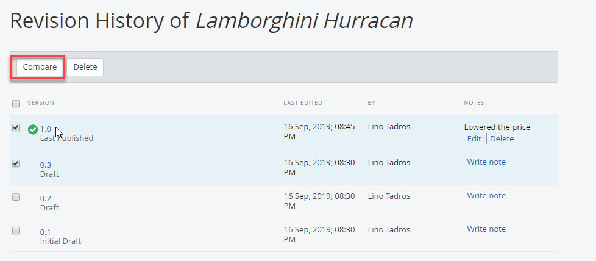{width="3.0104166666666665in"
height="2.620138888888889in"}

> 216 \| CUSTOM MODULES
>
> While the revision note is the change the person editing record
> *thought* they made, the comparison highlights each actual data
> change. The example below shows that "1970" was added to the title in
> the latest revision. If someone incorrectly edits a record, you can
> click the Revert to this version button to roll back changes to an
> earlier time.

{width="6.820138888888889in"
height="3.435416666666667in"}

CUSTOM MODULES \| 217

##### Add the Module to a Page

1.  Drag the widget for your new module onto the page.

{width="2.2852209098862644in"
height="5.767707786526684in"}

> 218 \| CUSTOM MODULES
>
> The module will be listed using the default configuration and layout.
> The example below shows all published cars in a list and the layout
> for each item shows the Title and published date.

{width="5.413702974628172in"
height="1.7395833333333333in"}

2.  Publish the page.

3.  View the completed page.

4.  Click one of the items to see the detail.

{width="4.560416666666667in"
height="4.790277777777778in"}

CUSTOM MODULES \| 219

##### Customizing the Backend Grid

> The stock backend grid shows only the identifying field and built-in
> content field's Publication Date and Author. You can customize the
> backend grid to show the columns from your module.

1.  To customize this list to include the year, make and model, select
    the menu Administration \> Module Builder.

2.  Select the link for your module.

3.  Select the Backend screens tweaks link.

{width="6.1in" height="1.0652777777777778in"}

> 220 \| CUSTOM MODULES

4.  Click the Add / Remove columns in the table button.

{width="5.885416666666667in" height="3.125in"}

5.  Representative examples of the existing columns display in a grid.
    Notice that some columns can be moved by dragging. Only the *Author*
    column can be deleted. Click the small x button to remove the
    *Author* column.

{width="6.020138888888889in"
height="2.160416666666667in"}

CUSTOM MODULES \| 221

6.  Drag the columns from your module to the right end of the grid and
    drop them there.

{width="6.020138888888889in"
height="2.1805555555555554in"}

7.  Click the Save Changes button.

8.  From the menu select Content \> \[your module\]. The grid now shows
    the other columns defined in your module.

{width="6.010416666666667in"
height="1.1902777777777778in"}

> 222 \| LOCALIZATION

Localization
============

> Localization allows you to display your website in any language. The
> ability to localize your entire site to any language is baked right
> into Sitefinity. Not only text, but any other content relevant to the
> culture of your website visitor is configurable. The back- end of the
> website is also fully localizable. All menu items, button text,
> labels, etc. are localizable. Search for \"Language Packs\" here:
>
> [*http://www.sitefinity.com/marketplace/modules.aspx.*](http://www.sitefinity.com/marketplace/modules.aspx)

##### Localizing Front End Pages

> In this next walk through we will add the Spanish language and
> localize a front-end page to reflect the language choice.

1.  Select the administration menu Settings option.

2.  From the list on the left side of the page select the Languages
    option.

3.  Click the Add languages\... button.

4.  Use the search box to locate *Spanish* in the list and select the
    check box.

{width="4.072413604549431in"
height="1.96875in"}

LOCALIZATION \| 223

5.  Click the Done button. Now the new *Spanish* language entry shows up
    under the default *English* entry.

{width="4.4233344269466315in"
height="1.9078116797900262in"}

> Below the Languages for public content section is the Default language
> for the backend system. You can change the language for the backend
> system by clicking the Manage backend languages link and adding
> languages there. Leave the default setting for this example.

6.  Click the Save changes button.

> Select the administration menu Pages option. This option will take
> extra time because Sitefinity needs to accommodate the new languages
> by making database changes. When the list refreshes, all the pages in
> the site are \"localization ready\" and have a new Translations
> column.

{width="5.989786745406824in"
height="2.8102077865266843in"}

> 224 \| LOCALIZATION

7.  Click the ES Add link for the home *Welcome* page (if you don't have
    the page built, go ahead and create a welcome page now).

{width="4.151536526684165in"
height="1.1240616797900262in"}

8.  Create a page (ES) displays so you can supply a new page Name, URL
    and Title in the appropriate language.

{width="3.4861843832020996in"
height="2.37875in"}

LOCALIZATION \| 225

9.  Click the Create and go to add content button.

10. At this point your options are Copy from another language, or Start
    from Scratch. The first option is especially productive if you have
    images that you want to copy between versions. Click the Copy from
    another language link.

11. The Copy content from another language dialog displays. The English
    language is the only version available for this page, so the drop
    down list is disabled. Select the Keep all language versions synced
    check box. Click the Done button to close the dialog.

{width="3.55in" height="2.925in"}

> The translated page displays. Notice the message at the top of the
> page that lets you know that the pages are synced and what kind of
> behavior you can expect while designing the page.
>
> {width="6.020138888888889in"
> height="1.5604166666666666in"}
>
> 226 \| LOCALIZATION

12. Click the content block Edit button (if you don't have a Content
    Block on the page, add one now).

13. Paste *Bienvenido a CarConduit!* into the editor window. Click the
    Save button.

14. Click the Publish button. Note that publishing pushes out all the
    translations.

15. View the page. Notice the URL in the address bar uses the culture
    code *es*. The translated content shows at the head of the page.

{width="4.270138888888889in"
height="2.4055555555555554in"}

LOCALIZATION \| 227

##### User Language Selection

> You can use the Language selector widget right in your page so that
> the user can dynamically choose the language they want to view the
> page in.

1.  Open the localized page for editing again.

2.  Open the Navigation section of the right hand menu. Drag the
    Language selector widget to the top of the page.

3.  Click the language selector widget Edit button. In the Display
    language selector as\... option, select Drop-down menu.

> Also notice the checkbox option to include the current language in the
> selector.
>
> What to do with languages without translations? Your options are to
> Hide the link to the missing translation or Redirect to the home
> page\...

{width="3.469408355205599in"
height="3.588020559930009in"}

> 228 \| LOCALIZATION

4.  Click the Save button to close the dialog.

> Publish and view the page. Use the drop down language selector to show
> both translations of the page.

{width="1.2393536745406823in"
height="0.7995833333333333in"}

> PAGE ADMINISTRATION \| 229

Page Administration
===================

> As your own website builds in size and complexity, you need to work on
> all your pages in one place. For example, you may want to search for a
> certain set of pages, then publish them all. Pages administration
> allows you to work on all your pages at one time. The top of pages
> administration contains a set of buttons that create, delete and
> perform other actions on pages. Below that is a list of pages, and to
> the right, the Manage Pages area.

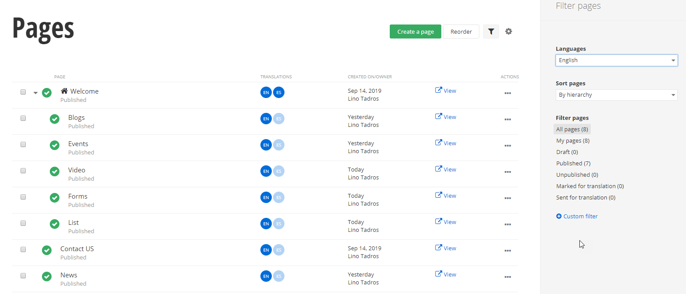{width="6.520138888888889in" height="3.425in"}

##### Page List

> {width="0.125in"
> height="0.10454505686789152in"}{width="0.14499890638670165in"
> height="0.14499890638670165in"}Pages are listed in a tree structure.
> The screenshot below shows a *Welcome* page, with a *Contact Us* page
> underneath it. Notice the house icon that lets us know that *Welcome*
> page is the default home page. Also notice the green check marks that
> indicate these pages are published. Click the name of the page to edit
> the page or click the View link to preview the page at any time in a
> separate browser window. The Actions menu provides the full set of
> options possible for the page, such as deleting, editing, etc. The
> Date/Owner column shows the creation date of the page and the person
> that created it.

{width="5.422534995625547in"
height="0.9178116797900262in"}

> 230 \| PAGE ADMINISTRATION

##### Actions

> The top section of the Actions menu allows you to Delete the page
> completely from the system while Unpublish makes the page invisible to
> the public.
>
> **Note**: By default, Sitefinity sends deleted pages to a [[recycle
> bin]{.underline}.](http://docs.sitefinity.com/recycle-bin)
>
> Use Duplicate if you want to use the existing page as a starting
> point. Set as Homepage makes the selected page the default if you
> navigate to the website without specifying a particular page. Share
> preview link\... creates a temporary link (expires in one day by
> default) that you can paste into an email or instant message.
>
> Create a child page adds a new page underneath the current page in the
> tree hierarchy.
>
> The Edit\... section of the Actions menu allows you to go back and
> change the Content or Title and Properties. Permissions determines who
> can see and perform other actions on the page. Revision History allows
> you to see each of the changes made to the page, who made these
> changes and when. If a later version has serious mistakes, you can
> revert to any earlier version.
>
> PAGE ADMINISTRATION \| 231
>
> 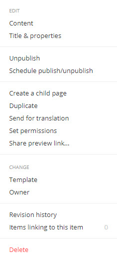{width="2.91in" height="6.115in"}The Change
> section of the Actions menu allows you to change the Template for the
> page. For example, if you want the page that has a single column and
> header and footer to use the Apple Promo style layout with three
> columns, then you can change the template for the entire page.
> Changing page Owner lets you pass off certain pages to other team
> members so that they can search for pages that they have
> responsibility for.
>
> Use the Move\... section Up and Down options to move the page in the
> tree hierarchy.
>
> More options may show up on this menu depending on the state of the
> page. For example, if the page is locked, the Unlock option will
> display here. Note that all items in the menu will only show up if you
> have the appropriate permissions. For example, you might not see the
> Change Owner option if you don\'t have the correct permissions.
>
> 232 \| PAGE ADMINISTRATION

##### Revision History

> When you click the Save button, content is recorded in the revision
> history (shown on the right of the screenshot below). The revision
> history allows you to compare versions, roll back to earlier versions
> and add notes to particular versions.

{width="6.520138888888889in"
height="3.6055555555555556in"}

> PAGE ADMINISTRATION \| 233

##### Manage Pages

> As you build your production website, it becomes harder to locate
> pages when you want to maintain them. The Manage Pages area to the
> right of the page list allows you to filter pages quickly. The filters
> in the screenshot below are not random, but reflect Telerik\'s
> experience working with Sitefinity customers in real-world situations.
> For
>
> 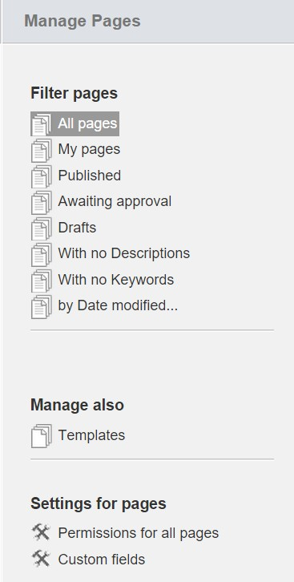{width="3.06in" height="6.05in"}example,
> lack of descriptions or keywords are not best practice for Search
> Engine Optimization.
>
> You can use the With No Keywords filter for example to get the pages
> where keywords were left out. You can, of course, just filter to show
> only your own pages. Using the by Date modified\... filter you can
> look at the most recent changes, or use a custom date and time range.
>
> The Manage also \> Templates option is a shortcut for Design \> Page
> Templates.
>
> The Permissions for all pages option allows you to change the access
> to all pages at one time. This option controls what roles can view,
> edit, modify, and change permissions and so forth.
>
> The [[Custom fields for page]{.underline}](#_bookmark5) option allows
> you to attach extra information to your page.
>
> 234 \| PAGE ADMINISTRATION

##### Function Bar

> The buttons along the top of the pages list work against all selected
> pages at one time. The checkboxes to the left of each page indicate
> which pages are affected. You can Create a child of the selected page
> to extend the hierarchy of pages. The More actions drop down menu
> includes the ability to change the page Template (i.e. the predefined
> overall layout of the page). You can also restructure your page by
> dragging and dropping pages.

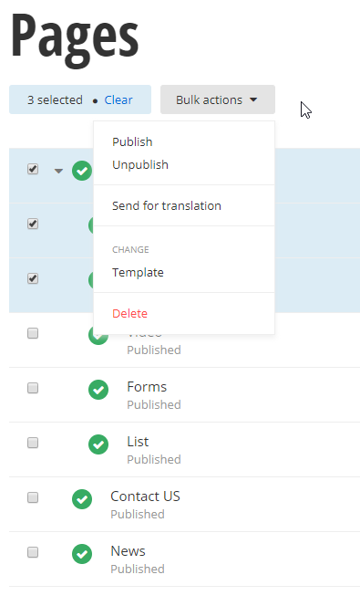{width="5.185416666666667in" height="2.175in"}

> To narrow down a long list of items, click the Search\... button,
> enter the text to search for and click the Search button next to the
> text entry. The search is not case sensitive and looks for titles that
> contain the search text. Click the Close Search button to return to
> the unfiltered list of items.

{width="6.520138888888889in"
height="1.8305555555555555in"}

##### Sharing Pages with Unauthorized Users

> You may need to share page links with people that don't have a user
> name or password in your Sitefinity site. For example, you may want
> reviewers to see pages even though they are not authorized on your
> system. You can even share a link to the draft of a page before it
> becomes published, as well as have the link expire on a given day.
>
> PAGE ADMINISTRATION \| 235
>
> You will need to change administration settings to allow sharing with
> unauthorized users and also create a preview link.
>
> Using the Sitefinity administration menu, first navigate to
> Administration \> Settings, then click the Advanced link. Then click
> the Pages node of the left hand tree view. Verify that the Allow
> backend users to share link to preview pages option is checked. Also
> inspect the Expiration time for shared links entry for the number of
> hours before the shared links expire. If you make any changes from the
> default values, click the Save changes button.

{width="6.520138888888889in"
height="4.445138888888889in"}

> 236 \| PAGE ADMINISTRATION
>
> To obtain a link to share with unauthorized users, navigate to Pages,
> drop down the Actions menu for the page you want to share and click
> the Share preview link option.

{width="6.520138888888889in"
height="2.6902777777777778in"}

> The Share secure link to this item dialog appears and provides a link
> that you can paste in an email or Instant Message. Notice that the
> dialog tells you how long the link will be valid for before it
> expires.

{width="4.118534558180228in"
height="2.4270833333333335in"}

##### Custom Fields for Pages

> The ability to create your own arbitrary fields for pages has been a
> top customer request. The *custom fields for pages* feature now allow
> you to specify additional details for a page. Once a custom field is
> created, the field is associated with the page from then on. It's an
> all-in-one tool that you can use for multiple purposes as your
> requirements dictate. You can use custom fields to associate
> information with the page such as manufacturer, costs or priorities.
> You can also use custom fields to customize
>
> PAGE ADMINISTRATION \| 237
>
> how a particular page is rendered. For example, you could include
> custom banner images, icons or other styling for each page based on a
> custom field.
>
> **Note**: You can [define custom fields just like this for the other
> content types]{.underline} and for [custom data types]{.underline}.
>
> To create a custom field, navigate to Pages from the administration
> menu. On the right- hand side under Manage Pages, click the Custom
> fields link.

{width="2.3555555555555556in"
height="1.3652777777777778in"}

> This takes you to the Pages Data Fields page that lists both custom
> and default fields. In the Custom fields area, click the Add a
> field... button.

{width="5.378198818897638in"
height="1.2445833333333334in"}

> 238 \| PAGE ADMINISTRATION
>
> In the Add a field dialog, select the Type of data you want in your
> custom field from the drop-down list. Choices include Short text, Long
> text, Multiple Choice, Yes / No, Currency, Date and Time, Number,
> Classification, Related data, Related Media and unknown.
>
> Classification will let you choose from a list of choices such as
> Category, Tags or Departments. Related data will let you choose from a
> list of content types like News, Blog posts, Events or Pages. Related
> media choices are Images, Videos or Documents and other files.
>
> Here is an example that contains a simple Short text field named
> MoreInformation. The Name is used in code and in the database, so no
> spaces are allowed in the name. Enter a Name and click the Continue
> button.

{width="4.0746445756780405in"
height="4.228124453193351in"}

> PAGE ADMINISTRATION \| 239
>
> Next up, the Settings dialog allows you to enter the Label and
> Instructional text that will display with the field when editing the
> page's Title and Properties. Enter those items and click the Done
> button.

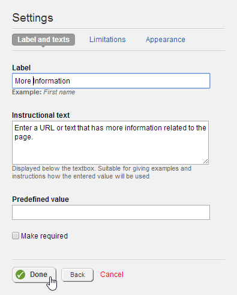{width="4.114664260717411in"
height="5.114583333333333in"}

> When you have added as many custom fields as you require, click the
> Save changes button.

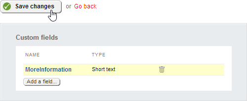{width="5.154951881014873in"
height="2.124374453193351in"}

> 240 \| PAGE ADMINISTRATION
>
> Now, navigate to any specific page and click the Title and Properties
> link at the top of the screen.

{width="1.8in" height="1.0805555555555555in"}

> In the Edit the Page screen that shows, scroll down to the bottom to
> find the entry for your new field. Enter content to the new field and
> then click the Save changes button.

{width="6.446680883639545in" height="1.9375in"}

##### Personalization

> Personalization lets you display different versions of a page to those
> that belong to a particular *user segment*. A *user segment* is a
> collection of characteristics that define a group of people, such as
> how long the user stays on the site, the time of day, the user's
> preferred language, the number of blog posts the user has contributed,
> what items or types of items they've purchased, what page they landed
> on and many others. If a user spends a long time on the *Luxury Car
> Trends* page you could display a *Suggestions for You* page that has
> luxury cars and products. A user that purchases sleeping bags and camp
> stoves could be shown outdoor gear. The user effectively gets a custom
> page.
>
> Before you can personalize pages, your administrator needs to set up
> user segments in Marketing \> Personalization. For this example, there
> is a *Luxury Cars* segment and a *Clothes* segment.
>
> PAGE ADMINISTRATION \| 241
>
> To personalize a page, you can either start from the Pages
> administration and select Personalization from the Actions drop down
> list or you can edit a page and click the Personalize this page
> button. In this example, we start by editing a new page called
> *Suggestions*. The page has a single content block at the top with
> text *Suggestions for you* in a heading style. From here:

1.  Click the Personalize this page from the top right row of buttons.

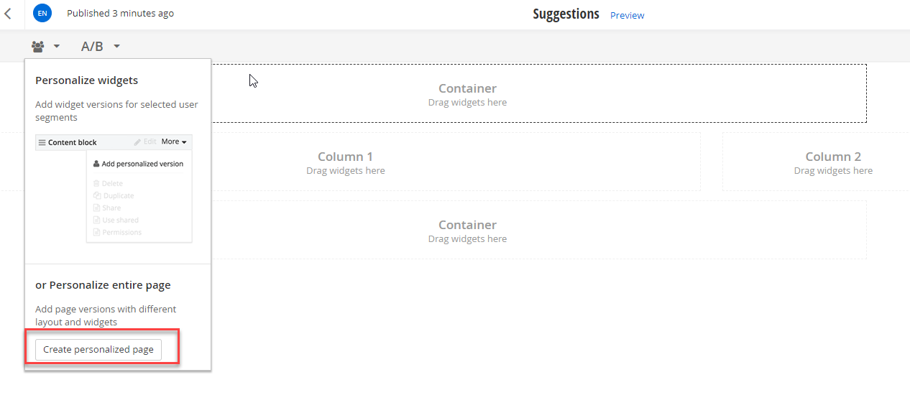{width="6.020138888888889in"
height="2.8354166666666667in"}

2.  Select a user segment from the drop down list, then click the Create
    and go to edit content button.

{width="4.425in" height="2.790277777777778in"}

> 242 \| PAGE ADMINISTRATION
>
> Notice that the page title *Suggestions* is appended with a drop down
> list that displays *Luxury Cars*. The list will include each
> personalization and an entry for *Everyone*.

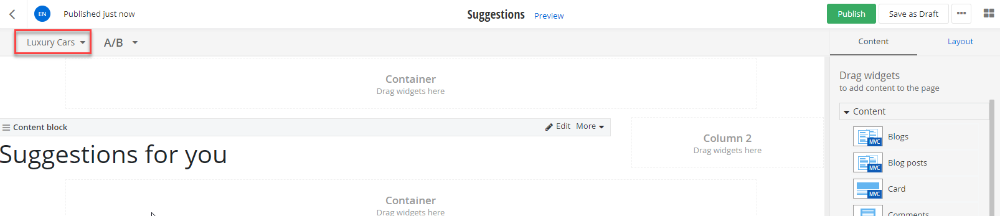{width="5.330555555555556in"
height="2.4902777777777776in"}

3.  In this example an Image widget is added that displays a luxury car.

{width="6.020138888888889in"
height="3.040277777777778in"}

> PAGE ADMINISTRATION \| 243

4.  You can repeat these steps, starting with clicking the Personalize
    this page button, for every user segment. For example, we can
    personalize the page for the Clothes user segment by adding an
    Ecommerce product list widget.

{width="6.020138888888889in"
height="4.935416666666667in"}

> The Pages list will now show a Personalized link. Clicking the link
> will allow you to edit any of the personalized pages.

{width="5.936059711286089in"
height="0.38437445319335084in"}