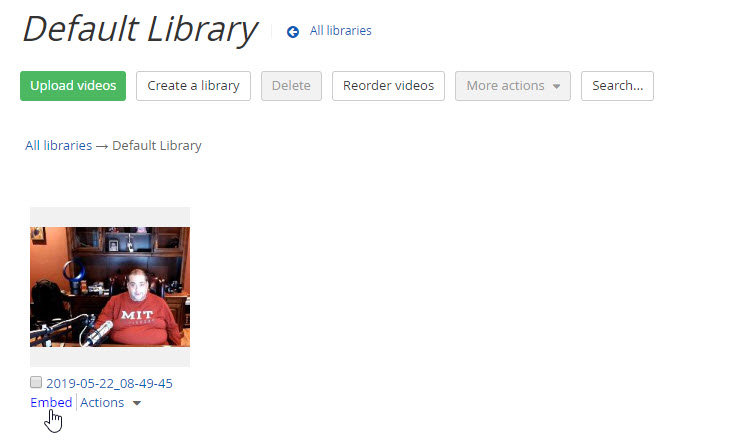
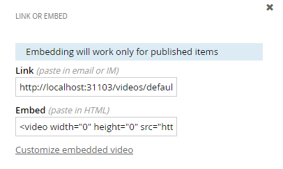
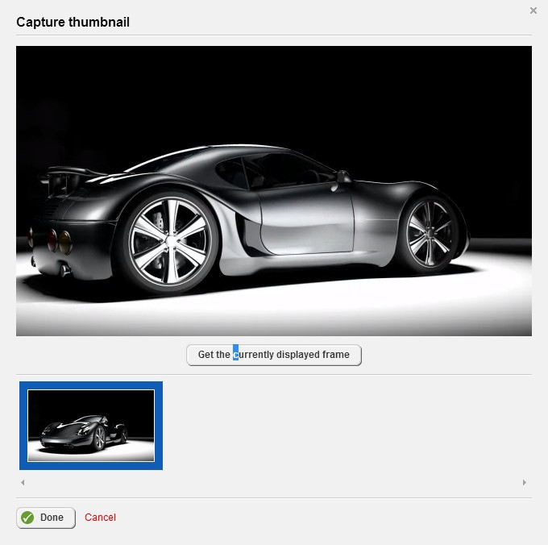

Videos
======

> Before you start uploading lots of videos to Sitefinity, be aware of
> how videos are stored, retrieved and played back.

-   When a video is uploaded to Sitefinity, by default, the video is
    uploaded to the database, not as a separate file. So if you upload a
    7MB video, the Sitefinity database grows by 7MB.

-   When the user starts a video that is stored in a file, the video is
    *buffered* on the client machine, where after the first 20% or so of
    the video is read, the video starts to display. If the video is
    coming from a database, then the entire video must be read before it
    can start to play.

-   The implication is that large files, 5MB plus as a general rule,
    should be left as files.

##### Uploading and Configuring Video

> Videos are handled very much like Images and are uploaded to
> Libraries. Sitefinity uses an HTML5 player that can handle \*.mp4,
> \*.webm and \*.ogv formats.

1.  From the administration menu select Content \> Videos.

2.  Click the Upload videos link.

3.  Click the Select videos from your computer link.

4.  Select any video you have available on your computer.

5.  Click the Upload and Publish button. Depending on the size of your
    video and the speed of the machine, the upload can take some time.

6.  Click the View all videos button.

7.  Open the library that contains the video, hover your mouse over the
    uploaded video and click the Embed link.

8.  The Link or embed dialog provides a Link that can be placed in email
    or Instant Messenger. The Embed tag can be pasted into an HTML page
    for Mozilla and IE based browsers. Close this dialog.

9.  Drop down the video\'s Actions menu (just below the video thumbnail)
    and notice that you can Play the video directly without having to
    view the page.

10. Select the video\'s Actions \> Edit Properties. This displays the
    Edit Video page where you can change the video Title, Thumbnail,
    Categories and Tags, Author and Description. Click the Thumbnail
    Capture video frame button.

11. The Capture Thumbnails dialog pops up and lets you take snapshots of
    the video as it plays. Just click the Get the currently displayed
    frame button to save off a thumbnail image. You can save off
    multiple thumbnails to the thumbnail strip below the playing video.
    Select the thumbnail that you want displayed in the page and click
    the Done button.

#### Note: 
> You can now select the Upload custom image button to use an
> uploaded image or an image from a library as the thumbnail for the
> video.

12. Click the Publish button for the video. The published video now
    displays the new thumbnail.

##### Using Video Widgets

To use video content on a page:

1.  Click the Pages menu option.

2.  Create a new page.

3.  Click the Create and go to add content button.

4.  Drag a Video widget to the top row of the page. Notice that, in
    place of an image from the video, a message tells us that the page
    must be published before the video can be displayed.

5.  Click the Video widget\'s Edit link.

6.  In the Insert a video dialog, click the Select video link. Select a
    previously uploaded and click the Save button.

7.  Click the Publish button for the page.

8.  Click the View link for the page. The HTML5 video player displays
    with all the industry standard controls like play, pause, a time
    line, volume controls and a full screen button. Click the play
    button arrow to view the video.

9.  Edit the page.

10. Drag a Video gallery widget to the page.

11. Click the Video gallery Edit link. The edit dialog is very similar
    to the dialog for the image gallery. The Videos link radio buttons
    display all published videos, just videos from a particular library,
    or you can upload new videos.

12. Click the Settings link. The dialog is split up between two areas
    where you can select the video gallery type and a second area to
    fine tune the selected type. In the Select video gallery type
    section, you can choose Thumbnails + Detail page or Thumbnails +
    Overlay. These work the same as their image counterparts.

13. Select the Thumbnails + Overlay (lightbox) option.

14. In the Fine tune the selected type section, you can limit both the
    number of items the gallery shows and the size of the thumbnails. To
    get the best control over

> your page real estate, select either the Use paging or Use limit
> options.

15. Click the Save button.

16. Publish and view the page.

##### Using YouTube Videos

> You can even play YouTube videos or playlists. Just go to YouTube,
> right-click a playing video and select Copy Video URL from the context
> menu. Edit the Video widget and select the Advanced button. Scroll to
> the end and paste into the YouTubeVideoUrl property.

> To add a YouTube playlist, first get the playlist id using the YouTube
> playlist Share button. This should be the ID of the playlist, not the
> entire embedded URL. Paste the playlist id to the YouTubePlaylistID
> advanced property. When you publish the page that uses it, the video
> and other items in the playlist will appear. Even when items are added
> to the playlist in YouTube, they are automatically shown on the page.

